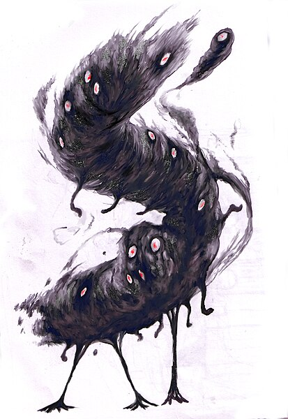

# Reglas de ambientación

\sincolumna

## Creación de personajes

\concolumna

Hay una serie de reglas en esta ambientación que modifican las normas generales de creación de personajes. No son muchas ni muy complicadas, pero tienen su sentido. Veámoslas:

* Tu PJ empieza con la ventaja Trasfondo arcano (Hechicería primigenia).
* Las ventajas de Nuevos poderes y Puntos de poder no pueden cogerse en la creación de personaje, a no ser que se tenga la ventaja Experiencia con los Mitos.
* Tu PJ empieza con un d4 gratis en Criollo. Esto le permite comunicarse mínimamente con cualquier persona en el Caribe. Puedes adquirir a d6 Taíno, Arahuaco, Castellano, Francés o Inglés en vez del Criollo, pero solo será útil en las áreas de influencia de los respectivos idiomas.
* Ocultismo desaparece como habilidad. Los conocimientos sobre magia están recogidos por la nueva habilidad de Mitos de Cthulhu. Los conocimientos básicos de Ocultismo, como formas de matar a un zombi o cómo quitar un mal de ojo, puedes integrarlos dentro de Conocimientos Generales. La mitología, las religiones, etc. puedes integrarlos en Humanidades.
* La desventaja Analfabeto pasa a ser mayor. Aunque la mayoría de la gente no sabe ni leer ni escribir, para una persona que va a estar rodeado de libros y que los necesita para enfrentarse a seres muy poderosos, ser analfabeto es un problema serio.

\saltocolumna

\saltopagina

\sincolumna

## Nuevas habilidades

\concolumna

En Cultos Salvajes puedes hacer uso de todas las habilidades básicas de SWEA. Por otro lado, hay una serie de nuevas habilidades:

### Mitos de Cthulhu

Mitos de Cthulhu representa los conocimientos que tiene tu personaje sobre los Mitos de Cthulhu, los monstruos, los hechizos, ritos, objetos, etc. y la historia que hay detrás de ellos. También puede servirte para identificar maldiciones y quitarlas o para identificar puntos débiles de seres de los Mitos.

Esta habilidad no se puede escoger en la creación del personaje. Solo mediante el estudio de libros prohibidos y enfrentándote a los horrores de los mitos podrás subir esta habilidad. Reglas especiales:

* No está basada en ningún atributo. Así que su coste es como si quisiéramos subir una habilidad por encima de un atributo. Es decir, que cuesta un avance subir un nivel de la habilidad.
* Solo puede subirse una vez por rango, como un atributo.
* Para poder subir esta habilidad, tu personaje ha debido enfrentarse a, al menos, una TPC o haber leído un libro prohibido durante las sesiones de juego de ese rango.
* No tiene límites, cuando se llega a d12 continuamos con +1, +2, +3, ...

### Idioma cthulhunés (Astucia)

El cthulhunés (o r'lyehiano) es la lengua hablada por Cthulhu, los habitantes R'lyeh y sus servidores, por ejemplo, los profundos. Los que lo han oído lo describen como extraño y gutural (seguramente para usarse bajo el agua) y muy difícil de pronunciar para las gargantas humanas.

La Orden del Gran Cthulhu ha conseguido transcribir el idioma a caracteres latinos, ya que los caracteres escritos del Cthulhunés no han podido ser descifrados. Eso ha llevado a que parezca formado por grupos de consonantes que suenan relativamente extraños para el oído, como mglw'naph o fhtagn.

\saltocolumna

_ph'nglui mglw'nafh Cthulhu R'lyeh wgah'nagl fhtagn_  
_En la Ciudad de R'lyeh, el difunto Cthulhu, espera soñando_

Durante la creación de personaje no puedes ponerle puntos a Idioma Cthulhunés a no ser que tengas la ventaja Experiencia con los Mitos.

El Cthulhunés puede ser entendido y leído (si está escrito en caracteres latinos) pero el usuario tiene dos niveles menos a la hora de hablarlo. Si no llega a d4 no podrá pronunciarlo. Es decir, con Cthulhunés d8, podrá hablarlo a d4. Con un d6 no podrá hablarlo, pero si leerlo y entenderlo.

El Cthulhunés es una lengua creada para pronunciar cosas impronunciables y es por ello que afecta a la cordura del hablante. Así pues, cada vez que se suba este idioma, deberá hacerse una TPC (tirada de perdida de cordura) igual al nivel que se quiere conseguir.

### Idioma Naacal (Astucia)
El naacal es el idioma que habla la serpigente. Era el idioma que se hablaba en el continente perdido de Mu hace más de 173.000 años. Las letras son ligeramente similares en apariencia a lenguajes mesoamericanos como el maya. Su pronunciación es complicada para los humanos debido a que está pensada para la lengua y las cuerdas vocales de la serpigente.

\saltopagina

\sincolumna

## Nuevas desventajas

\concolumna

La mayoría de las desventajas que hay en esta ambientación están relacionadas con la locura y el horror. Pueden ser bastante limitantes, así que ve con cuidado a la hora de escogerlas y trata consensuarlas con tu director de juego. Con una sola persona sentada a la mesa con "La llamada de Cthulhu" es más que suficiente.

### Débil de mente (mayor)
Hay personas que no están preparadas para enfrentarse al horror y esta desventaja lo refleja. No estás preparado para todas las terribles visiones que vas a presenciar y las horribles situaciones que vas a experimentar. Pero por todo eso, enfrentarte al horror como vas a hacerlo es una señal de tu valor.

Todas las TPC tiene un nivel más. Es decir, una TPC de d8 será de d10 para alguien con una mente débil. Este nivel extra se aplica al final, después de hacer todas las cuentas. Si sale que no hay tirar TPC, en realidad, tira una TPC de d4. Si hay un mínimo de d4, para esta persona sería de d6.

### Más cerca de la locura (mayor)
Te encuentras más cerca de la locura que el resto del mundo. Tu equilibrio mental es más frágil que el común de los mortales. Puede ser por muchas razones: genética, infancia traumática, etc. Sea como sea, tu psique es más débil de lo normal y estás más cerca de la locura que el resto de tu equipo.

Empiezas con 3 puntos de cordura en vez de 4 como es normalmente. Nunca podrás tener más de 3 puntos de cordura, aunque termines una campaña con éxito y el DJ diga que recuperáis todos los puntos de cordura.

### La llamada de Cthulhu (menor)
Tu mente artística e imaginativa es muy susceptible a las ondas mentales del Gran Cthulhu, teniendo terribles pesadillas sobre Cthulhu y su tumba acuática de R'lyeh.

Siempre que te duermas sin tener benis, tendrás unas horribles pesadillas que no te dejarán dormir y tendrás un nivel de fatiga al día siguiente hasta que descanses una noche entera teniendo un beni y, por tanto, sin pesadillas. Durante las pesadillas podrás hacer uso de tu habilidad de Mitos de Cthulhu para tratar de sacar información, sobre Cthulhu, R'lyeh, sus adoradores y sus planes.

### Trastornos mentales
Todo el sistema de horror/cordura típica de los juegos basados en la obra de Lovecraft se basa en trastornos mentales que vayan lastrando a tu personaje hasta acabar locos en un callejón del puerto de Tortuga gritando a los viandantes sobre que su fin está cerca cuando el gran Cthulhu despierte de su tumba acuática.

Todos estos trastornos mentales debemos tratarlos como desventajas y se les aplican todas las reglas de las desventajas.

Además, de las desventajas listadas a continuación puedes usar como trastornos mentales Avaricioso, Arrogante, Envidioso, Exceso de Confianza, Delirio, Fobia, Hábito, Manía y Sanguinario.

### Amnesia y flashbacks (menor/mayor)
El cerebro de tu personaje, muy sabiamente, ha bloqueado parcialmente el recuerdo concreto de una situación traumática (cómo le torturaron, cómo presenció como un vampiro de fuego quemaba a toda su familia, ...). No quiere decir que no recuerde ese hecho concreto, pero solo generalmente. Los detalles son lo que ha reprimido y todos sabemos que el demonio está en los detalles. Esos detalles vuelven a su mente como flashbacks mostrándoles los momentos más traumáticos del evento que produjo la amnesia, los gritos espeluznantes, el olor a sangre podrida, los brillantes ojos del asesino, ...

\saltopagina

En juego, supone que una vez por sesión en momentos de estrés puede sufrir esos flashbacks fallando la tirada que vaya a hacer sin posibilidad de gastar un Beni para repetirla. Por estrés entendemos cualquier tirada enfrentada, desde jugar al póquer a discutir con un oponente político o tratar de entrar sigilosamente en la casa del gobernador. Si se coge como mayor, el DJ podrá hacerle fallar cualquier tirada de combate y dejarle aturdido como si le hubieran hecho una finta o un truco sucio.

### Depresión (mayor/menor)
Tu PJ sufre depresión y todo se le hace cuesta arriba, tiene siempre un bajo estado de ánimo y sentimientos de tristeza.

\saltopagina

Si es menor al principio de cada sesión deberá tirar un d6. Si consigue un éxito, sobrelleva la depresión hasta la próxima sesión. Si falla, pierde uno de sus benis hasta la próxima sesión. Si es mayor directamente cuenta con un beni menos.

### Trastorno de ansiedad generalizada (mayor/menor)
Este complejo trastorno mental consiste en una ansiedad general y continua por todos los aspectos de la vida. Se siente una ansiedad tremenda por asuntos que no son tan importantes, se siente ansiedad por tomar decisiones y elegir la peor, se sienten situaciones normales como más amenazantes de lo que son e incluso se siente ansiedad por tener ansiedad.

En juego, el personaje con este trastorno recibe un -2 a todas las tiradas que necesite para tomar decisiones. Por ejemplo, hará una tirada de Tácticas con -2 para decidir que puerta es mejor para atacar la cárcel local y liberar a tus compañeros.

Como mayor directamente no podrá hacer la tirada, la ansiedad le atenazará dejándole en blanco.

### Ataques de pánico (mayor/menor)
Están muy asociados con el trastorno anterior. Tu personaje sufre un miedo terrible de repente y sin sentido ante una situación o evento normal (normal para el personaje).

Como desventaja menor, una vez por sesión el DJ podrá obligar a tu PJ a hacer una tirada de Espíritu o sufrirá un terrible ataque de pánico que le imposibilitará llevar a cabo la acción que quería hacer.

En caso de que sea mayor, no hará falta tirada, el DJ podrá hacer que el miedo atenace al personaje directamente imposibilitándole seguir con la acción que deseaba hacer.

Como DJ te aconsejo que uses sabiamente esta desventaja, sobre todo en mayor. Puede ser muy frustrante para cualquier persona no tener control de su personaje. Mi consejo es que lo uses como una forma de encauzar a quien se salgan de madre.

### TOC - Trastorno obsesivo-compulsivo (mayor)
El trastorno obsesivo-compulsivo (TOC) se caracteriza por un miedo no deseado (obsesiones) que provocan comportamientos repetitivos (compulsiones). Por ejemplo, un miedo a las enfermedades puede llevar a un paciente de TOC a lavarse compulsivamente las manos.

Deberás elegir una fobia menor y un hábito menor relacionado para formar el TOC de tu personaje.

### Paranoia (mayor/menor)
Tu personaje está convencido de que los enemigos están en todas partes, y cree que todos están contra él. Siempre está mirando a su espalda esperando una traición de sus compañeros o tratando de escuchar cómo conspiran a sus espaldas.

Como desventaja menor, tienes un -1 en todas las tiradas de habilidad que exijan concentración (como abrir cerraduras, jugar a las cartas, descifrar un código, …) cuando otros están a tu alrededor.

Si se toma como mayor, además, el -1 se aplicará a todas las tiradas de percepción, ya que estará más preocupado desvelando conspiraciones y enemigos ocultos que en vigilar o buscar.

### Megalomanía (mayor/menor)
La megalomanía se caracteriza porque la persona tiene ideas de grandeza, de manera que puede mentir, manipular o exagerar algunas situaciones o a las personas, a fin de conseguir sus objetivos.

A nivel menor deberá elegir algo en el que quiere el mejor (el más fuerte, el más rápido, el más rico, ...), esto hará que actúe de forma desafiante y agresiva contra las personas que es mejor que él y obtendrá un -1 a todas las tiradas de interacción social con esas personas. A nivel mayor será a nivel general contra toda persona que pueda ser mejor que él en algún campo en el que esté cualificado, es decir, que tenga atributo/habilidad d8 o más.

## Nuevas ventajas
Como en el caso anterior de nuevas desventajas, todas las nuevas ventajas de Cultos Salvajes están muy relacionadas con el horror y la cordura y como en el caso anterior, pueden tener mucha influencia en el juego, así que trata de consensuar la elección de estas desventajas con tu DJ y el resto de la mesa.

### Acostumbrado al horror (tipo de monstruo)
_Prerrequisitos: Novato_

A base de enfrentarte a un horror específico te has acostumbrado y tu cordura no sufre al estar en su presencia.

A efectos de juego baja 4 niveles el TPC de un monstruo. Si el TPC modificado baja por debajo de d4 no necesitas hacer tirada de TPC. Por ejemplo, si estás "acostumbrado a los profundos" al ver un profundo (TPC d4) no tendrás que tirar, pero si ves una horda de 1000 profundos (TCP d12+1) solo tendrás que enfrentarse a un TPC (d6, 4 niveles menos).

### Experiencia con los Mitos
_Prerrequisitos: Novato_

Has tenido experiencias con los Mitos, quizás en tu niñez o adolescencia. Puede ser que vengas de un linaje de adoradores de Primigenios o que la sangre de profundo corra por sus venas. Puede ser que te enfrentaras a un monstruo de los Mitos y consiguieras sobrevivir o que tu abuela te transmitiera parte de los conocimientos prohibidos de su akelarre de brujas.

A nivel de juego, podrás empezar con las ventajas "Nuevos poderes" y "Puntos de poder". Es decir, podrás empezar tus aventuras con la capacidad de hacer hechizos. Además, podrás adquirir con puntos de creación la habilidad Mitos de Cthulhu a d4 y dispondrás de un libro de los Mitos generado aleatoriamente. También podrás gastar puntos hasta d4 para la habilidad idioma Cthulhunés.

\saltopagina

### Imán de lo extraño
_Prerrequisitos: Novato_

Todo lo extraño se siente atraído hacia ti para bien y para mal. Abres y lees el libro maldito, te pierdes en el bosque y acabas encontrando la casa de la bruja o se te cae una probeta del laboratorio del científico loco.

Todas las tiradas de botín en las que te veas involucrado podrás repetirlas gastando un beni y el grupo podrá quedarse con el mejor resultado. En caso de no conseguir ningún éxito en ninguna de las tiradas, el imán de lo extraño deberá hacer una tirada en la tabla de maldiciones, pero la duración solo será en horas y recuperarás el beni gastado.

En caso de que haya varias personas con esta ventaja, cada uno tendrá que gastarse un beni y añadirá una tirada extra. En caso de maldición, todos los jugadores con la ventaja serán maldecidos.

### Sensibilidad celta
_Prerrequisitos: Novato_

Tienes una sensibilidad especial a las energías extrañas que nos rodean, desde los diferentes planos, pasando por otras dimensiones, hasta la magia y en general todo lo relacionado con los Mitos. Como la desventaja "Llamada de Cthulhu" está muy relacionado con la sensibilidad y la creatividad.

TU PJ obtiene un +2 a todas las tiradas de Mitos de Cthulhu, pero también un -1 a todas las tiradas de TPC.

### Ritualista
_Prerrequisitos: Novato_

No has llegado a desarrollar tus dotes de hechicería, pero si controlas una serie de rituales que son de uso común en tu comunidad o en tu familia.

Empiezas con 4 rituales, puedes elegirlos tú mismo, pero debe tener cierta coherencia con tu historia. Si tienes "Brindar al mar" porque vienes de un pueblo de pescadores, no tiene mucho sentido que sepas "Protección de la cosecha" que sería más de campesinos de interior. Además, tienes un +2 a las tiradas de Conocimientos generales relacionados con magia y hechicería.

\saltopagina

\sincolumna

## Benis

\concolumna

Hay nuevos usos para los benis en tres apartados muy importantes de este juego, la magia, la cordura y la navegación. Debes hacer comprender a tu mesa que estos usos normalmente deben ser reservados para momentos épicos, cuando la situación es a vida o muerte y sobre todo "queda bien" en la historia.

\saltopagina

* Puedes gastar todos tus benis (mínimo 1) para lanzar un hechizo sin necesidad de gastar puntos de poder. Esto supone que se pueden lanzar hechizos sin tener puntos de poder o lanzar hechizos que piden más puntos de poder de los que tienes.
* Gastando todos tus benis (mínimo 1) puedes hacer un golpe de timón en tus viajes por mar y negar un resultado en la tirada de encuentros en el mar. Se acerca una tormenta y antes de verse rodeada por ella, el piloto del barco hace girar el timón 180º y busca una ruta alternativa.
* Como se ve más adelante, se pueden gastar benis para que los trastornos mentales no sean permanentes.

\saltopagina

\sincolumna

## Horror y cordura

\concolumna

El horror y la cordura sustituyen a las reglas de miedo de SWEA. Las ventajas y desventajas que afectan al miedo (como Osado o Cobarde) no son válidas en esta ambientación y no pueden ser adquiridas por los héroes. Todo personaje tiene 4 puntos de cordura y si pierde todos caerá en la locura y pasará a ser un PNJs al servicio del DJ.

Cada vez que un personaje se enfrente a un ser de los Mitos deberá hacer una tirada de enfrentada de Astucia contra la tirada de pérdida de cordura (TPC) del monstruo. Si pasa la tirada no ocurre nada, el personaje ha racionalizado correctamente lo que ha ocurrido y puede actuar con normalidad.

Si falla la tirada, deberá hacer una segunda tirada de Espíritu, si saca más éxitos que la tirada TPC simplemente quedará aturdido. Si falla, perderá un punto de cordura. Como ya hemos explicado, si pierde toda su cordura, cederá ante el horror y la locura y pasará a ser un PNJ.

Puede evitarse la pérdida de puntos de cordura, adquiriendo un trastorno mental permanente con un máximo de 3 trastornos permanentes o gastando todos tus benis (mínimo 1) y adquiriendo un trastorno mental de forma temporal.

Los trastornos mentales son un tipo de desventaja y siguen sus mismas reglas. Para decidir el trastorno deberá sacar una carta y revisar la tabla de Trastornos. Si es temporal deberá consultar la tabla de Duración del trastorno. Los trastornos permanentes repetidos pueden apilarse si son menores, convirtiéndose en un trastorno mayor. Si no tendrá que volver a coger una carta nueva. Los temporales simplemente ampliarán el tiempo.

Si se saca un Joker en cualquier carta relacionada con trastornos, no solo no adquieres el trastorno, sino que recuperas un punto de cordura.

\saltopagina

\sincolumna

**Tabla de Trastornos**

| | ♥ | ♣ | ♠ | ♦ |
|--|--|--|--|--|
| 2-3 | Paranoia (menor) | Delirio (menor) | Fobia (menor) | Manía (menor) |
| 4-5 | Envidioso (menor) | Hábito (menor) | Fobia (menor) | Trastorno de ansiedad generalizada (menor) |
| 6-7 | Fobia (menor) | Manía (menor) | Delirio (menor) | Fobia (menor) |
| 8-9 | Amnesia y flashbacks (menor) | Ataques de pánico (menor) | Fobia (menor) | Arrogante (mayor) |
| 10  | Avaricioso (menor) | Megalomanía (menor) | Envidioso (mayor) | Arrogante (mayor) |
| J   | Ataques de pánico (menor) | Megalomanía (mayor) | Avaricioso (menor) | Fobia (mayor) |
| Q   | Trastorno de ansiedad generalizada (mayor) | Avaricioso (mayor) | Exceso de Confianza (mayor) | Sanguinario |
| K   | Trastorno obsesivo-compulsivo (mayor) | Amnesia y flashbacks (mayor) | Ataques de pánico (mayor) | Delirio (mayor) |
| A   | Fobia (mayor) | Paranoia (Mayor) | Hábito (mayor) | Depresión (mayor) |

**Tabla de Duración del trastorno**

| | ♥ | ♣ | ♠ | ♦ |
|--|--|--|--|--|
| 2 - 10 | 8 turnos | 8 minutos | 8 horas | 8 días |
| J   | 10 turnos | 10 minutos | 10 horas | 10 días |
| Q   | 12 turnos | 12 minutos | 12 horas | 12 días |
| K   | 14 turnos | 14 minutos | 14 horas | 14 días |
| As  | 20 turnos | 20 minutos | 20 horas | 20 días |

\concolumna

La TPC del monstruo es específica para cada PJ, pero solo debe hacerse una tirada con cada tipo de monstruo, aunque la cantidad sí puede modificar la TPC. Es decir, que si nos encontramos con 4 profundos y una docena de gules. Cada jugador deberá hacer una tirada enfrentada contra los profundos y otra contra los gules.

\saltopagina

### Modificaciones de las TPC
Las TPCs pueden ser modificadas en determinadas situaciones.

#### Grandes grupos
Normalmente, los monstruos de los Mitos son seres solitarios o como mucho viven en grupos muy pequeños, Sin embargo, hay monstruos que viven en grandes grupos y producen más o menos locura según su número. No es lo mismo encontrarse un profundo solitario en una cueva (TPC d4) que ver como cientos de ellos salen del agua y devoran a toda la tripulación y hunden el barco. (TPC d12). Para los monstruos que tengan manada en su TPC deberás consultar la tabla de Grandes grupos.

#### Acostumbrarse
Cada vez que pasas la tirada enfrentada de Astucia contra TPC te vas acostumbrando a ese horror en específico. Deberás apuntar las veces que ha pasado el TPC de determinado monstruo y hasta obtener 4 marcas, con lo que estará acostumbrado a ese horror y obtendrá la ventaja Acostumbrado al horror. Si falla la TPC y pierde puntos de cordura o adquiere un trastorno mental permanente o temporal, perderá una marca.

#### Pásame la petaca de whisky
Si el personaje puede prepararse para el horror al que se va a enfrentar, por ejemplo, trincándose un buen lingotazo de ron de su petaca antes de abrir la puerta del laboratorio donde los Mi-Go experimentan con humanos, obtendrá un +1 a su tirada de TPC y durará toda la escena. Para poder prepararse, deberá ser consciente de alguna manera de que va a enfrentarse al horror (por ejemplo, sabiendo que hay algo raro al otro lado de la puerta), no tendrá que estar en una situación de estrés, por ejemplo, un combate, persecución, … y deberá poder pasar unas 3 rondas preparándose para el horror que se le viene encima.

#### Frenesí del combate
Una vez empezado el combate, los jugadores no tendrán necesidad de hacer TPC. La adrenalina se encargará de todo, pero tampoco se acostumbrarán al horror. Aunque si puede pasar que el monstruo aparezca por sorpresa, les deje aturdidos y los ataque a continuación.

**Tabla de Modificación del TPC por grandes grupos**

| Tamaño de la manada | d4  | d6  | d8  | d10 | d12 |
|--|--|--|--|--|--|
| hasta tamaño del grupo (0) | d4  | d6  | d8  | d10 | d12 |
| hasta tamaño del grupo x 2 (+1) | d6  | d8  | d10 | d12 | d12+1 |
| hasta tamaño del grupo x 5 (+2) | d8  | d10 | d12 | d12+1 | d12+2 |
| hasta tamaño del grupo x 10 (+3) | d10 | d12 | d12+1 | d12+2 | d12+3 |
| hasta tamaño del grupo x 20 (+5) | d12 | d12+1 | 12+2 | d12+3 | d12+4 |
| hasta tamaño del grupo x 50 (+6) | d12+1 | d12+2 | d12+3 | d12+4 | d12+5 |

\saltopagina

### Recuperar cordura

#### Psiquiatría y psiquiátricos
xxx

#### Situaciones especiales
La cordura también se recupera entre campañas o en situaciones especiales de heroísmo excepcional. El DJ puede establecer que al principio de una nueva campaña el grupo ha recuperado 1, 2 o todos los puntos de cordura perdidos. 

En cuanto a las situaciones especiales vendrán marcadas en la campaña. Por ejemplo, se puede establecerse que salvar a un pueblo de pescadores de ser masacrado por una horda de profundos puede recuperar 1 punto de cordura. Hacer que Cthulhu vuelva a yacer eternamente en R'lyeh podría devolver toda la cordura.

### Horror y secuaces
Todos los secuaces tienen un único punto de cordura y si lo pierden caerán inmediatamente incapacitados entre gritos de horror o saldrán corriendo presas del miedo. Como los personajes jugadores podrán coger un trastorno en vez de perder su punto de cordura, pero no podrás hacerlo más que una vez.

Queda a discreción del DJ que le pasa al secuaz/aliado después de perder su punto de cordura. Puede que se recupere tras el encuentro con graves trastornos mentales o no sea recuperable para el resto de la campaña. Puede ser una buena historia secundaria tratar de recuperar la cordura de un aliado enloquecido.

***

# Hechicería primigenia
La magia es una parte fundamental de Cultos Salvajes, tan fundamental como en los relatos de los Mitos y como en estos, tiene una mezcla de magia ritual y de ciencia extraterrestre y futurista. Pero no se nos debe olvidar que tiene que ser oscura y maligna. Es por ello que es una magia que tira más de perversiones, acechadores en las sombras, velas y cálices y rituales con sacrificios que de auras de luz, bolas de fuego, rayos eléctricos y bendiciones. Si revisitas los relatos de Lovecraft verás que no hay magos con cayados en mano lanzando rayos fuego, sino de siniestros hechiceros que lanzan maldiciones y sombras asesinas a sus enemigos desde sus círculos de invocación.

Es por ello que la santería o vudú (o por lo menos el vudú de las películas y series de miedo) casa tan bien con la magia de Cultos Salvajes. Es tenebroso, impuro, con sacrificios y muertos que se levantan. Como podrás ver más adelante, muchos de los poderes de SWEA, toman forma en hechizos de inspiración vudú. Además, como bien nos ha enseñado Monkey Island el vudú y los piratas combinan muy bien.

En los relatos de Lovecraft todas las personas pueden llevar a cabo rituales y hechizos. No necesitas tener sangre de demonio o ser descendiente de magos o ser un elegido de un dios. Solo necesita estudiar el hechizo y hacerlo correctamente usando las formulas mágicas y los ingredientes adecuados.

Es por ello que todo comodín en esta ambientación tiene capacidades mágicas, pero debe saber las fórmulas, los rituales y las recetas para poder activar las fuerzas oscuras y enfocarlas de la manera que le interesa. Y la única forma de conocer nuevos hechizos es estudiar tomos de los mitos Cthulhu. A nivel de juego, podríamos decir que todo personaje tiene la ventaja Trasfondo arcano (Hechicería primigenia).

\saltopagina

\sincolumna

## Ventajas de Hechicería primigenia

\concolumna

### Trasfondo arcano (Hechicería primigenia)

* **Habilidad arcana:** Mitos de Cthulhu
* **Poderes iniciales:** 0
* **Puntos de poder (PP):** Igual al nivel de Espíritu

Todo personaje dispone de tantos puntos de poder diarios como su nivel de Espíritu que recupera tras una noche de descanso (8 horas de descanso sin interrupciones).

Hay objetos y pociones mágicas que pueden dar puntos temporales de poder.

### Puntos de poder
La ventaja Puntos de poder otorga tantos puntos de poder nuevos como el Espíritu del personaje. Si aumenta el espíritu (temporal o permanentemente) aumentan los puntos de poder.

### Nuevos poderes
La ventaja de Nuevos poderes solo podrá adquirirse tras leer un libro de los mitos. Los libros a veces dejan que el jugador elija los hechizos para su personaje, pero a veces forzaran uno o dos hechizos específicos y leer ese libro solo permitirá aprender esos hechizos.

\saltopagina

### Recuperación rápida
Recuperación rápida supondrá que necesitará la mitad de tiempo de descanso para recuperar todos sus puntos de poder. Como ejemplo:

* Un personaje con Espíritu d6 y Puntos de poder, recuperará 12 puntos de poder tras dormir 8 horas.
* Un personaje con Espíritu d6, Puntos de poder x3 y Recuperación rápida, recuperará 24 puntos de poder tras descansar 4 horas.

### Otras ventajas mágicas
Otras ventajas asociadas a la ventaja Trasfondo Arcano, como Canalización, funcionarán normalmente, pero puede que haya ventajas de otras ambientaciones que quieras usar y que tengas que adaptar teniendo en cuenta estas reglas.

* Los puntos de poder se basan en Espíritu. Si una ventaja da/quita puntos de poder no será un valor fijo, sino basado en el nivel de Espíritu del personaje.
* Todos los comodines tienen la ventaja Trasfondo Arcano (Hechicería primigenia) con lo que cumplirán siempre ese requisito.
* La adquisición de ventajas que den (como Nuevos poderes) o mejoren poderes debe estar asociadas al estudio de libros de los Mitos.
* Los ornamentos siempre deberían tener un toque nigromántico, oscuro, extradimensional y elemental.

\saltopagina

\sincolumna

## Ornamentos

\concolumna

Los ornamentos de todos los hechizos deben tratar de seguir la ambientación lovecraftsiana, deberán tener un toque oscuro, nigromántico muchas veces y rozando la locura y el horror.

* Un objeto maldito que provoque ceguera, debería dejar los ojos del objetivo como cuencas vacías o hacer que los párpados parezcan cosidos.
* Protección recubrirá al hechicero de grandes escamas reptilianas o de una estructura quitinosa que le haga parecer un insecto.
* Invocar aliados debería traer aliados de entre los muertos o de otras dimensiones.

\saltopagina

\sincolumna

## Nuevos poderes

\concolumna

En Cultos Salvajes hay nuevos poderes disponibles, aparte de los que puedas encontrar en el Manual Básico de SWADE.

### Abrir puertas

* **Rango:** Novato
* **Puntos de poder:** 2 PP
* **Distancia:** Astucia
* **Duración:** Instantáneo

\saltopagina

Este poder hace que las puertas se abran lo suficiente para que la persona que uso el poder pueda entrar. Las puertas se desatrancarán, los rastrillos se subirán, las cerraduras se abrirán, etc. El efecto es instantáneo y la puerta se puede volver a cerrar, las trancas volver a colocar y bajar los rastrillos en el siguiente turno.

El hechizo abre los elementos normales de una puerta, pero no afecta a elementos especiales. El pestillo y la cadena de la puerta se quitarán solas, pero si han puesto un armario para evitar que se abra la puerta, el armario y, por tanto, la puerta no se moverá ni un centímetro.

#### Modificadores

**Saltar las cerraduras (+2):** Gastando 2 PP extras las cerraduras y las trancas saltarán por los aires y los rastrillos se saldrán de sus carriles. Esto obligará al defensor a gastar 2 acciones completas para poder cerrar la puerta.

**¡Sésamo, ciérrate! (+2):** Se puede usar el poder a la inversa para cerrar la puerta. El rastrillo se bajará solo, la tranca se pondrá en su sitio sola y los candados se pondrán solos aunque hayan saltado por los aires. Para poder usar este modificador debemos estar al otro lado de la puerta en el lugar del defensor. Habrá que pasar una tirada enfrentada en caso de querer cerrar una puerta abierta con este poder.

### Buscar el camino

* **Rango:** Novato
* **Puntos de poder:** 2
* **Distancia:** --
* **Duración:** Hasta llegar al objetivo

Según el ornamento, aparecerá delante de la persona que use el poder una guía que marcará el camino hasta el lugar que se busca.

Debemos conocer el nombre del lugar que buscar y debe haber una forma física de llegar a ella. Si buscamos un lugar en las tierras de Sueños sin saber como llegar a mundo onírico, el hechizo fallará.

La guía es visible para todo el mundo, con lo que, por ejemplo, un fuego fatuo que marca el camino podría ser visto por los guardias que protegen la muralla.

A medida que se acerque al destino será cada vez más impreciso. Por ejemplo, nos puede llevar hasta el palacio del Califa, pero no específicamente a las habitaciones del Califa. Los lugares tendrán que tener nombre y cosas como "donde está el Califa" no funcionan.

La guía siempre marca el camino más rápido posible que sea factible. Por ejemplo, evitará ríos y buscará puentes, pero no se preocupará si hay enemigos en la zona o si se quiere moverse sin ser detectado.

Si nos alejamos demasiado de la guía, esta se disipa (a discreción de Scheherazade) y en caso de ser sitios ocultos con magia deberá hacerse una tirada enfrentada con el hechizo de ocultación que se usó. Una vez lanzado este hechizo se mantiene solo y no afecta al lanzamiento de otros hechizos.

#### Modificadores

**Preciso (+2):** Nos permite establecer un lugar mucho más concreto.

**Oculto (+1):** Solo la persona que lo lanzo ve la guía que marca el camino.

\saltopagina

### Caminar sobre las aguas

* **Rango:** Experimentado
* **Puntos de poder:** 2
* **Distancia:** Astucia
* **Duración:** 2 horas

Caminar sobre las aguas permite al objetivo caminar por superficies líquidas como el mar como si fueran sólidas. El éxito le permite desplazarse a su Paso normal, con aumento, podrá correr. No podrá sumergirse en el agua, pero podrá tumbarse. Si hay oleaje, se considerará terreno difícil.

#### Modificadores

**Objetivos adicionales (+1):** Es posible afectar a más de un objetivo, incrementando el coste en 1 PP por blanco adicional.

### Invocar montura

* **Rango:** Novato
* **Puntos de poder:** 4
* **Distancia:** --
* **Duración:** Una semana

Con este poder se invoca una montura (mula, caballo o camello) que tiene la capacidad de moverse a gran velocidad recorriendo en 1 día, lo que haría en 2 semanas. Además, no se ve afectado por los terrenos difíciles. Con un avance en la tirada se duplica la velocidad avanzando en 1 día lo que se recorrería en 1 mes.

El poder incluye que los testigos que vean la montura y su jinete no se percaten de la gran velocidad que lleva.

No se puede usar en combate más que como forma de huida. Durante el turno de subirte a la montura podrían atacarte. En cuanto te subes a la montura se mueve tan deprisa que quedas fuera de su alcance. Esto hace que nadie tenga capacidad de atacarte por métodos mundanos mientras huyes.

#### Modificadores

**Un mes en un día (x2):** La montura va tan rápido que en un día hace lo de un mes y con avance harían en un día lo que en un año.

**Mayor carga (+2):** Se dobla la capacidad de carga de la montura. Si de normal sería una mula, en este caso podría ser un camello.

**Pasajero adicional (+2):** Esta modificación permite llevar a solo un pasajero adicional y como en el modificador anterior pasaríamos de invocar una mula a invocar monturas más grandes como camellos o caballos.

\saltopagina

### Transmutación

* **Rango:** Especial
* **Puntos de poder:** 3PP x nivel de dificultad
* **Distancia:** Toque
* **Duración:** 1 hora

La transmutación es el poder de convertir una materia en otra. Puede ser cosas tan clásicas como el plomo en oro o el agua en vino o más complejas como la carne en piedra.

A la hora de calcular la dificultad y los PP que debes gastar para lanzar una transmutación, debes tener en cuenta estas variables y calcular el nivel de dificultad:

* **Estado de la material:** Transformar una materia en otra materia que esté en el mismo estado no supone ningún nivel. Transformar un sólido a líquido o un líquido a un gas exige 1 nivel. De sólido a gaseoso serían 2 niveles.
* **Complejidad de la materia:** No es lo mismo transformar una barra de plomo que un cuerpo humano. Por cada, elemento principal adicional que contenga la materia a transmutar o trasmutada sería un nivel. Un barrote de hierro no necesitaría ningún nivel extra, mientras que un objeto complejo como un ataúd serían 2 niveles extra, 0 por la madera de la caja y 2 niveles por el metal de las bisagras y los clavos y tela del interior.
* **Rareza:**Las materias pueden ser más o menos raras, transformar algo común como la madera en algo común como piedra es más sencillo que convertir cantos rodados (comunes) en diamantes (extremadamente raro). Hay 4 niveles de rareza, común, poco común, raro o muy raro. Pasar de un nivel a otro supone un nivel de dificultad. Convertir cantos rodados (común) en esmeraldas (muy raro) serían 3 niveles de dificultad.
* **Cantidad de materia a transmutar:** Cada metro cúbico de materia a transmutar supone 1 nivel, con un mínimo de 1. Un cuerpo humano sería medio metro cúbico, un gran portón de madera reforzada podría ser 3.

La transmutación es muy complicada y hay muy pocas posibilidades de que salga bien. Hay demasiadas variables en juegos que han de ser modificadas y a la naturaleza no le gustan estos cambios y se resiste. Para que la transmutación se produzca debe pasarse una tirada de Saber de Suleimán contra una dificultad de 4 + nivel de dificultad de la transmutación. En el caso de seres vivos o seres mágicos se hace una tirada enfrentada contra Vigor del objetivo + nivel de dificultad.

Según el nivel del lanzador, puede intentar transmutaciones más difíciles.

|     |     |
| --- | --- |
| Novato | 1 nivel |
| Experimentado | 2 niveles |
| Veterano | 4 niveles |
| Heroico | 8 niveles |
| Legendario | sin límite |

\saltopagina

La transmutación no sirve para crear otra cosa que la propia transformación de la materia. No puedes conseguir ventajas adicionales que puedan darte otros poderes.

* Si quieres tener Armadura convirtiendo tu piel en piedra no podrás conseguirlo con este hechizo, sino con un hechizo basado en el poder Armadura.
* No podrás volar convirtiéndote en gas, deberás tener el poder Vuelo para ello.
* Si deseas inmovilizar a un enemigo en pleno combate o mientras intenta huir tendrás que usar Captura.
* Quizás puedas convertir a tus enemigos en piedra después del combate como castigo o para poder llevarlos ante la justicia, pero nunca para emular otros poderes y sobre todo en situaciones de estrés.

#### Ejemplos de transmutación

**Carne en piedra (5 niveles, 15 PP, dificultad Vigor + 5 del objetivo):** Sería 0 niveles por convertir un sólido en un sólido (aunque la sangre sea líquida se considera en conjunto un sólido) + 3 niveles por el cuerpo humano (carne, huesos, piel y sangre) + 0 niveles por la piedra. + 1 por la cantidad + 1 por la rareza, de algo no común a algo común.

**Plomo en oro (3 niveles, 9 PP, dificultad 7):** Sería 0 niveles por convertir un sólido en un sólido + 0 niveles por el plomo + 0 niveles por el oro + 1 por la cantidad + 2 niveles por convertir algo no común en algo muy raro.

**Una jarra de agua en vino (1 nivel, 3 PP, dificultad 5):** Sería 0 niveles por convertir un líquido en un líquido + 0 niveles por el agua + 0 niveles por el vino + 1 por la cantidad + 0 por la rareza (algo común en algo común).

#### Modificadores

**A medías:** Normalmente transformas todo el objeto, si solo quieres transformar una parte el coste de PP se multiplica por 1,5.

### Modificadores de poder

#### Horror (gasto de poder/2):

Esta modificación es genérica para la mayoría de poderes. Gastando la mitad de los puntos poder normales que pide el poder se puede hacer que el hechizo infunda terror en los objetivos y los que los presencien. Por ejemplo, Adivinación puede hacerse tan horripilante (sombras aterradoras que rodean al o la vidente, voces graves y terroríficas, ...) que los que lo presencien tengan que hacer una TPC de d4, si se gasta la misma cantidad de puntos de poder la TPC es un d6. Incluso poderes de sanación puede ser horripilantes con esta modificación.

Recuerda que este es más un recurso más para que lo usen tus PNJs, especialmente los malos que realmente para tus schahriars y deberías dejarles claro que ir sumiendo en la locura a la gente no es cosa de héroes.

### Poderes permitidos

No todos los poderes de SWEA son posibles en esta ambientación. Aquí tienes un listado de los poderes y sus versiones en hechizos que son posibles en Cultos Salvajes.

\saltopagina

**Tabla de Poderes y Hechizos**

| Poder | d100 | Hechizo | Ornamento |
| --- | --- | --- | --- |
| Adivinación | 1   | Augurios del soñador | El hechicero recita los diferentes ensalmos antes de dormir y recibe los augurios en sueños. |
| Adivinación |2   | Ritual vudú de adivinación | Tras el sacrificio de un animal pequeño como una gallina o un conejo, el hechicero puede leer sus entrañas. |
| Alivio | 3   | Café especiado | El curandero ofrece una pócima a base de concentrado de café, ron y especies secretas. |
| ntrañas. |
| Alivio | 4   | Ensalmo de Babalú Ayé | El chamán yoruba recita el ensalmo secreto de Babalú Aye, orisha de la salud y las enfermedades, que ayuda a restaurar el vigor y quitar el cansancio. |
| Amistad  animal | 5   | Dominar a las bestias | El brujo empieza a hablar el idioma primitivo de las bestias. |
| Amistad  animal | 6   | El don de Ossaín | El orisha Ossaín concede a sus fieles yoruba el don de hablar y ordenar a los animales. |
| Aura dañina | 7   | Sombras lacerantes | Las sombras que rodean al taumaturgo se convierten en sólidas y cortan y laceran a los que se le acercan. |
| Aura dañina | 8   | Llamas verdes de Tulzscha | El taumaturgo invoca el poder Tulzscha y este le concede parte de su poder rodeándolo de voraces llamas verdes. |
| Barrera | 9   | Muro de Yog-Sapha | Mediante una fórmula mágica el conjurador levanta una barrera gelatinosa de gran fuerza a su alrededor, sacada directamente del propio Yog-Sapha, el Habitante de las Profundidades. El muro es casi invisible, pero distorsiona un poco la luz. |
| Barrera | 10  | Invocar los apéndices de Dygra | El invocador lanza unas piedras cristalinas (cuarzos, peridotos, amatistas, ...) para invocar a la Piedra-Cosa Dygra. Sus tentáculos minerales de Dygra salen de suelo formando una barrera cristalina. |
| Cambio de forma | No permitido |     |     |
| Captura | 11  | Aferrar | El taumaturgo dirige su mano hacia su objetivo y hace como que lo agarra. |
| Captura | 12  | Invocar avatar de Atlach-Nacha | El hechicero invoca al Dios-araña Atlach-Nacha que captura a su objetivo con su tela de araña. |

\saltopagina

| Poder | d100 | Hechizo | Ornamento |
| --- | --- | --- | --- |
| Castigo | 13  | Bendecir arma | El brujo toca el arma y la bendice en nombre de una divinidad tomando un brillo especial. |
| Castigo | 14  | Emponzoñar arma | El hechicero escupe sobre el arma emponzoñándola y esta se cubre de óxido, moho y suciedad. |
| Cavar | No permitido |    |    |
| Ceguera | 15 | Nublar la vista | El mago sopla un polvo especial a su objetivo que nubla su vista. |
| Ceguera | 16 | Ajar ojos | El hechicero señala a los ojos del objetivo y estos se secan y marchitan hasta que se caen de sus cuencas. |
| Chorro | No permitido |    |    |
| Confusión | 17 | Verdadero nombre de Hastur | El brujo pronuncia parte el auténtico nombre de Hastur y la víctima es aturdida al enfrentarse a lo incognoscible. |
| Confusión | 18 | Nauseas | El mago empieza a girar sobre sí mismo e induce náuseas y vómitos a su objetivo. |
| Conmoción | 19 | Luces hipnóticas | El lanzador del hechizo proyecta una serie de luces con un patrón hipnótico que deja conmocionada a la víctima. |
| Conmoción | 20 | Estruendo | El grito de taumaturgo crea tal estruendo que conmociona a su objetivo. |
| Conmoción | 21 | Rotura temporal | El hechicero lanza a su objetivo fuera de la línea de tiempo durante una fracción de segundo. El shock de producido por la rotura temporal puede dejar conmocionado al objetivo. |
| Curación | 22 | Canto de Babalú Ayé | El brujo yoruba entona la canción de Babalú Aye, orisha de la salud y las enfermedades, para acelerar la curación del herido. |
| Curación | 23 | Poder de Imhotep, Imposición de manos de Imhotep | Haciendo una imposición de manos al herido, el sanador invoca a Imhotep, el dios egipcio de la medicina. |
| Destierro | 24 | Expulsar ente | El practicante de magia invoca el auténtico nombre de la criatura de más allá del tiempo y el espacio para expulsarla de este mundo. |

\saltopagina

| Poder | d100 | Hechizo | Ornamento |
| --- | --- | --- | --- |
| Destierro | 25 | Exorcizar | Invocando el poder de una entidad poderosa de los Mitos, el exorcista puede devolver al demonio/fantasma/entidad a su dimensión de origen. |
| Desvío | 26 | Vibración dimensional | El hechicero empieza a mover rápidamente manos y cabeza y empieza a vibrar entre dimensiones. Esto hace más difícil que sea golpeado al no estar total o parcialmente en la dimensión del atacante. |
| Desvío | 27 | Vibración temporal | El hechicero se queda totalmente inmóvil y empieza a vibrar atrás y adelante en el tiempo. Esto hace más difícil que sea golpeado al no estar total o parcialmente en la misma corriente temporal del atacante. |
| Detección Ocultamiento arcano | 28 | Varita de zahorí, Radiestesia | Usando una ramita de árbol, el zahorí puede detectar objetos mágicos, portales, seres sobrenaturales, ... |
| Detección Ocultamiento arcano | 29 | Péndulo de cuarzo | El buscador saca un péndulo con una piedra de cuarzo o cristal. El movimiento del péndulo indica la dirección y la distancia de lo que se busca. |
| Detección Ocultamiento arcano | 30 | Círculo de ocultación | El conjurador crea un círculo alrededor de lo que desea ocultar con sal, arena, agua, etc. en general elementos o productos muy básicos. |
| Detección Ocultamiento arcano | 31 | Perdido en el tiempo | El mago crea una zona de disrupción temporal en la zona donde está lo que quiere ocultar. El objetivo a ocultar está en el lugar donde debe estar, pero temporalmente no está allí. |
| Disfraz | 32 | Robar la piel | El brujo (normalmente serpigente) roba literalmente la piel de aquel del que quiere disfrazarse. |
| Disfraz | 33 | Moldear apariencia | El mago moldea su carne y huesos como si fueran barro hasta ser exactamente igual que su objetivo. |
| Disipación | 34 | Poder de Nodens | El brujo invoca el poder de Nodens levantando sus brazos y gritando uno de sus muchos nombres para disipar un efecto mágico. A veces el invocador puede ver al propio Nodens en su carro volador por el rabillo del ojo. |
| Disipación | 35 | Anti magia | El mago usa su poder para negar la magia de su objetivo, repitiendo los pases y las palabras mágicas al revés. |
| Drenaje de puntos de poder | 36 | Rayo vampírico, Rayo nigromántico | El hechicero lanza un rayo escarlata que drena la esencia vital del objetivo. |
| Drenaje de puntos de poder | 37 | Invocar vampiro estelar | El hechicero invoca este ser extradimensional que drena la vida al objetivo y se lo entrega a su amo invocador. |

\saltopagina

| Poder | d100 | Hechizo | Ornamento |
| --- | --- | --- | --- |
| Empatía | No permitido |    |    |
| Empujón | No permitido |    |    |
| Explosión | No permitido |    |    |
| Gigantismo Enanismo | No permitido |    |    |
| Ilusión | 38 | Sombras ilusorias | El brujo empieza a manipular la forma de las sombras hasta que parecen objetos reales. |
| Ilusión | 39 | Espejismos de Xirdneth | Xirdneth,el hacedor de ilusiones, enseña a sus fieles a crear ilusiones, trampantojos y espejismos mediante pases mágicos con sus manos. |
| Intangibilidad | 40 | Forma astral, Viaje astral | El objetivo pasa a su forma astral. |
| Intangibilidad | 41 | Forma de sombras | El objetivo se convierte en una sombra. La sombra es mucho más grande y con elementos extras que la real del objetivo. |
| Invisibilidad | No permitido |    |    |
| Invocación de aliados | 42 | Animar tatuaje | El lanzador se arranca un tatuaje de un monstruo de los Mitos de su cuerpo y este anima y va tomando tamaño y volumen hasta transformarse en ese ser. |
| Invocación de aliados | 43 | Animar figurita vudú | El sacerdote vudú crea unas figurillas de arcilla que representan al ser que quiere invocar y las destruye con sus manos para poder convocarlo. |
| Invocación de aliados | 44 | Círculo de invocación | El hechicero crea un círculo de invocación en el suelo con sal, cal, arena, tiza, ... e invoca a un ser de otro tiempo o de otra dimensión. |
| Invocación de aliados | 45 | Doppelgänger | En vez de invocar un monstruo, el mago se divide en dos y crea un clon de aspecto horrible de sí mismo con la apariencia del monstruo. Puede hacer un clon suyo con aspecto de profundo, serpigente o un shoggoth con tu cara entre su limo. |
| Lectura de mentes | 46 | Percepción extrasensorial | El telépata cierra los ojos y se concentra en su objetivo. Mediante una mezcla de lectura de alma, percepción extrasensorial e intuición, puede averiguar cosas de su objetivo. |
| Lectura de mentes | 47 | Espejo de Alétheia | Reflejando en un espejo a su objetivo, el taumaturgo obtendrá la respuesta verdadera en el reflejo. |

\saltopagina

| Poder | d100 | Hechizo | Ornamento |
| --- | --- | --- | --- |
| Lectura de objetos | 48 | Hablar con las cosas | Al tocar un objeto, el mago puede hablar con él y este pueden contarle cosas que han pasado. |
| Lectura de objetos | 49 | Lectura de aura | Tocando y concentrándose en el objeto, este revela el aura psíquica que ha ido acumulando a lo largo de su historia. |
| Lenguas | No permitido |    |    |
| Lentitud Rapidez | No permitido |    |    |
| Luz Oscuridad | 50 | Invocar avatar de Thanaroa | Se invoca a un avatar de Thanaroa, el dios malvado con forma de pilar de luz deslumbrante. |
| Luz Oscuridad | 51 | Invocar avatar de Mordiggian | Al invocar a un Avatar de Mordiggian, la gran sombra, todo la zona queda a oscuras. |
| Luz Oscuridad | 52 | Luz del día | El lanzador de conjuros invoca una zona de luz solar alrededor suyo. |
| Luz Oscuridad | 53 | Abismo de sombras | Las sombras empiezan a crecer hasta sumir la zona en una total oscuridad. |
| Manipulación de recuerdos | 54 | Toque del olvido | El brujo toca las sienes del objetivo con las manos y se concentra en el recuerdo que quiere manipular. |
| Manipulación de recuerdos | 55 | Poción del recuerdo perdido | Se prepara una pócima para el objetivo que le hará olvidar el recuerdo que se desee. |
| Manipulación elemental | 56 | Dominio del agua, Hidromancia | El mago elemental entrega como ofrenda su propia agua en forma de alguno de sus fluidos (sangre, saliva, ...). |
| Manipulación elemental | 57 | Dominio de la tierra, Geomancia | Esparce un puñado de tierra que no sea del lugar donde se encuentra el elementalista. |
| Manipulación elemental | 58 | Dominio del fuego, Pirokinesia, Piromancia | Calienta sus manos frotándolas y luego sopla sobre sus palmas como avivando el fuego que quiere crear y manejar. |
| Manipulación elemental | 59 | Dominio del aire, Eolomancia | El invocador usa algún tipo de artilugio para soplar aire como un abanico o un fuelle. |
| Manipulación elemental | 60 | Dominio de la madera, Xilomancia | El invocador golpea el suelo con algún tipo de bastón, cayado o báculo de madera. |
| Marioneta | 61 | Hipnosis, Mirada hipnótica | Los ojos del hechicero empiezan a brillar mientras mira fijamente a su víctima y le da órdenes con una voz grave. |

\saltopagina

| Poder | d100 | Hechizo | Ornamento |
| --- | --- | --- | --- |
| Marioneta | 62 | Muñeca vudú | El hechicero crea una muñeca vudú que representa el objetivo que quiere controlar. |
| Mejora/Reducción de rasgo | No permitido |    |    |
| Miedo | No permitido |    |    |
| Protección | 63 | Bendición de Yig, Protección de Yig | El dios-serpiente Yig bendice al hechicero con una piel dura y llena de escamas que le protege del daño. |
| Protección | 64 | Protección de Dagón, Armadura de Hydra | Dagón otorga su protección haciendo que la piel del hechicero sea gomosa y resistente para bloquear muchos ataques. |
| Protección arcana | 65 | Signo de Nodens | El brujo dibuja el símbolo del dios Nodens en el aire y su cuerpo empieza a brillar. |
| Protección arcana | 66 | Muñeco vudú de protección | El brujo saca un muñeco vudú replica de él mismo al que se desviará casi todos los ataques mágicos que se le lancen. |
| Protección ambiental | 67 | Hidromiel espacial | El mago elabora una hidromiel que permite resistir las inclemencias del vacío estelar. Pero también vale para el fondo marino, por ejemplo. |
| Protección ambiental | 68 | Adaptación | Entre gritos de dolor, el cuerpo del conjurador empieza a modificarse grotescamente para desarrollar órganos que le den posibilidad de sobrevivir y moverse en el ambiente que desee. Por ejemplo, agallas y extremidades palmeadas para poder respirar y moverse debajo del agua y capas de grasa para aguantar las bajas temperaturas del agua. |
| Proyectil | 69 | Pudrir carne | De las manos del brujo salen unos rayos negros que al impactar sobre su objetivo lo pudre, corrompe u oxida produciéndole mucho daño. |
| Proyectil | 70 | Impacto sónico | El grito desgarrador del mago toma forma sólida golpeando brutalmente a su objetivo. |
| Proyectil | 71 | Maldición de escarabajos | De los pies del invocador sale una informe masa de escarabajos (alados si es necesario) de grandes pinzas que atacan a su objetivo. |
| Proyectil | 72 | Incineración de Cthugha | Una bola de fuego, parte de Cthugha la llama viviente, cae sobre el objetivo incinerándolo. |

\saltopagina

| Poder | d100 | Hechizo | Ornamento |
| --- | --- | --- | --- |
| Resurrección | 73 | Líquido restaurador del ciclo de la vida | Mediante una serie de destilados de plantas y elementos químicos se crea un líquido que devuelve un cuerpo muerto a la vida si se sumerge en él. |
| Resurrección | 74 | Convocar al Barón Samedí | Se hace una ritual de invocación para llamar el barón Samedí, el loa de la muerte, y se le ofrece un sacrificio animal. Si le parece un pago justo, el barón Samedí sacará el alma del difunto del Guinee (inframundo haitiano) y este volverá a la vida. |
| Silencio Sonido | 75 | Campanilla muda | El hechicero agita una pequeña campanilla de plata sin badajo y todo el sonido es absorbido por la campanilla. |
| Silencio Sonido | 76 | Invocar a Alala | Al invocar mediante una plegaria a Alala, heraldo de S'glhuo, este ser hecho de sonido vivo muestra su poder absorbiendo todo el ruido de la zona. |
| Silencio Sonido | 77 | Resonancias de Xirdneth | Xirdneth, el hacedor de ilusiones, enseña a sus fieles a crear sonidos e imitar voces cuando ponen sus manos sobre su boca en forma de altavoz. |
| Silencio Sonido | 78 | Ecos pervertidos de Xa'ligha | Xa'ligha, el demonio del sonido retorcido, permite a sus creyentes dar forma al ruido producido por carracas, maracas, baquetas y demás instrumentos de percusión simples y crear sonidos, ruidos y voces. |
| Sueño | 79 | Don de Hypnos | El hechicero lanza arena sobre su objetivo. |
| Sueño | 80 | Pesadillas de R'lyeh | El conjurador canta una nana en cthulhunés (el idioma de R'lyeh) que hace que sus objetivos caigan dormidos y sufran terribles pesadillas con los horrores que se esconden en la ciudad sumergida. |
| Telekinesis | 81 | Poder mental | El mentalista se concentra en un objeto, pudiendo moverlo con el poder bruto de su mente. |
| Telekinesis | 82 | Siervo invisible | El taumaturgo invoca a unos seres extradimensionales, casi invisibles e intangibles que obedecen sus órdenes moviendo objeto. Las formas de estos seres pueden vislumbrarse al distorsionar la luz a través de ellos, como hace el calor en los espejismos en el desierto. |
| Teleportación | 83 | Viaje angular | El hechicero usa los ángulos y las líneas rectas en los objetos y estancias para conectar con la estructura interna del espacio y poder así teleportarse. |
| Teleportación | 84 | Geometría no-euclideana | Dibujando en el aire una figura que no cumple las leyes matemáticas de Euclides y atravesándola, el mago puede teleportarse. |
| Trepamuros | 85 | Garras reptilianas | Las uñas de manos y pies crecen, de forma que posibilitan andar por las paredes como un reptil. |

\saltopagina

| Poder | d100 | Hechizo | Ornamento |
| --- | --- | --- | --- |
| Trepamuros | 86 | Ventosas pulpoides | Las manos se llenan de ventosas que secretan una sustancia pegajosa que permiten pegarse a las paredes. |
| Ventaja de combate | No permitido |    |    |
| Vínculo mental | 87 | Red neural Mi-go | El hechicero entrega a los integrantes de la red neural unos colgantes con símbolos extraños (lengua Mi-go) para poder crear la red telepática. |
| Vínculo mental | 88 | Mente colmena de la gran raza de Yith | El hechicero sabe como extender su mente formando una mente colmena como puede hacer los yithianos. |
| Visión oscura | 89 | Ojo nocturno de Bast, Nictalopía | Los ojos de mago cambian de forma y se asemejan a los de un felino. |
| Visión oscura | 90 | Ungüento ocular para ver de noche | El hechicero unta en sus parpados un ungüento pastoso a base de hierbas y tinta de cefalópodos. |
| Vista lejana | 91 | Ojo de Rhogog | Rhogog, el roble negro, presta su ojo al invocador para que pueda ver más allá del horizonte. |
| Vista lejana | 92 | Bálsamo ocular para ver lejos, Columbrar | El hechicero unge en sus parpados un bálsamo lechoso a base de brea y plumón de rapaz. |
| Vuelo | 93 | Invocar noctivago demacrado | Un noctivago demacrado sirve al mago permitiéndole volar. |
| Vuelo | 94 | Levitación | El mago se coloca en una posición de meditación para elevarse a continuación. |
| Vuelo | 95 | Don de Ithaqua, Nubes de Ithaqua | Ithaqua, el que camina con el viento, concede a su invocador la capacidad andar sobre el aire. Unos pequeños cúmulos aparecen donde el hechicero quiere pisar, lo que le permite moverse por los aires. |
| Zombi | 96 | Danza de los muertos | El hechicero vudú baila de forma descontrolada haciendo que los muertos se levanten para seguir su danza. |
| Zombi | 97 | Ritmo macabro | El taumaturgo empieza a tocar un ritmo con algún instrumento musical percusivo tipo tambor, pandereta, baquetas, etc. que hace que los muertos se levanten y lo sigan. |
| Ritual menor | 98-100 | Tira en la tabla de rituales menores | En vez de un hechizo hay 2 rituales menores. Elígelos al azar tirando en la tabla Rituales menores |

\saltopagina

Por cada poder tenemos varias opciones de hechizos y rituales que no son más que ornamentos para ese poder. La idea es que el jugador tenga diferentes opciones al adquirir un nuevo poder, todos ellos con tintes cthulhulianos. Al leer un libro no encontrará como tal poderes, sino hechizos con ornamentos prefijados. Es decir, leyendo el "Extraño relato de Elizabeth en la isla de Jamaica" no encontrará el poder Protección, sino la Bendición de Yig que le dará protección contra el daño, haciendo que su piel se vuelva escamosa y dura.

### Modificadores de poder

#### Horror (gasto de poder/2):
Esta modificación es genérica para la mayoría de poderes. Gastando la mitad de los puntos poder normales que pide el poder se puede hacer que el hechizo infunda terror en los objetivos y los que los presencien. Por ejemplo, Ceguera puede hacerse tan horripilante (ojos derretidos, sangrantes, ...) que los que lo presencien tengan que hacer una TPC de d4, si se gasta la misma cantidad de puntos de poder la TPC es un d6.

Recuerda que este es más un recurso más para que lo usen tus PNJs, especialmente los malos que realmente para los jugadores y deberías dejarles claro que ir sumiendo en la locura a la gente no es cosa de héroes.

Esta modificación solo se puede usar con: Aura dañina, Barrera, Ceguera, Drenaje de puntos de poder, Ilusión, Lectura de mentes, Invocación de aliados, Manipulación de recuerdos, Marioneta, Protección, Oscuridad, Proyectil, Sonido, Sueño y Trepamuros

#### Permanente (gasto de poder especial):
Esta modificación permite hacer permanente cierto hechizo. En principio no debería poder aplicarse a cualquier hechizo, sobre todo si son hechizos de mejora personal como Desvío o Protección. Deberían ser hechizos que afecten a objetos o zonas. Pero todo esto queda a discreción del DJ. Por regla general solo los poderes con duración mayor de Instantáneo debería poder hacer permanente. Mi recomendación es que solo los siguientes hechizos se deben poder hacer permanentes: Barrera, Castigo, Destierro, Ocultamiento arcano, Ilusión, Luz/Oscuridad, Silencio. Las manipulaciones elementales podrían usarse, por ejemplo, para crear unas llamas eternas que nuca se apaguen o una fuente de la que mane agua potable. Usar Castigo en un arma y hacerlo permanente podría crear un arma mágica.

Hacer un hechizo permanente exige el sacrificio del 20% del coste de lanzar el hechizo en PMs permanentes redondeando hacia arriba (mínimo 1 PP). Si lanzar un ocultación arcana, nos cuesta 8 puntos de magia, para hacerlo permanente deberá sacrificar 2 PMs (20% de 8 es 1,6 redondeando hacia arriba 2 PMs). Además, el tiempo de preparación y de realización del hechizo, de forma que se necesita un día por PP que se vaya a gastar. No se podrán sacrificar más puntos de PP que tu Espíritu.

**Deshacer hechizos permanentes:** El taumaturgo que lanzo el hechizo de forma permanente podrá siempre que quiera deshacer el hechizo permanente con las siguientes reglas. Debe estar en contacto con el objeto o en el lugar si es una área; deberá gastar en deshacerlo un minuto por PP sacrificado; deberá gastar la mitad de los PMs que gasto al lanzarlo. El hechizo permanente desaparecerá y la persona que lanzo de hechizo recuperará un PP sacrificado por semana.

\saltopagina

**Disipar hechizos permanentes:** Para disipar un hechizo permanente primero deberá pasarse una tirada de Mitos para identificar exactamente el hechizo exacto usado. Una vez pasada la tirada debemos estar en contacto con el objeto hechizado o en el área sobre la que se lanzó; deberá pasarse una hora por PP sacrificado para hacerlo permanente; y gastar tantos PP como sacrificó el lanzador del hechizo permanente. Si no puede gastar tantos puntos, recuerda que pueden usarse benis para lanzar hechizos sin tener PP los necesarios. No hace falta ninguna tirada, se consigue directamente. Pueden hacer tiradas de Mitos para acortar el tiempo necesitando una hora menos por cada avance. Si se falla se perderá el tiempo y los PP. El lanzador del hechizo recuperará sus PMs sacrificados normalmente, un PP a la semana.

### Aliados que pueden ser invocados
Los aliados que pueden invocarse son monstruos de los Mitos, normalmente razas servidoras como los profundos o los gules. Las razas independientes y poderosas como los lloigor son más complejas de invocar. Según el rango del lanzador podrá invocar los aliados de rango igual o inferior. Para poder invocar a un ser de los Mitos ha debido conocerse y haber sobrevivido a su visión, es decir, haber hecho una TPC y haberla pasado.

Los monstruos invocados generan una TPC igual a la del monstruo menos dos niveles con un mínimo de d4 a todos los que lo vean, excepto el invocador. Si queremos que generen el horror, completo el hechizo debe lanzarse usando el modificador de Horror anterior.

**Tabla de Aliados que pueden ser invocados**

| Coste PP | Rango del lanzador | Monstruo |
| --- | --- | --- |
| 2   | Novato | Profundos, gules |
| 4   | Experimentado | Serpigente, Yithanio científico, Vampiro de fuego |
| 6   | Veterano | Noctivagos, Yithanio soldado, Byakhee |
| 8   | Heroico | Retoños oscuros, Perros de Tíndalos |
| 15  | Legendario | Shoggoths, Chthonianos |

### Rituales menores
Los rituales menores son hechizos muy sencillos de magia que son de conocimiento común. Son sencillos conjuros basados en supersticiones y supercherías, pero que si el ejecutor de tales rituales tiene el suficiente poder, se pueden hacer realidad. Estos rituales pasan de generación en generación como canciones, cuentos y fábulas. Es magia muy débil y enfocada y muchas veces falla, pero eso no impide que sus practicantes no dejen de intentarlo. Muchas veces son casi tradiciones como sacrificar incienso para pedir amor o buenas cosechas.

\saltopagina

Los rituales menores normalmente se enseñan oralmente y no suelen estar escritos. No se necesita gastar avances, simplemente cuando se escuchan de viva voz por otro practicante se aprenden para siempre. También pueden estudiarse en algún tipo de publicación, desde notas de sesudos antropólogos hasta de piedras talladas. Para ejecutarlos hay que seguir los pasos del ritual y al final gastar 1 PP y tirar Espíritu. Si se consigue un avance, el ritual funciona y su efecto se produce. No siempre es inmediato, pero acaba ocurriendo y es por eso por lo que muchas veces no se creen que sea magia, sino simple casualidad.

**Adivinación con mandiocas:** Antes de acostarse debemos meter en un saco 3 mandiocas (también conocidas como yucas), una pelada, una medio pelada y otra con piel. A la mañana siguiente debemos pensar una pregunta de sí o no y meter la mano en el saco y coger la primera yuca que se toque. Si sacamos la pelada es sí, si se saca la yuca sin pelar será no y si se saca la medio pelada es un "quizás". La pregunta debe ser bastante genérica y sobre cosas del futuro como si tendré buena pesca o cosecha o si llegaré a mi destino.  
Si se falla la tirada del ritual siempre saldrá la yuca medio pelada. Si se pasa la tirada, el DJ deberá responderle a la pregunta lo más acertadamente posible. El DJ debería hacer lo posible porque se cumpla la profecía, por ejemplo, falseando la tirada de encuentros en el Mar. Has de tener en cuenta que si le dices que sí tendrá una buena cosecha y no planta las semillas, pues terminará siendo un no por mucho que la mandioca pelada diga que sí.  
Según la comunidad en que te encuentres, la mandioca puede ser otras frutas y hortalizas que sean la principal fuente de alimento.

**Atraer a los peces:** Este sencillo ritual puede hacer que las redes de los pescadores se llenen de peces. Consiste en lanzar una herradura (o una teja según zonas) al mar cuando se sale a faenar.

**Astillas en la planta de los pies:** Este sencillo ritual evitar que el cadáver de un ser querido se levante por un nigromante. Simplemente consiste en clavar astillas de madera en la planta de los pies de cadáver. Otras versiones hablan de tijeras abiertas en el pecho debajo de la ropa o la clásica estaca en el corazón. Puedes adaptarlo fácilmente a comunidad que desees. Aunque se retiren las astillas, su magia ya está hecha y el cuerpo seguirá sin poder animarse.

**Bendecir un arma:** Un clérigo consagrado de cualquier religión puede bendecir un arma de filo o hasta que vaya a portar un creyente de dicha religión. El método de bendición va en función de la religión y puede ser desde salpicar agua bendita en la hoja a escupir ron. En juego, el arma bendita se considera un arma mágica, pero sin ningún tipo de bonus extra y el efecto dura hasta media noche.

**Bendecir la cosecha:** Este ritual en el que se entrega ron, tabaco y miel a los espíritus de la cosecha para que la protejan de los insectos, gusanos, larvas y otras plagas y alimañas. También puede usarse en la bodega del barco para evitar que las ratas se coman el cargamento. Este ritual puede usarse como una forma de crear una zona que repela hasta cierto punto monstruos insectoides como los shans o de gusanos y larvas como los chthonianos.

**Brindar por el mar:** Brindar por los dioses del mar supone lanzar un tonelete de licor por la borda para asegurarse buen tiempo en el viaje. Si se hace el ritual bien, se puede repetir la tirada del tiempo durante viaje y quedarse con lo que más te convenga.

**Canción pirata:** El jugador con mayor carisma del barco puede empezar a cantar, a poder ser, una canción contra el patrón, la Iglesia o la Corona con toques obscenos y picantes. Si tiene suerte, poco a poco toda la tripulación terminará cantándola a viva voz. La canción les recordará a todos porque luchan y esto infundirá valor en los corazones de los tripulantes, obteniendo +1 en las tiradas de TPC en la siguiente escena.

**Cegar al mascarón del barco:** Cuando hay tormenta, se colocaba una venda a la cabeza del mascarón de proa, de forma que no podía ver la tormenta y temerla. A nivel de juego, eso supone que todas las penalizaciones que impongan la tormenta a la maniobrabilidad o el combate de la nave se reducen en 1.

\saltopagina

**Clavo en la calavera:** Para realizar este ritual debemos clavar un clavo de plata en una calavera humana o animal. Si no se rompe el cráneo y el clavo queda sujeto, allá donde se entierre la calavera ni entrarán no-muertos ni se levantarán.

**Consagrar persona:** Un clérigo de cualquier religión puede consagrar una persona a una deidad de la religión. El método de consagración va en función de la religión y puede ser desde ungir con aceites a la persona consagrada hasta ponerle unas vestiduras rituales. En juego, el héroe consagrado obtiene un +1 a todas las tiradas que impliquen estrictamente ayudar o defender a la deidad y sus adoradores. El efecto dura hasta media noche.

**Cornucopia:** La cornucopia o cuerno de la abundancia es un cuerno de cabra del que salen frutas, cereales, pan, vino, dulces, ... Si el ritualista consigue hacer sonar un cuerno soplándolo, conseguirá riquezas. En juego, en el próximo negocio que hagan recibirán un 20% más de beneficios, pero si fallan, perderán un 20%.

**Máscaras de Caracol de Opiyelguobirán:** Esta máscara tallada de caracol marino gigante tiene forma de perro y representa al cemí (divinidad taína) que se encarga de guiar a los muertos. Portando esta mascará debemos adentrarnos el la jungla que es a donde lleva Opiyel a los muertos y podremos hacer una pregunta de sí/no al espíritu de un muerto que haya fallecido cerca. La respuesta puede ser muy variada, desde el gruñido de un animal salvaje o una rama que se parte hasta luces fantasmagóricas o incluso aparición de algún espíritu.  
La máscara solo puede usarse para hacer una pregunta y luego debe destruirse. Fabricarla lleva todo un día de trabajo entre buscar la concha adecuada, darle forma y pulirla. Tampoco debe molestarse mucho a Opiyel y a almas errantes de los muertos porque podemos enfadarlos y nadie quiere que nos maldigan.

**Máscaras de Caracol de Yúcahu:** Esta máscara de concha de caracol representa al cemí Yúcahu y permite a su portador obtener +1 a cualquier tirada relacionada con sus dominios, la agricultura y el mar. Puede que obtenga una +1 a nadar o un +1 a forrajear.

**Protección del hogar:** Quemando diferentes hierbas aromáticas en el lar de la casa y esparciendo sal en el umbral, se protege la casa de muchos tipos de males. Los monstruos no podrán atravesar el umbral ni amenazar físicamente a las gentes de su interior. Si podrán usar poderes mentales para, por ejemplo, hacer que los habitantes de la casa rompan el umbral. Es importante que sea un hogar, un sitio donde gente haga vida hogareña. Se podría hacer en una casa o un barco, pero no en una tienda o una biblioteca.

**Queimada:** La queimada es una popular bebida alcohólica gallega de origen medieval que llevaron al caribe los conquistadores españoles. Principalmente es aguardiente con azúcar, cáscara de limón o naranja y a veces granos de café, que se flambea. Cuando se extingue la llama puede beberse, así que normalmente se toma caliente.  
Es un ritual para expulsar a las meigas (brujas gallegas) y proteger a los participantes de sus maldiciones. En partida, cada ritual de queimada protege a 5 personas y hace que cualquier practicante de magia deba pasar una tirada de Espíritu para poder lanzar un conjuro con el objetivo protegido. Esto también afecta a hechizos con efectos beneficiosos o de área. El efecto dura hasta la próxima luna nueva (1 semana). Si el brujo pasa la tirada, no tendrá que hacerla nunca más, pudiendo lanzar hechizos a ese objetivo sin problemas, pero si falla, podrá intentarlo el siguiente turno y no pierde los puntos de poder del hechizo perdido.  
El aguardiente puede ser cualquier alcohol destilado, por ejemplo el ron.

**Ritual de buena suerte:** Hay montones de rituales de buena, desde meter un trébol de cuatro hojas en tu zapato hasta dejar una copa de bebida para los espíritus, pasando por llevar ropa de color rojo o comer uvas con las campanadas. Cuando se aprende el ritual se debe especificar el ritual que se va a seguir.  
Una vez por sesión solo una persona de tu mesa podrá intentar este ritual de buena suerte y si se consigue se crea un beni comunitario que podrá ser usado por los jugadores como quieran, incluso en tiradas de PNJs. El beni dura hasta el final de la sesión.

\saltopagina

**Sanación Obeah:** El obeah es toda una mezcla de religiones de África Occidental que se caracteriza por tener muchos y variados rituales de sanación, desde cuidados de las parturientas hasta tratamiento de heridas graves y epidemias. El practicante de esta fe sabe realizar una serie de prácticas que pueden parecer mágicas, pero en la mayoría de los casos son buenas prácticas médicas como limpiar y desinfectar heridas o bebedizos de plantas para provocar abortos.  

Este ritual puede cogerse varias veces tratando diferentes tipos de prácticas médicas (traumatismos, epidemias, obstetricia, neumología, ...) Pasando la tirada de Espíritu podrás otorgar un +1 extra a las tiradas de recuperación de tu paciente si sufre alguna dolencia relacionada con tus conocimientos de sanación Obeah.

**Silbar al viento:** En momentos de calma chica en el mar, el más joven del barco debe silbar (cosa prohibida en los barcos) para atraer el viento. Otra opción es que toda la tripulación, incluso capitanes y oficiales, cuelguen su ropa interior en las velas. Con este ritual podemos cambiar una "Calma chicha" por un "Tiempo perfecto".

**Soltar al gallo:** Se suelta un gallo y otra ave de corral antes de partir a pie por la jungla y se le hace que se interne en la espesura. Este ritual se entiende de dos maneras, como un sacrificio para no tener problemas en el viaje por la jungla o como que el gallo se lleva los problemas y los peligros que tendría el grupo en su viaje. A nivel de juego, no se hace tirada de encuentro en este viaje, para bien o para mal.

**Trigonolito de Atabey:** Tallando un trigonolito representando a Atabey en una noche de luna llena (que ya es la diosa de la Luna) obtendrás las bendiciones de la diosa.  
A nivel de juego, obtienes un +2 a una única tirada. Debes sacrificar primero el trigonolito antes de poder hacer la acción bonificada. El sacrificio puede ser destruir el trigonolito, lanzarlo a un pozo o al mar, etc. cualquier acción que haga que no puedas recuperarlo. Es por ello que, por ejemplo, no será muy útil en combate para por ejemplo esquivar un ataque, ya que exige perder tiempo deshaciéndose del trigonolito.  
Su efecto se podrá usar hasta la próxima luna nueva. Digamos 1 semana, así que si la talla al partir en un viaje le durará hasta el final de una travesía en barco normal.

### Libros de los Mitos
Hay muchos ejemplos de tomos de conocimiento oscuros en los libros H. P. Lovecraft y sus seguidores, como el Necronomicón o el Libro de Eibon. Sin embargo, para esta ambientación hemos decidido usar libros con un toque diferente.

La idea es que los libros no sean los clásicos de los mitos de Cthulhu sino bitácoras de navegación, diarios de marineros, recopilaciones de cartas de colonos, guías de exploradores del Caribe, manuscritos de misioneros, …

Son libros más mundanos donde el autor cuenta sus experiencias con el horror y la locura de los mitos de Cthulhu. Además, elementos como el formato, edición o estado de conversación puede hacerlos todavía más únicos.

También hay que tener en cuenta que muchas veces puede que sean únicos y no haya más copias, ya que, como hemos dicho, no sean libros en sí, sino que sean correspondencia entre dos personas, un diario personal o las notas de campo con las que luego se hizo un libro completo. Esto hará que se tengan que conservar adecuadamente porque no hay más copias y si se pierden se acabó la información que contenían. También son buenos regalos que pueden conseguirte favores y contactos si los entregas a las personas adecuadas.

En cuanto a su valor monetario, los personajes no deberían poder venderlos fácilmente porque los no-iniciados en el mundo de los Mitos no los encontrarán interesantes y con los iniciados es más interesante usarlos como moneda de cambio para conseguir otros libros u objetos extraños. En caso de que necesitarán urgentemente dinero para situaciones extremas, como pagar un rescate o sacar a un compañero de la cárcel, hazles unas tiradas de botín usando el TPC del libro, pero solo pudiendo tirar luego en la tabla de riquezas.

\saltopagina

#### Leer libros
Para poder leer un libro de los Mitos lo primero es que el personaje sea capaz de leer ese idioma. Si no sabe el idioma deberá pedir una traducción, lo que llevará tanto tiempo como leerla.

\saltopagina

Los libros de normal necesitan 1 semana en leerse. Realmente no tienen que ser 7 días exactos, sino que representa una unidad de tiempo un poco larga que puede ser de 3 a 10 días. Una semana puede ser:

* El tiempo que tardan en carenar el barco.
* El tiempo de navegar de una isla a otra. Si el clima dobla o triplica el tiempo del viaje dará para leer más libros si se tiene acceso a ellos.
* El tiempo que tarda un juicio.

Serían periodos de varios días de relativa tranquilidad en la que poder centrarte a leer y estudiar.

Si necesitan leer el libro para continuar y paran expresamente para leerlo, necesitarán 7 días para leerlo y estudiarlo.

Durante esa semana podrá llevar una vida normal e incluso hacer pequeñas acciones, como visitar al gobernador, batirse en duelo, etc. cosas rápidas y sencillas. No podrá hacer, por ejemplo, vigilancias, adentrarse en la jungla, construir algún artilugio o ayudar activamente en el barco (dando bonus a pilotaje o a combate).

Una vez leído el libro se marcará como leído y hará la TPC. Cuando pueda gastar avances podrá adquirir las ventajas, habilidades y demás elementos que exigen leer libros de los Mitos.

Los libros solo pueden ser leídos por una persona a la vez. Los libros que tardan medía semana podrán ser leídos por dos personajes en una misma semana. Y el personaje, si su cordura se lo permite, podrá leer dos libros cortos en esa semana.

Hay libros largos que necesitan más de una semana para leerlos. Necesitan varios periodos seguidos, por ejemplo la ida y vuelta a los Cayos de Florida. Si se intercala el estudio de un libro largo con la lectura de otro libro, se pierde el avance hecho en ese libro largo.

La lectura de un libro como requisito solo va a poder usarse en un único avance. Si en un mismo rango queremos subir Mitos y escoger la ventaja Nuevos Poderes. Deberemos leer dos libros diferentes. Leer un libro más de una vez puede ser divertido, pero a nivel de juego no aporta ninguna ventaja ni desventaja.

De normal, un libro permite aprender dos hechizos (los que se pueden aprender con la ventaja Nuevos poderes). Si el libro no especifica qué hechizos contiene, los que aprenda la primera persona que lo lea serán los que el resto de personales podrán aprender. Usa la Hoja de biblioteca para llevar un registro de los hechizos.

#### Bibliotecas de libros
Los personajes irán acumulando libros a lo largo de sus aventuras. Estas pequeñas bibliotecas pueden ayudar a sus tiradas de Mitos siempre que las tengan cerca y puedan dedicarles un día de estudio. Cada 5 libros darán un +1 a la tirada de Mitos.

\saltopagina

#### Generación de libros
Cada libro tiene una serie de características que se definen haciendo tiradas en un sistema de tablas:

* Título.
* Idioma.
* TPC.
* Tamaño.
* Estado de conservación.

Cuando generamos un libro, si saca el mismo número en dos tablas seguidas ... ¡Bingo! Tiene algo especial. Tira en la siguiente tabla. Esta característica se aplicará a todo el que lo lea.

**Tabla de Características especiales de libro**

| 1D6 | Característica especial |
| --- | --- |
| 1   | Los hechos que narra el libro son tan espeluznantes y terribles que obligan a hacer una segunda tirada de TPC en caso de pasar una primera TPC. |
| 2   | Es un excelente texto educativo. El lector consigue un +1 a Conocimientos Generales, Ciencias, Humanidades, Medicina o Tácticas. |
| 3   | Está publicado en una edición de lujo, tapas de cuero, letras de oro, ... Su valor monetario, de intercambio o como regalo se dobla. Podría intercambiarse por dos libros y cualquier coleccionista de libros estaría muy agradecido si se lo regalaran. |
| 4   | El libro tiene un apéndice mágico que le permite aprender dos hechizos extras en vez de los 2 normales. |
| 5   | Está traducido a varios idiomas. El libro está en varios idiomas (vuelve a tirar en la tabla de idiomas para establecer el segundo idioma). Si lo llevas a un buen encuadernador podría sacar dos libros, uno en cada idioma. |
| 6   | La historia tiene un buen final y se narra de una forma tan reconfortante que el lector recupera 1 punto de cordura. |

\saltopagina

**Tabla de Idioma para libros**

| 1d20 | Idioma |
| --- | --- |
| 1-8 | Castellano |
| 9-12 | Inglés |
| 13-15 | Francés |
| 16-17 | Criollo |
| 18  | Holandés |
| 19  | Latín |
| 20  | Cthulhunés en caracteres latinos |

**Tabla de TPC para libros**

| 1d12 | TPC |
| --- | --- |
| 1-4 | d4  |
| 5-6 | d6  |
| 7-8 | d8  |
| 9-10 | d10 |
| 11  | d12 |
| 12  | d12 + 1 |

**Tabla de Tamaño para libros**

| 1d10 | Tamaño |
| --- | --- |
| 1   | **Conjunto de notas.** Son un conjunto de notas tan inconexas que el horror que tratan de explicar no se puede percibir bajando un nivel el TPC (valor mínimo d4). |
| 2   | **Relato corto.** Exige media semana leerlo en vez de 1 semana. |
| 3   | **Libro por entregas.** Faltan algunas entregas y está incompleto, por lo que le falta uno de los dos hechizos que normalmente se puede aprender, Además, se decidirá cuál es el hechizo al azar. |
| 4-8 | **Libro.** Un libro de tamaño normal escrito a mano o impreso. |
| 9   | **Tomo de gran tamaño con diagramas y/o grabados.** Sus grabados y/o diagramas son tan precisos y descriptivos que suben un nivel al TPC. |
| 10  | **Varios tomos.** Exige 2 semanas para estudiarlo en vez de 1. |

\saltopagina

**Tabla de Estado de conservación para libros**

| 1d10 | Estado de conservación |
| --- | --- |
| 1   | **Se cae a pedazos.** Solo podrá usarse una vez. |
| 2   | **Mojado e ilegible.** Solo pueden extraerse 1 hechizo, el resto son ilegibles. Se debe escoger al azar al encontrar el libro. Al leer este libro y coger la ventaja Nuevos poderes solo se pueden aprender ese hechizo y hasta que no estudie otro libro no podrá aprender el segundo hechizo. |
| 3   | **Muy usado y leído.** Está lleno de notas y apuntes de anteriores lectores que ayudan a racionalizar lo que hay escrito bajando un nivel el TPC (valor mínimo d4). |
| 4-8 | **Usado y leído.** Ha pasado seguramente por algunas manos antes que tú, pero no tiene ningún problema de conversación. |
| 9   | **Bien conservado.** Está en muy buen estado y seguro de que puede ser un buen regalo para la persona adecuada. |
| 10  | **Recién impreso/escrito.** El autor/editor están vivos y se les podrá mandar cartas o entrevistar en persona para resolver dudas sobre los Mitos. Pueden convertirse en Contactos. |

#### Ojear libros

Si un lector destina medio día a ojear un libro y pasa una tirada del Idioma en que está escrito el libro, puede hacerse una idea de sus características (los hechizos que puede contener, su TPC y sus características especiales).

### Maldiciones

**Apagafaroles:** Toda forma de luz artificial se apaga si entra en el rango de visión del maldito y no se volverá a encender hasta que deje de verla. Da lo mismo una antorcha cercana que un faro a kilómetros de distancia, si el portador de la maldición ve el brillo de artilugio luminoso este se apagará. Para más inri, si cierra los ojos y, por tanto, se queda a oscuras, las luces podrán volver a encenderse.  
Parece muy simple, pero puede dar mucho juego, por ejemplo, si quieren hacer misiones de robo o infiltración. Además, puedes jugarlo como la maldición de las campanas. Los gentiles verán algo oscuro y diabólico en aquel que acaba con sus antorchas, lámparas y linternas y los sume en la oscuridad. Esas son cosas del demonio y la gente de bien no debería acercarse al maldito.

**Campanas del Infierno:** Esta maldición es muy sutil y bastante inofensiva, pero, bien llevada por el DJ, puede ser tremendamente inquietante e interesante. Todas las campanas, campanillas, cencerros y similares cercanas a la persona maldita solo emiten un muy débil tañido, independientemente de la fuerza con que se golpee y del tamaño de la campana. De hecho, si las golpea el maldito ni sonarán y en general producirá mucho menos ruido de normal (obtendrá +1 a sigilo mientras dure la maldición).  
Lo importante es que la paranoia se extienda entre la gente, temiendo que lo de las campanas solo es una señal del mal que vendrá después. Los marineros murmurarán quién puede ser el gafe que hace que no suene la campana del barco, los campesinos sacarán sus horcas y antorchas buscando al culpable de que sus campanas y su protector sonido no suenen y los clérigos hablarán de como esto es una señal de que el demonio anda entre ellos.  
Si alguien consigue averiguar quién es el maldito, seguramente se formará una gran turba para lincharle.

\saltopagina

**Castigo de Nodens:** El propio Nodens corta la conexión entre el maldito y sus puntos de poder. El sujeto maldecido no podrá hacer uso de sus puntos de poder de ninguna manera.

**Decrepitud:** La vida se le escapa rápidamente de su cuerpo y envejece un montón de años en unos minutos. La piel se llena de arrugas y se vuelve flácida, el pelo se vuelve ralo y blanco y empieza a caerse, te mueves más lento y tus reflejos ya no son como eran. El cuerpo en general pierde fuerza y resistencia, AGI, FUE y VIG y las habilidades asociadas caen un rango con un máximo de d8.

**Extraña hambre de gul:** Los alimentos se niegan a entrar en la boca del maldito, desde carne, pan o pescado hasta los más caros platos de gourmet. Según pasen los días, el personaje se irá quedando más débil y puede que termine muriendo de inanición. Esta maldición no tiene tiempo de duración. Durará hasta que el maldito muera o coma carne humana cruda, teniendo que hacer una TPC de 1d6. Para saber como acabar con la maldición vale con pasar una tirada de Mitos o puedes darles pistas como que se siente atraído por el olor a sangre o se relame al ver heridas abiertas.

**Mal de ojo:** Mientras el personaje esté maldito, el usuario no podrá usar sus benis para repetir tiradas.

**Mal de San Guido:** El personaje sufre terribles convulsiones y espasmos involuntarios que afectan a todos los aspectos de su vida, como comer y beber, pero, sobre todo, a la precisión. Sufre un -1 a todas las tiradas que supongan precisión con las manos, como abrir cerraduras, falsificar documentos o disparar.

**Maldición de Jasy Jateré:** Jasy Jateré es el cuarto hijo monstruoso de Tau y Keraná de la mitología guaraní. Jasy rapta niños y cuando se cansa de ellos o los entrega a sus hermanos para que los devoren o les lame la cara o los besa y les deja atontados y mudos para terminar abandonándolos. La persona maldecida pierde totalmente el habla, no pudiendo emitir ningún sonido vocal, solamente cuando este completamente solo podrá hablar, pero no lo servirá de nada porque nadie podrá escucharle.

**Percepción no euclidiana:** El personaje maldecido está parcialmente fuera de las leyes de la geometría euclidiana. Las distancias, los ángulos y las direcciones funcionan diferente para él. Todo lo relacionado con la percepción de la profundidad, el equilibrio, las distancias y la orientación tienen un penalizador de -2 (disparar, golpear, pilotar, orientarse, ...). Como ventaja, tiene un +1 a la dificultad de ser golpeado o disparado, ya que no siempre está donde parece que está.

**Pestilencia de shoggoth:** Esta repugnante maldición infesta a sus víctimas de terribles pústulas supurantes y malolientes. Mientras dure el olor, toda interacción con otros personajes tendrá un -2. Los animales huyen del maldito y en caso de no poder huir atacarán.

**Sed insaciable:** Los líquidos se niegan a deslizarse por la garganta del maldito, desde agua y alcohol hasta bebedizos mágicos. Según pasen los días, el personaje se irá deshidratando y puede que termine muriendo.

**Venganza de Montezuma:** La venganza de Montezuma no deja de ser una simple diarrea del viajero, pero en este caso será muy grave. El héroe saldrá corriendo al váter (si es que lo hay) cada dos por tres y se pasará horas en él. A nivel de juego será incapaz llevar cualquier tarea que exija tiempo realizarla. Por ejemplo, no podrá hacer guardias o vigilancias, tampoco ponerse a estudiar un libro o buscar en los archivos de una biblioteca.

### Perdidos en el tiempo y el espacio

Puede ser que en algún momento los héroes sean absorbidos por un agujero dimensional, sean desterrados a otros planos por un hechicero, abducidos por alguna raza extraterrestre o simplemente al usar una llave de plata la puerta se abra a un nuevo plano. Con esta tabla podrás elegir donde acaba tu mesa. Cada opción viene con ideas de aventuras y de cómo volver.

\saltopagina

**Tabla de Perdidos en el tiempo y el espacio**

| 1d12 | Nombre | Descripción |
| --- | --- | --- |
| 1   | Carcosa | Carcosa es una ciudad de uno de los planeta de las Híades, cerca de Aldebarán. Esta situada junto al lago Hiade. Frecuentemente confunde dimensiones con la Tierra, arrastrando a aventureros que se hablan adentrado en la ciudad. Se cree que esto se produce, ya que es la morada/prisión de Hastur. |
| 2   | Carcosa en ruinas | No se sabe muy como, pero la ciudad de Carcosa cayó en desgracia en algún momento de su historia y ahora solo quedan ruinas de sus edificios y fantasma de sus antiguos habitantes. Además, múltiples byakhee anidaron en la ciudad. |
| 3   | Ulthar | Ulthar es una vieja población de casas de madera situada más allá del río Skai, junto al Bosque encantado, en las Tierras del Sueño. Por ley los gatos no pueden ser dados a muerte por nadie. |
| 4   | Meseta de Leng | La tradición dice que la Meseta de Leng está ubicada en Asia Central, pero debido a lo difícil que es localizarla seguramente sea una paradoja espacial que puede estar en muchas partes y en ninguna al mismo tiempo. Es una amplia región fría y desértica en cuyo centro se encuentra el Monasterio de Leng, donde vive el terrible Tcho-tcho Lama, posiblemente un avatar de Nyarlathotep o de Hastur. |
| 5   | K'n-yan | Es un reino subterráneo que se encuentra debajo de Oklahoma (EUA). Es una inmensa caverna iluminada por una fosforescencia azul. Sus ramificaciones ocupan casi toda Norteamérica y además de permitirte volver a la superficie, dan acceso a otros mundos como las Tierras de los Sueños o Yoth. Está habitada por unos humanoides inmortales llamados Vieja Raza de K'n-yan y su capital se Tsath en honor a su deidad principal, Tsathoggua. Se puede acceder a K'n-yan desde cuevas y cenotes. La ciencia de la Vieja Raza es muy avanzada y puede que necesiten conseguirla para alguno de sus descabellados planes. |
| 6   | Yoth | Yoth es un reino en ruinas situado debajo de K'n-yan. Fue creado por serpigente, pero atrajeron la ira Yig al empezar a adorar a Tsathoggua y este los maldijo haciendo que degeneraran y perdieran su inteligencia. |
| 7   | Jungla de Kled | La Jungla de Kled es una inmensa jungla que se encuentra en las Tierras de los Sueños. Por toda la jungla hay palacios y templos perfectamente conservados en los que la jungla no ha podido entrar. Si tu mesa se pierde en la jungla, pueden que aparezca aquí. Quizás tengan que explorar alguno de los palacios para encontrar la forma de volver. |
| 8   | Hiperbórea | No voy a decir más: conoce a Conan y combate a su lado. |
| 9   | Corona Mundi | Corona Mundi es una inmensa ciudad abandonada en la Antártida creada por los Antiguos. Ya solo está habitada por pingüinos gigantes y los sirvientes de los Antiguos, los shoggoth. Esta ciudad se ha conservado perfectamente gracias al hielo a las montañas que lo rodean y lo protegen. Está lleno de edificios que son maravillas de la arquitectura, llenos de bajorrelieves y estatuas contando la historia de los Antiguos. |
| 10  | Pnakotus | Pnakotus fue construida hace millones de años por la Gran Raza de Yith en el Gran Desierto de Australia. Es conocida por su gran biblioteca, donde está recopilado todo lo que ha pasado y mucho de lo que pasará. Recordemos su capacidad para lanzar sus mentes atrás y adelante en el tiempo. Igual necesitan visitar su biblioteca para conseguir algún dato importante para sus misiones. El viaje de regreso al Caribe desde Australia puede ser una aventura en sí misma. |

\saltopagina

| 1d12 | Nombre | Descripción |
| --- | --- | --- |
| 11  | R'lyeh | Ya hemos hablado de R'lyeh mucho en esta ambientación, así que ya sabes qué van a encontrar. |
| 12  | El vacío | Este gran espacio vació, es la nada, el fin del tiempo y el espacio sin origen y sin final. Igual es el centro de un agujero negro o lo que queda de una dimensión devorada por dholes. Pero desde luego mejor no tener que entrar nunca. |

\saltopagina

\sincolumna

## Maldiciones

\concolumna

Las maldiciones son algo común en los relatos de las 1001 Noches y en los del escritor de Providence. Las hay desde muy clásicas como transformar a la víctima en animal o en piedra como o extrañas y bizarras como lepra, llagas supurantes, ceguera o hambre de carne o sangre humana.

Las maldiciones son hechizos que se lanzan buscando hacer daño físico y emocional al objetivo y sus seres queridos y amistades cercanas. Pero lo que lo convierte en maldición es su carácter permanente y que haya algún tipo de acción, objeto, ritual o contra-hechizo que la rompa.

No cualquier hechizo puede hacerse permanente y convertirse en maldición. Cómo hemos dicho, tiene que tener un componente maligno y dañino. Mejorar un atributo y hacerlo permanente no es una maldición, no tiene una intención maligna. Hacer que te conviertas en asno para que tu pareja te use para arar sus campos y te castigue dando fustazos sin saber que está castigando a su querida pareja.

Las maldiciones son hechizos que deben ser aprendidos como el resto de hechizos, pero que tienen la característica que son permanentes hasta que se cumpla una condición o alguna persona que conozca la maldición decida quitarla.

Las maldiciones son terribles hechizos que solo se pueden aprender de grimorios especiales, grimorios que estén malditos. Maldito es una característica que pueden tener algunos grimorios.

> Conviene recalcar que las maldiciones deberían ser hechizos que solo deberían tener le gente malvada de tus relatos que usarán para atormentar a tus schahriars. No es un conocimiento que deberían tener los propios schahriars para usarlos indiscriminadamente, como mucho deberían usarlo para quitar esa maldición o en casos de extrema necesidad.

\saltopagina

### Lanzar maldiciones
El lanzamiento de una maldición empieza con el lanzamiento del hechizo de un normal, siguiendo las instrucciones del poder del manual básico, pero con los siguientes cambios.

* Las maldiciones solo pueden usarse contra comodines y no importa su tamaño, pero exige un PP por cada dos niveles superior. Podrías petrificar un Falak (tamaño 30)con un coste de 24 PP (10 + 14 del tamaño).
* Un practicante de magia solo puede lanzar una vez una maldición a una víctima en concreto y no puede hacerse en un combate o en situaciones no estresantes como escapar de un incendio o escalar un acantilado. Normalmente se debería lanzar a objetivos indefensos derrotados, por ejemplo, meter en una botella a una poderosa hechicera serpigente tras derrotarla y lanzar el recipiente al mar.
* Para lanzar una maldición es necesario que las personas implicadas, el lanzador de la maldición y el maldecido, estén el mismo espacio, ya que se necesita una interacción física entre ellas. Por ejemplo, es muy normal en las maldiciones de transformaciones en animal que se lance agua al objetivo de la maldición.
* Lanzar una maldición es una tirada enfrentada entre Mitos de Cthulhu y el atributo especificado en cada maldición.
* Lanzar una maldición gasta tantos PP como marca cada maldición. Además, una maldición exitosa consume un PP del lanzador de forma permanente que no recupera hasta que la maldición sea revertida.
* Si el hechizo sale correctamente, tanto la persona que lanza el hechizo como la que lo recibe tendrán que pasar una TPC igual a la tirada de Mitos de Cthulhu que se hizo al lanzar la maldición. Una maldición afecta tanto a la cordura del mago o maga como de la víctima. Y cuanto mayor sea el efecto, más difícil será evitar sus efectos en la cordura.
* El efecto es permanente en la víctima hasta que otra persona que conozca la maldición la revierta o hasta que se cumpla una condición bastante difícil de cumplir. Pueden ser condiciones como leer un pasaje de algún grimorio perdido, alguna extraña conjunción astral, alguna improbable situación como que llueva sangre o conseguir algún objeto mágico. En cada maldición hay ejemplos de condiciones que puedes usar y la condición debe ser aprobada por Scheherazade.

#### Revertir una maldición
Para deshacer una maldición hay dos opciones, cumplir la condición para romperla o lanzar una contra-maldición.

Para lanzar una contra-maldición hay que lanzar la misma maldición con las mismas condiciones (PP, modificaciones, etc.) e igualar o superar la tirada que saco el maldecidor al lanzarla. Si se consigue la tirada, la maldición se rompe. Hay que tener en cuenta que no hay TPCs ni se consume un PP permanentemente.

La opción de deshacer una maldición cumpliendo una condición queda a discreción de Scheherazade y normalmente cumplir esa condición es una buena semilla de relato.

#### Modificadores
**Seguidores y súbditos (+2):** Las maldiciones pueden afectar a los seguidores y súbditos de la víctima no comodines. Es decir, que una maldición de sueño puede afectar al Califa y a todos sus súbditos, sumiendo a Bagdad en un sueño eterno. Los seguidores y súbditos caen víctimas de la maldición automáticamente, a no ser que estén en situaciones estresantes como combates en cuyo caso tienen derecho a tirada opuesta.

\saltopagina

### Maldiciones más conocidas
En este listado tendrás una mezcla de maldiciones de las 1001 Noches con un toque de locura. Esperamos que sean dignas del autor de Providence y sus relatos.

#### Invidencia
* **Resistencia:** VIG
* **Puntos de poder:** 6

> Entonces el derviche se puso muy pálido y su rostro tomó un aire de dureza que no conocía yo en él, y me dijo: "Te vuelves ciego con tus propias manos". Y tomó un poco de pomada y me la aplicó alrededor del ojo derecho y en el párpado derecho. Y ya no vi más que tinieblas con mis dos ojos, y me convertí en el ciego que ves, ¡oh Emir de los Creyentes!
> 
> **Referencia:** Historia del ciego que se hacía abofetear en el puente (n. 876)

La víctima quedará completamente ciega hasta que se retire la maldición. Obtendrá la desventaja ciego (Mayor). Normalmente la condición para retirar la maldición debería ser algún tipo de ungüento para los ojos o algún tipo de objeto con poderes curativos.

\saltopagina

#### Encerrar en una botella
* **Resistencia:** ESP
* **Puntos de poder:** 12

> Al oírle, el efrit intentó salir, pero no pudo, y vio que estaba encarcelado y tenía encima el sello de Soleimán, convenciéndose entonces de que el pescador le había encerrado en un calabozo contra el cual no pueden prevalecer ni los más débiles ni los más fuertes de los efrits. Y comprendiendo que el pescador le llevaría hacia el mar, suplicó: «¡No me lleves! ¡no me lleves!» Y el pescador dijo: «No hay remedio». Entonces, dulcificando su lenguaje, exclamó el efrit: «¡Ah pescador! ¿Qué vas a hacer conmigo?» El otro dijo: «Echarte al mar, que si has estado en él mil ochocientos años, no saldrás esta vez hasta el día del Juicio. ¿No te rogué yo que me dejaras la vida para que Alah la conservase a ti y no me mataras para que Alah no te matase? Obrando infamemente, rechazaste mi plegaria. Por eso Alah te ha puesto en mis manos, y no me remuerde el haberte engañado». Entonces dijo el efrit: «Ábreme el jarrón y te colmaré de beneficios». El pescador respondió: «Mientes, ¡oh maldito! ...
> 
> **Referencia:** Historia del pescador y el efrit (n. 4)

Esta maldición es una forma permanente del hechizo Destierro. La víctima se convierte en humo que se mete en la botella y queda encerrado en una especie de dimensión de bolsillo que simula algún tipo de ambiente o sala con cojines, camas, etc.

Mientras la víctima esté encerrada, no necesita, ni comer, ni beber, ni respirar y es inmune a la edad, enfermedades, etc. Pero no puede interactuar con la realidad de ninguna manera es como si no existiera.

La condición normalmente es tan sencilla como quitar el tapón de la botella, lo difícil es encontrar la botella porque está en el fondo del mar o en algún lugar mágico y perdido lleno de trampas.

Algún schahriar inteligente podría meter a una persona con una enfermedad terminal en una botella esperando encontrar un remedio y sacarla cuando pueda curarla. Como Scheherazade está en tu mano permitirlo o no.

\saltopagina

#### Enfermedad
* **Resistencia:** VIG
* **Puntos de poder:** 6

> «Sabrás, ¡oh, efrit! que, en la antigüedad del tiempo y en lo pasado de la edad, hubo en la ciudad de Fars, en el país de los rumán, un rey llamado Yunán. Era rico y poderoso, señor de ejércitos, dueño de fuerzas considerables y de aliados de todas las especies de hombres. Pero su cuerpo padecía una lepra que desesperaba a los médicos y a los sabios. Ni drogas, ni píldoras, ni pomadas le hacían efecto alguno, y ningún sabio pudo encontrar un eficaz remedio para la espantosa dolencia. Pero cierto día llegó a la capital del rey Yunán un médico anciano, de renombre, llamado Ruyán.
> 
> **Referencia:** Historia del visir del rey Yunán y el medico Ruyán (n. 4)

Hablamos de enfermedades no-mortales, pero visibles y estigmatizadas y que crean problemas para la víctima. Serían cosas como lepra o sarna. El lanzador podrá elegir entre:

* Pierde 2 niveles en 1 o más atributos físicos (mínimo d4) y desventaja Marginado (Mayor)
* Pierde 1 nivel en 1 atributo físico (mínimo d4) y desventaja Marginado (Menor)

Normalmente la condición para retirar la maldición debería ser algún tipo de ungüento o elixir mágico o algún tipo de objeto con poderes curativos. También puede ser que se deshaga de todos sus bienes o que alguien limpie y cure sus llagas desinteresadamente sin que es se lo pida.

\saltopagina

#### Hambre no-humana
* **Resistencia:** ESP
* **Puntos de poder:** 6

> En tanto que caían en aquel estado mis amigos, los hombres desnudos llevaron un tazón lleno de cierta pomada con la que untaron todo el cuerpo a mis compañeros, resultando asombroso el efecto que hubo de producirles en el vientre. Porque vi que se les dilataba poco a poco en todos sentidos hasta quedar más gordos que un pellejo inflado. Y su apetito aumentó proporcionalmente, y continuaron comiendo sin tregua, mientras yo les miraba asustado al ver que no se llenaba su vientre nunca.  
> Por lo que a mí respecta, persistí en no tocar aquellos manjares, y me negué a que me untaran con la pomada al ver el efecto que produjo en mis compañeros. Y en verdad que mi sobriedad fue provechosa, porque averigüé que aquellos hombres desnudos comían carne humana, y empleaban diversos medios para cebar a los hombres que caían entre sus manos y hacer de tal suerte más tierna y más jugosa su carne. En cuanto al rey de estos antropófagos, descubrí que era ogro. Todos los días le servían asado un hombre cebado por aquel método; a los demás no les gustaba el asado y comían la carne humana al natural, sin ningún aderezo.
> 
> **Referencia:** La cuarta historia de las historias de Sindbad el marino, que trata del cuarto viaje (n. 302)

Esta maldición no está ligada a ningún poder, ya que no funciona exactamente como un hechizo, sino que cae sobre su víctima de otras formas. Simplemente tiene que darse una condición concreta para que te caiga encima, como que te muerda un ser con sed de sangre o comer carne humana y otra condición que te la quite, como beber determinado elixir o peregrinar a determinado lugar.

No hay gasto de PP ni temporales ni permanente, pero hay una tirada enfrentada de ESP para que la maldición surta efecto y ambos tienen que pasar una TPC d8.

Esta maldición se refleja en un Hábito (Mayor) que obliga al schahriar a consumir carne humana o sangre cada 24 horas. La condición puede ser hacer alguna peregrinación a algún lugar sagrado perdido o o conseguir algún tipo de compuesto mágico.

\saltopagina

#### Petrificar
* **Resistencia:** VIG
* **Puntos de poder:** 10

> se puso de pie, pronunciando unas palabras misteriosas, y dijo: “Por la virtud de mi magia, que Alah te convierta mitad piedra y mitad hombre". E inmediatamente, señor, quedé como me ves. Y ya no puedo valerme ni hacer un movimiento, de suerte que no estoy ni muerto ni vivo.
> 
> **Referencia:** Historia del joven encantado y de los peces (n. 8)

La víctima de la maldición es convertido en piedra total o parcialmente, de forma que está inmovilizada e indefensa. A discreción del lanzador puede estar consciente de todo lo que pasa y puede comunicarse con el exterior de alguna forma, por ejemplo, pudiendo mover la boca y hablar, mover los ojos, etc. La otra opción es que sean cachos de piedra inertes que ni sienten ni padecen.

Mientras la víctima esté petrificada no necesita, ni comer, ni beber, ni respirar y es inmune a la edad, enfermedades, etc. La piedra tiene la dureza del material que el lanzador eligió desde cristal a mármol o granito.

> »Entonces desembarcamos, pero apenas hubimos entrado en la ciudad, nos quedamos asombradas. Todos los habitantes estaban convertidos en estatuas de piedra negra. Y sólo ellos habían sufrido esta petrificación, pues en los zocos y en las tiendas aparecían las mercancías en su estado normal, lo mismo que las cosas de oro y de plata. Al ver aquello llegamos al límite de la admiración, y nos dijimos: “En verdad que la causa de todo esto debe ser rarísima”.  
> »Y nos separamos, para recorrer cada cual a su gusto las calles de la ciudad, y recoger por su cuenta cuanto oro, plata y telas preciosas pudiese llevar consigo.
> 
> **Referencia:** Historia de Zobeida, la mayor de las jóvenes (n. 16)

La petrificación puede tener otras versiones, más bíblicas, como estatuas de sal, o más ciencia ficción, como congelar a la víctima en el tiempo.

\saltopagina

#### Sueño eterno
* **Resistencia:** ESP
* **Puntos de poder:** 10

> Bajo un dosel de terciopelo salpicado de gemas y diamantes, en amplio lecho construido con tapices de seda superpuestos, reposaba una joven de tez brillante, de párpados entornados por el sueño tras unas largas pestañas combadas, y cuya belleza realzábase con la calma admirable de sus facciones, con la corona de oro que ceñía su cabellera, con la diadema de pedrerías que constelaba su frente y con el húmedo collar de perlas que acariciaban su dorada piel. A derecha y a izquierda del lecho se hallaban dos esclavos, blanco uno y negro otro, armado cada cual con un alfanje desnudo y una pica de acero. A los pies del lecho había una mesa de mármol, en la que aparecían grabadas las siguientes frases:  
> ¡Soy la virgen Tadnaar, hija del rey de los amalecitas, y esta ciudad es mi ciudad! ¡Puedes llevarte cuanto te plazca a tu deseo, viajero que lograste penetrar hasta aquí! ¡Pero ten cuidado con poner sobre mí una mano violadora, atraído por mis encantos y por la voluptuosidad!
> 
> **Referencia:** Historia prodigiosa de la ciudad de bronce (n. 345)

Una variación de la petrificación es el sueño eterno. En el relato que habla de la Ciudad de Bronce, todos los habitantes de la ciudad están congelados en el tiempo y la hija del rey está dormida en sus aposentos como la bella durmiente.

La víctima de la maldición se sume en un profundo sueño que está inmovilizada e indefensa. Una persona que sepa el hechizo Interpretar sueños podría intentar comunicarse con la víctima y hacerle preguntas.

Mientras la víctima esté dormida, no necesita, ni comer, ni beber, ni respirar y es inmune a la edad, enfermedades, etc.

Como condiciones podemos hacer que tenga que tomar algún fruto mágico o elixir mágico difícil de conseguir. Quizás pueda ser interesante que pase un número muy grande años y que esa fecha este a punto de cumplirse. Interacciones con el entorno pueden ser divertidas, como que se seque el lago en el que está sumergida la persona maldita o caigan las murallas de la ciudad sumida en un sueño eterno.

_Olvídate de la chorrada del beso de amor verdadero, la gente dormida no da su consentimiento._

\saltopagina

#### Transformar en animal
* **Resistencia:** VIG
* **Puntos de poder:** 8

> Pero mi naturaleza real es la de un ser humano, kadí de profesión. Y me transformaron en pollino los enemigos que tengo, que están versados en la hechicería y en los encantamientos. Y como no conozco las ciencias ocultas, me veo privado de recursos y armas contra ellos. Sin embargo, como, a pesar de todo, son creyentes, permiten que de vez en cuando, en los días de sesiones de justicia, recobre mi forma humana, dejando de ser pollino, para ir a dar audiencia en el diwán. ¡Y de tal suerte tengo que vivir, siendo pollino unas veces y kadí otras, hasta que Alah el Altísimo quiera librarme de los encantos de mis enemigos y romper el hechizo que me escribieron!
> 
> **Referencia:** El pollino kadí (n. 801)

La víctima normalmente es transformada en un animal de granja o en aves. No sería muy inteligente convertir a tu enemigo en un tigre o un elefante, pero puedes transformarlo también en animales malditos como hienas, serpientes o cocodrilos o incluso "animales" de los Mitos, siempre que no sean 2 niveles más grandes que la víctima.

La trasformación sigue las reglas del poder "Cambio de forma" y puede elegir si la persona maldita puede hablar o no.

> La hija de mi tío, o sea esta gacela, estaba iniciada desde su infancia en la brujería y el arte de los encantamientos. Con la ciencia de su magia transformó a mi hijo en ternerillo, y a su madre, la esclava, en una vaca, y los entregó al mayoral de nuestro ganado.
> 
> **Referencia:** Cuento del primer Jeque (n. 1)

Las condiciones pueden ser variadas según el animal, por ejemplo, un animal de granja puede quitarse la maldición si rastrilla las tierras del emir en un día o si consigue que crezca hierba en el desierto y aves podría darles algún fruto mágico o bañarse en aguas de algún lago o cascada mágica.

\saltopagina

\sincolumna

## Grimorios y libros de hechizos

> Y sacó del bolsillo un libro antiguo, en el cual había trazados al revés caracteres desconocidos, semejantes a patas de hormigas, y se puso a leer en voz alta ante la montaña, moviendo la cabeza, unos versículos en lengua incomprensible. Y al punto, girando sobre sí misma por ambos lados a la vez, se separó en dos partes la montaña, dejando junto al suelo un espacio lo bastante ancho para permitir pasar a un solo hombre.
> 
> **Referencia:** Historia maravillosa del espejo de las vírgenes (n. 723)

\concolumna

El libro de hechizos o grimorio mágico es un elemento fundamental que necesita toda aquella persona que practique la magia. Su estudio permite aprender nuevos hechizos y mejorar tus capacidades mágicas, aumentando tu control sobre las energías mágicas y el poder de tus hechizos y maldiciones.

El grimorio es algo muy importante para su propietario. Nunca viajas sin él, nunca lo prestas, lo mantienes cuidado y protegido y lo tienes siempre a buen recaudo. Sin tener acceso a un grimorio, la única forma de acceder a poderes mágicos y mejorarlos es a través de una mentora o un mentor, pero será él el que paute qué hechizos aprendes o qué aspectos de tu magia mejoras y no podrá enseñarte algo que no sepas.

Los grimorios normalmente no se venden, no de manos de una persona con poderes mágicos. Son demasiado preciados para ellas. Podrías comprarlo a algún buhonero o a alguien que los ha recibido en una herencia y desconoce su valor real.

Todos los grimorios tiene un nivel de poder que representa el conocimiento que se puede aprender, el número de hechizos que se pueden aprender de él y la cantidad de poder mágico (PP) que se puede conseguir siguiendo sus enseñanzas. Un libro de magia con un nivel de poder 4 permite gastar 4 avances en ventajas mágicas como Puntos de poder o Nuevos poderes. Adquirir otras ventajas de tipo mágico quedan a descripción de Scheherazade si gastan o no niveles de poder. También podemos gastar niveles de poder en subir nuestra habilidad de Mitos de Cthulhu.

Además de nivel de poder, todos los libros de magia tienen un idioma que se debe dominar mínimamente (d6 o más) para poder leerlo.

### Leer un grimorio
Leer un libro de hechizos exige mínimo de una semana ininterrumpida dedicándole por lo menos 8 horas diarias. Es decir, que puedes dormir 8 horas, estudiar 8 horas y dedicarte a tus quehaceres durante 8 horas. Por ejemplo, podrías estudiar mientras viajas de pasajero en un barco, pero no si trabajas de aguador en el zoco. 8 h dormir + 8 h de trabajar + 4 horas de comer, hacer recados, etc. no deja tiempo a estudiar.

\saltopagina

Se puede dedicar 4 horas diarias, pero entonces tendrá que ser 2 semanas sin interrupción. Si se interrumpe el estudio se exigen el doble de semanas de las normales.

Leer un manuscrito mágico exige una tirada de TPC igual al NP que le queda para el lector, redondeando hacia abajo. La primera vez que se lee un grimorio de NP 8, la TPC será d8, la siguiente vez el nivel de poder es 7 y la TPC sera de d6, la siguiente NP 6 y TPC d6, etc. Así hasta un mínimo de TPC d4.

### Compartir o intercambiar grimorios
Aunque no es muy normal, puedes compartir tu grimorio con más practicantes de magia. El trato al que se llegue a la hora de compartir o intercambiar grimorios es cosa tuya. La cuestión es que al compartir solo una persona podrá usarlo para mejorar sus habilidades durante el avance actual.

Los libros, si te dan acceso, pueden copiarse. Su magia no está en el libro en sí, sino en el conocimiento que encierran sus palabras, así que una buena copia es tiene tanto poder como el original. Si la copia es mala o se hace rápidamente, podrías quitarle niveles de poder. Es un proceso tan largo que debería hacerse entre partidas y, como siempre, exige conocer el idioma del libro para poder copiarlo.

### Vender y comprar grimorios
Los libros son artículos de lujo, solo al alcance de la gente más rica y de las personas de más alto rango social. Y los grimorios mágicos son todavía más exclusivos. Es por ello que comprar y vender un manuscrito mágico debería ser casi el tema principal de un cuento salvaje.

Para poderse hacer una idea, el precio de un grimorio rondaría los 10.000 dinares por nivel de poder. Pero este es un valor orientativo, y puedes subirlo o bajarlo según te interese. En una subasta el precio podría ascender a 20.000 por NP y seguramente que un avaro prestamista lo tasaría en como mucho 5.000 dinares el NP.

### Modificaciones de los grimorios
Hay cosas que pueden modificar el nivel de poder del grimorio:

* **Edición original:** El grimorio está tal y como lo escribió su autor o autora original.
* **Traducción:** La traducción a otro idioma diferente del original supone un nivel menos de poder. La traducción de una traducción serían dos niveles menos y así sucesivamente.
* **Incompleto:** A discreción de Scheherazade puede juzgar que un grimorio al estar incompleto tiene menos niveles que su versión completa.
* **Anotado:** Puede estar anotado por anteriores practicantes de magia y añadirle un nivel extra de poder.
* **Dañado:** Tiene daños por agua, fuego, tiempo, etc. lo que supone que tiene la mitad del nivel de poder de su versión normal (redondeando hacia abajo).
* **Muy dañado:** Tiene graves daños por agua, fuego, tiempo, etc. lo que supone que tiene solo un tercio del nivel de poder de su versión normal (redondeando hacia abajo).
* **Maldito:** Pueden aprenderse maldiciones, no solo hechizos normales.

\saltopagina

### Listado de libros y grimorios malditos
Crear un grimorio mágico es bastante fácil, solo necesitas, un título atractivo, una descripción interesante, un nivel de poder y el idioma en que fue escrito. Es interesante que le metas alguna regla que lo haga especial, como que puede encontrarse en varios tomos o que solo puede ofrecer hechizos con ornamentos de fuego.

Te ofrecemos un listado con grimorios mágicos reales o inventados tanto de las 1001 Noches como de los Mitos de Cthulhu que cuadren en la época de esta ambientación.

#### Anales de los Antiguos (NP 8, Maldito)

**Idioma:** Árabe

Este tratado de matemáticas y criptografía de autor desconocido deriva poco en sus páginas en diferentes símbolos matemático-arcanos que permiten realizar prodigios mágicos e invocaciones de diversas entidades.

Entre sus hojas se encuentra la ubicación de la Ciudad sin nombre y como poder llegar a sus ruinas.

#### I ching (NP 4)

**Idioma:** Chino

Es un libro oracular chino cuyos primeros textos se suponen escritos hacia el 1200 a. C. Los astrólogos y adivinos chinos lo usaban como guía para hacer predicciones, pero si sabes interpretar sus metáforas y sus fábulas tienes un interesante grimorio mágico del que sacar poderosos hechizos.

#### Liber Ivonis - Libro de Eibon (NP 10, Maldito)

**Idioma:** Latín

El libro describe la vida de Eibon, un hechicero y nigromante hiperbóreo, así como varios hechizos, conjuros e invocaciones. El libro original está escrito en el lenguaje hiperbóreo pictográfico conocido como tsath-yo. Pero se han hecho traducciones al latín y griego jónico.

#### Pnakotica - Manuscritos Pnakóticos (NP 10)

**Idioma:** Griego clásico

Pnakotica es la traducción al griego de los Manuscritos Pnakóticos, un grimorio escrito por la gran raza de los Abu-Qith antes de la aparición del hombre.

Contiene mucha información acerca de estos yinns, así como de otras muchas materias taumatúrgicas, incluyendo descripciones de dioses exteriores, primigenios y lugares míticos y como llegar a ellos.

#### Séfer HaRazim - El libro de los secretos (NP 8)

**Idioma:** Hebreo

El libro de los secretos es un texto mágico presuntamente entregado a Noé por el ángel Raziel, y transmitido a lo largo de la historia bíblica a al gran Rey Suleimán, para quien fue una gran fuente de su sabiduría, y supuestos poderes mágicos.

\saltopagina

El libro está dividido en siete secciones más un prefacio. Cada una de las secciones corresponde a un cielo, y contiene una lista de ángeles, e instrucciones para realizar uno o más ritos mágicos.

Puede encontrarse en un único tomo con NP 8 o en tomos separados con NP 1 por sección que contenga.

#### Kitab an-nawamis - Libro de las leyes (NP 6)

**Idioma:** Árabe, griego clásico

Kitab an-nawamis es la traducción al árabe, atribuida a [Hunayn ibn Ishaq](#anchorhunayn-ibn-ishaq) de un texto helenístico que habría escrito Platón, el Liber Aneguemis.

Este libro se divide en dos partes: el libro mayor y el libro menor. El libro mayor trata de recetas para adquirir poderes (invisibilidad, adivinación, dominio de los fenómenos naturales, transformación, entre otros) y para la creación artificial de entidades vivientes híbridas, todo a partir de sustancias que incluyen preparados minerales, fluidos orgánicos (como el esperma y la sangre) y restos corporales de hombres y animales, empleándose, además, envases de vidrio y de metal dentro de un laboratorio mágico.

El libro menor, por su parte, trata sobre el asunto de las ilusiones ópticas y la creación de artefactos para lograrlo.

#### Historia de las Aventuras de Hassan Al-Bassri (NP 4)

**Idioma:** Árabe

> Y de improviso, en medio de las lamentaciones, hizo su entrada el mameluco Mobarak, blandiendo el manuscrito, y se acercó a su amo, y después de besarle la mano, le entregó las hojas preciosas, la primera de las cuales ostentaba en letras grandes el título: Historia de las Aventuras de Hassan Al-Bassri.
> 
> **Referencia:** Las aventuras de Hassan Al-Bassri (n. 578)

Hassan Al-Bassri o Hassan de Basora fue un antiguo predicador, asceta, teólogo, erudito, juez y místico. Todos sus aventuras y anécdotas fueron recopiladas en diferentes tomos por diferentes autores y en mucho de ellos se puede extraer enseñanzas mágicas.

Dentro de los grimorios mágicos puede ser el más popular y fácil de encontrar.

#### Séfer Raziel HaMalaj - El Libro del Arcángel Raziel (NP 10)

**Idioma:** Hebreo, árabe

Está escrita por el Patriarca Adán, al dictado del arcángel Raziel, de ahí su nombre. Esto lo haría la obra más antigua de la Humanidad, que no de la Tierra, ya que tenemos libros más antiguos escritos por yinns anteriores a los hombres.

\saltopagina

El libro contiene las enseñanzas del arcángel Raziel a Adán y a Abraham explicando las leyes de la Creación. Se divide en cinco libros que tratan sobre la angelología, los Nombres divinos, la gematría, la astronomía y la construcción.

Puede encontrarse en un único tomo con NP 10 o en tomos separados con NP 2 por cada libro (angelología, nombres, geometría, ...).

#### El Libro de Dzyan (NP 10, Maldito)

**Idioma:** Chino

> Aprendí del Libro de Dzyan, cuyos primeros seis capítulos se remontan antes de que el gran creador diese forma a la Tierra y que era antiguo cuando los señores del Lucero del Alba vinieron a través del éter en sus naves voladoras para civilizar nuestro planeta.

Este libro, totalmente hereje para casi todas las fes, trata, entre otras cosas, sobre los orígenes de la humanidad en los continentes perdidos de Hiperbórea, Lemuria y la Atlántida.

Solo el visir Giafar posee una copia de este libro en su idioma original, el senzar, una de las lenguas habladas en la Atlántida.

### Enseñar magia
Alternativamente a la lectura de grimorios mágicos, se puede aprender magia de otras personas que tengan conocimientos mágicos. Pero mientras el conocimiento que aporta un grimorio es muy extenso, el del mentor o mentora está más limitado. Solo podemos aprender los poderes que esa persona sepa y solo podemos comprar las ventajas que conozca. Si tiene cogida la ventaja Puntos de poder 2 veces, solo podremos aprender de esa persona 2 veces Puntos de poder. Tampoco podremos aprender hechizos desconocidos para esa persona.

Aprender de un maestro exige el mismo tiempo que leer el libro, pero en este caso maestre y aprendiz tendrán que poder destinar ese tiempo a enseñar y aprender secretos mágicos.

***

# Lugares de los Mitos
xxx

\sincolumna

## R'lyeh

\concolumna

Explorar R'lyeh y encontrar al durmiente Cthulhu es una tarea solo para los más valientes o los más locos o ambas cosas.

R'lyeh está rodeado de una especie de esfera de entropía que la oculta, que no deja entrar el agua y que hace que esté fuera del tiempo. En R'lyeh no ha pasado ni un segundo desde que se sumergió en las aguas y lo mismo para sus edificios, sus selvas y los terribles animales prehistóricos que se hundieron con la ciudad. De hecho, si consiguen salir lo hará un segundo después de haber entrado. Mientras que para ellos habrán pasado horas o días, para el resto del mundo no habrá pasado ni un minuto.

### La tierra antes del tiempo
R'lyeh está rodeado por una jungla que no ha cambiado ni un ápice en miles de años. La jungla está llena de árboles inmensos y arbustos llenos de espinas como navajas que hacen muy difícil avanzar. La flora no es reconocible, parecen versiones primigenias de plantas actuales, pero a la vez son totalmente distintas.

En cuanto a la fauna, está repleta de seres de antes del tiempo, como caimanes bípedos del tamaño de elefantes o iguanas, con cuerpos acorazados y colas pinchudas más grandes que un hipopótamo. Si estuvieron en el almacén de George Jansen puede que reconozcan algún esqueleto. Muéstrales espectaculares escenas de luchas entre estos seres y haz que corran por sus vidas delante de alguno de estos seres.

Usa las estadísticas del draco del manual básico (sin aliento de fuego) y déjales muy claro que no tienen ninguna posibilidad de derrotarlos. Si lo consiguen, seguramente, uno más grande ocupará su lugar. Estos fósiles vivientes no abandonan nunca la jungla y si consiguen atravesarlas hasta llegar a la ciudad estarán a salvo de ellos.

### La ciudad fuera de la geometría euclideana
La ciudad de R'lyeh es una mole de grandes edificios de piedra verde, grandes avenidas con columnas, descomunales plazas llenas de estatuas de mármol verde que representan a seres fantásticos. En la distancia todo parece construido a una escala muchísimo mayor que la de una persona y, sin embargo, al acercarse tiene un tamaño gigante, pero adecuado para un ser humano.

Las calles están impolutas, los edificios completamente vacíos, con las paredes lisas y nada parece tener daños, desperfectos o desgaste y, sin embargo, tienes la sensación de que lleva existiendo millones de años.

Desde cualquier parte de la ciudad se ve en una colina en el centro de la ciudad con una gigantesca mole de piedra en forma de mausoleo donde suponéis que yace el omnipotente Cthulhu.

Mientras exploran las grandes avenidas y las extrañas plazas de R'lyeh, puede suceder alguno de estos sucesos. Y recuerda:

\saltopagina

**Tabla de Geometría no-euclideana**

| d6  | Suceso extraño |
| --- | --- |
| 1   | **Esquinas rectas:** Cada vez que doblas la esquina parece que vuelves a estar en el mismo lado de la esquina. Solo doblando la esquina de espaldas podrán avanzar. |
| 2   | **Callejones estrechos:** El callejón se hace cada vez más estrecho hasta no poder avanzar. Si una persona entra en el callejón y otro desde fuera se aleja para que el primero se haga más pequeño por su perspectiva, podrá pasar por el callejón. La pregunta es cómo pasará el último. |
| 3   | **Escaleras:** Al subir o bajar una escalera no se moverán ellos, se moverá el resto del edificio. |
| 4   | **Espejismos:** En las largas avenidas verán varias personas delante suyo, que en realidad son ellos mismos, de hecho, harán los mismos gestos y movimientos. Si salen corriendo, los espejismos saldrán corriendo y será imposible alcanzarlos. |
| 5   | **Miradores:** Si suben a un edificio o algún mirador para orientarse, si giran 360º aún les quedará otros 90º para volver a donde estaban al principio. |
| 6   | **Demasiadas o demasiadas pocas esquinas:** Las habitaciones y estancias, incluso las plazas y los patios, no se corresponden igual dentro que fuera. Si entran en una estancia cuadrada o rectangular puede que una vez dentro tenga 5 o 3 esquinas. |

Todos estos sucesos extraños tienen un TPC d4, no quiebran tu mente mucho, pero se suele decir, muchos pocos hacen un mucho.

### No está muerto lo que puede yacer eternamente
En la cima de la colina se halla una vastísima explanada empedrada con grandes losas de piedra verde. Y en su centro hay un descomunal mausoleo con tantas columnas que pierdes la cuenta donde reposa eternamente el gran y poderoso Cthulhu esperando a que las estrellas se alinee correctamente.

El cuerpo de Cthulhu están grande que se pierde en la distancia, de forma que solo podrán ver una parte de su primigenia majestuosidad al mismo tiempo, quizás una extremidad, su tronco o su cabeza. Si vieran al magnífico Cthulhu en todo su esplendor, perderían la razón completamente.

Ver a Cthulhu reposando en su sepulcro es posiblemente la TPC más difícil a la que tu mesa tendrá que enfrentarse, d12+12. Si pierden cordura no podrán tratar de coger un trastorno en su lugar. Su visión solo supone horror y tu mente no puede desviar ese horror en forma de trastornos mentales permanentes o temporales. Va directamente a tu razón y la destruye sin contemplaciones.

Una vez que compruebe que están R'lyeh y que Cthulhu existe, déjales volver sin problemas a la superficie donde deberán informar a Read de sus descubrimientos. Esta les dirá la Hermandad que tiene que pensar que va a hacer. Déjales 2 semanas para que hagan sus propias aventuras para continuar con "Malas Noticias", la siguiente parte de este relato salvaje.

***

# Objetos de los Mitos

xxx

\sincolumna

## Objetos especiales

\concolumna

**Anestésico natural:** Este bebedizo hecho con extractos de misteriosas plantas de la jungla quita un nivel de penalización por daño durante una escena. El recipiente tiene 1d6 usos.

**Canicas magnetizadas:** Estas bolas de metal ennegrecidas del tamaño de canicas se magnetizaron cuando las toco un rayo de tormenta. Ahora se atraen entre sí, aunque haya mucha distancia entre ellas. Son perfectas para meter una de las canicas en un cofre o ponérsela en un bolsillo a una persona y así poder seguirle el rastro a distancia. Mientras el personaje que lleva la canica este a menos de un kilómetro, podrá saber dónde está la otra canica, dejando la suya rodar por el suelo y siguiendo la dirección que indique.

**Capa de salamandra de fuego:** Esta capa, que permite tapar a una persona y un acompañante, está hecha de una tela tratada químicamente para no quemarse y proteger del fuego y calor, que no del humo. Solo protege de fuegos de tamaño y temperatura normal, pudiendo meterse en una casa en llamas y salvar a un bebé. Para fuegos y temperaturas extremas como lava se quema en 1d6 turnos, pudiéndose, por ejemplo, colocar sobre lava y ponerse encima mientras se consume.

**Dados trucados:** Estos preciosos dados de marfil y ébano están trucados y según como se lancen obtienen unas tiradas u otras. Al usarlos en juegos de azar se obtiene un +2 a las tiradas. Una tirada de Latrocinio con dos avances permitirá al resto de jugadores darse cuenta de la trampa.

**Cabeza gigante olmeca:** La cultura olmeca se desarrolló en el sur de México entre el 3000 y el 400 a. C. De este pueblo nos han quedado unas enigmáticas cabezas colosales de piedra, exactamente alabastro. No se sabe ciertamente si representan a deidades o a personas importantes e influyentes. Cómo ha llegado a donde ha llegado (recuerda que es del continente) y para qué lo querían debería ser un misterio y cómo se lo van a llevar tus jugadores también debería serlo, ya que miden entre 2 y 3 metros de altura y pueden pesar entre 5 y 20 toneladas. Disfruta de cómo se las ingenian para llevársela a la civilización y cómo, después del esfuerzo, se dan cuenta de que nadie da un dolar por ella y de qué no sirve de nada en rituales y otros temas mágicos.

**Cepo para horrores:** Este cepo es una versión gigantesca de los cepos de caza. Mide un metro y medio de radio y pesa unos 200 kilos. Está preparado para atrapar animales de inmenso tamaño e incluso de horrores de los Mitos, siempre que sean tangibles.  
Tiene 4 anclajes al suelo y un potente muelle que cierra el cepo. Para poder escapar hay que superar una tirada enfrentada de Fue contra 1d12 + 3. Debido a su tamaño es difícil de esconder. La dificultad para detectarlo es la tirada de Supervivencia -2 que hizo el trampero.  
Al saltar hace daño con una FUE 1d12 + 3 y corta directamente por la mitad a cualquier secuaz que caiga en ella.

**Dunun:** Este grupo tambores de origen africano está compuesto por 3 piezas: kenkeni (el más pequeño), sangban (el medio) y doundounba (el más grande). Seguramente fueron hechos por los esclavos africanos traídos al Caribe para trabajar en plantaciones de caña y tabaco. Puede ser usado en rituales que exijan percusión y por su alto valor cultural serán un regalo estupendo para granjearse la amistad y la ayuda de las comunidades de origen africano.

**Gran recipiente lleno de formol:** Este recipiente de metal y cristal de gran tamaño está lleno de formol. Seguramente perteneció a algún naturalista que lo usaba para conservar grandes mamíferos. Permite conservar un cadáver de un animal o monstruo de hasta tamaño 3 indefinidamente y con mínima degradación. El monstruo tiene que tener forma física y desde luego debe quedar un cadáver, por ejemplo, no se podría conservar un vampiro de fuego, ya que realmente al morir no queda nada.

\saltopagina

**Jaula reforzada desmontable:** Esta jaula que permite transportar a un ser del tamaño de oso (tamaño 2) es muy ligera (40 kilos) pero terriblemente resistente (consistencia 12). Se puede desmontar y montar en unos minutos. Si fuera necesario se puede montar en 6 turnos (1 turno por cada lado) si se pasa una tirada de Reparar.

**Lanzaplatos:** Este objeto del tamaño de un barril, consiste en una maquinaria de relojería con una catapulta que va lanzando platos normales aleatoriamente para que un tirador prueba su destreza con una arma de fuego. El lanzaplatos tiene un soporte donde se cargan los platos, se le da cuerda y empieza a lanzar platos. Puedes entrenar con él tus habilidades con armas de fuego. Por unos 500 dolares en platos y munición y una semana de entrenamiento intensivo, mejorará el valor de Disparo del personaje en un nivel de dado cuando combata con el tipo de arma con el que ha estado entrenando. Su valor de habilidad no sufre cambios, por ejemplo, al gastar avance. Puede entrenarse varias veces para diferentes tipos de armas, pistolas, mosquetes y trabucos.

### Objetos más allá del tiempo y el espacio

**Amuleto con símbolo arcano:** Este amuleto, que puede tener muchas formas, desde pentáculos de plata a saquitos de polvos, tiene un símbolo en forma de una línea diagonal con otros cinco trazos emergiendo a los lados . Ofrece a su portador un +1 a todas las tiradas enfrentadas de hechizos y habilidades especiales de los monstruos de los Mitos.

**Ánfora de viaje por las Tierras del sueño:** Esta pequeña ánfora griega con infinidad de nombres grabados en su superficie contiene un icor de color verde. Si se graba el nombre de un lugar y todos los tripulantes de un barco toman el bebedizo de el ánfora, caerán en un profundo sueño. La nave entrará en las Tierras de los Sueños, viajará por sus mares para volver al mundo normal y aparecerá en el lugar escrito en el ánfora.  
La nave puede tirarse días y semanas en las Tierras de los Sueños, pero cuando vuelva a nuestro mundo solo habrán pasado unas horas. De hecho, los tripulantes verán que su pelo y sus uñas han crecido, sus ropas están sucias y malolientes como si no se hubieran bañado en semanas y tendrán una sed y un hambre atroz al despertarse.  
El ánfora se quedará en la Tierra de los sueños, para volver a aparecer años mas tarde en el mundo de la Vigilia.  
Si algún tripulante se despierta mientras están en la Tierra de los Sueños, el barco y su tripulación se quedarán allí atrapados hasta que encuentren la forma de volver.

**Carta náutica de los profundos:** Estos mapas hechos por los profundos en piel curtida de tiburones y grandes cetáceos son muy detallados en temas de corrientes, costas, arrecifes, etc. y otorgan +2 a las tiradas de Navegar dentro de la zona representada por el mapa.

**Cilindro cerebral de los Mi-Go:** Dentro de estos cilindros de metal verdusco hay un cerebro humano vivo. Los Mi-Go se dedican a meter cerebros de humano sobresalientes en estos cilindros para llevárselos a su planeta y poder estudiarlos y aprender de ellos. Estos cilindros tiene un sensor que le permite al cerebro escuchar que pasa a su alrededor y otro dispositivo que le permite comunicarse con una voz metálica.  
Estos cilindros están pensados para transportar cerebros y por eso los mantienen medio desactivados. El cerebro puede contestar preguntas y elaborar teorías a partir de sus conocimientos, pero sus funciones sociales/sentimentales están desactivadas, ni se aburre, ni se emociona, ni siente miedo, ... Tampoco tiene muy claro qué es ahora, quién fue o cómo acabo en un cilindro.  
A nivel de juego, cada cerebro permite a su propietario hacer una tirada de d10 (sin dado salvaje) de Conocimientos Generales, Ciencias, Humanidades, Medicina o Tácticas. El DJ puede decidir la habilidad al azar o escoger una según el contexto donde se encontró.  
Si alguna persona abre el cilindro o se rompe y deja ver su contenido, todos los presentes tendrán que hacer una TPC de d6.

\saltopagina

**Espora de Ubbo-Sathla:** Ubbo-Sathla es un dios primigenio que vino nuestro planeta desde el espacio. Se cree que es el origen de la vida en la tierra. Es una masa informe con un color y textura parecida al légamo sin cabeza ni extremidades reconocibles. Lo que tienes entre las manos es una de sus esporas. Si se planta en la tierra, a mañana siguiente en el lugar donde se plantó saldrán todo tipo de plantas cubriendo toda la zona de vegetación (un círculo de 100 metros de radio).  
Las plantas no son naturales de la zona, sino que son versiones prehistóricas de las plantas que había en esa zona. Puede, por ejemplo, usarse para volver a esconder en la jungla unas ruinas perdidas u obstaculizar el paso del enemigo. Si se tira al mar puede crear grandes zonas de sargazos que dificulte el paso de las embarcaciones. Podría usarse, por ejemplo, en un puerto para dificultar y retrasar la salida de barcos de un puerto durante unos días.  
Presenciar en vivo este proceso de crecimiento descontrolado de plantas y árboles no va a provocar horror, pero desde luego las insinuaciones, rumores y acusaciones de brujería se dispararán en las comunidades cercanas.

**Extraña moneda antigua:** Esta extraña moneda de oro parece muy antigua y es una mezcla entre maya y azteca. De hecho, no tiene una forma clara y cada vez que se examina parece tener detalles nuevos. Está maldita y su portador deberá tirar en la tabla de Maldiciones (apunta la maldición que tiene por si se la pasan a otra persona). Mientras tenga la moneda, la maldición seguirá con él. La ventaja es que no podrá morir por la maldición en caso de tener efectos mortales. Por ejemplo, tendrá una sed insaciable, pero no podrá morir de deshidratación. La única forma de librarse de la maldición es devolverla al tesoro donde fue robada o lanzarla a algún lugar especial como otras realidades, pozos insondables o incluso, si eres muy valiente, la boca del gran Cthulhu. Si intentan deshacerse de ella por medios normales, volverá a su bolsillo mágicamente.

**Flauta de hueso de byakhee:** Al tocar esta flauta hecha con hueso de byakhee, se puede convocar en minutos una gran tormenta, cuyo centro será donde se encuentre el flautista. Con una tirada de Interpretar exitosa se convoca la tormenta (Ver Tabla de Tiempo atmosférico durante los viajes para ver sus efectos). Por cada éxito adicional, la tormenta impondrá un -1 a todas las tiradas de maniobra y combate naval. Es una táctica perfecta para escaparse de combates navales, pero el gran problema de este objeto es que te encontrarás en el centro de la tormenta y tu barco también tendrá que luchar por salir de la tormenta.

**Gafas del Doctor Corvus Labranza:** Estas gafas de cristales octagonales y rosados permiten a su usuario ver en la oscuridad (espectro ultravioleta e infrarrojo), incluso en total oscuridad (visión calorífica). Son una versión portátil y adaptada a la vista de su máquina de amplificadora de la glándula pineal que según se dice permitía ver otras dimensiones y a través del tiempo. También permiten ver directamente a seres invisibles de los Mitos.  
Pero estas gafas van mucho más allá y funcionan también en el otro sentido, las radiaciones que emiten para hacer funcionar sus fabulosas capacidades son como un faro en la oscuridad para los seres de los Mitos y estos podrán ver perfectamente a la persona que las esté usando. Para este será imposible ocultarse de los seres de los Mitos hasta una hora después de haber usado las gafas. Lo verán, lo olerán, sentirán sus vibraciones, o el sentido especial que use el monstruo.

**Llave de plata:** Esta llave de gran tamaño, de un material desconocido parecido a la plata y con extraños jeroglíficos, abre cualquier cerradura automáticamente, incluso aquellas cerradas mágicamente. Cada vez que la usen saca una carta de acción. Si sale el comodín, tira en la tabla de Encuentros con lugares más allá del tiempo y el espacio. La puerta se habrá abierto al lugar que diga la tabla en vez de al otro lado de la puerta.

**Objeto perdido en el tiempo:** El objeto que han encontrado es algo venido del futuro por alguna extraña razón. Puede ser cualquier cosa, desde una bandeja de plástico con dibujos de bicicletas hasta una botella de refresco de cola o un reproductor MP3. Descríbelo de la forma más críptica que puedas. Todas las tiradas de Mitos para identificarlo fallarán siempre y nadie podrá decirles qué es. Puedes usarlo como gancho para alguna loca aventura o haz que alguien descubra por casualidad su función. Igual algún genio loco se lo compra para patentar la idea.

\saltopagina

**Polvo de Ibn-Ghazi:** El polvo tiene la capacidad de volver visible por un momento a criaturas invisibles e inmateriales cuando este se dispersa soplándolo hacia ellos. 1D6 usos.

**Tonel portal:** Este tonel de tamaño medio es en realidad una caja portal que permite teleportarse hasta otra caja portal en algún lugar del Caribe. Seguramente iba en un barco de la RCPC para que los cultistas del Cthulhu de nivel superior pudieran escapar en caso de ataques piratas o naufragio. El tonel puede moverse, pero no es fácil de transportar, pero la caja portal del otro lado está anclada dimensionamiento a su actual ubicación. Lo normal es que el tonel esté en la bodega del barco de los héroes o en su fortaleza guarida. Deberías evitar que lo llevasen a todas partes.

**Vasos canopos del Faraón negro:** Nadie sabe como estos vasos canopos (recipientes de piedra con tapa de cabeza de animal/dios egipcio que contienen restos extraídos a un cuerpo que se va a momificar como cerebro, entrañas, ...) han acabado en el Caribe, pero ahí están.  
Contienen los restos del Faraón Negro, un avatar de Nyarlathotep, y son tan poderosos que pueden sustituir cualquier ingrediente que se necesite en un ritual. Da igual lo raro que sea el componente mágico se puede sustituir con un poco de los restos putrefactos que hay en los vasos canopos. El recipiente tiene 1d4 usos.

**Ventana de Leng:** A este cristal traslúcido se le ha añadido un marco de madera con unas contraventanas para cerrarlo. Cuando se coloca sobre una superficie y se abren las contraventanas, el cristal se vuelve transparente y permite ver a través del cristal como si fuera una ventana abierta en la superficie colocada. El principal problema es que la ventana se abre hacia los dos lados y también pueden verte desde el otro lado.  
Para activar el cristal de Leng el personaje debe estar en contacto con el cristal y este con la superficie y gastar la mitad de los puntos de armadura del material de la superficie. El efecto durará mientras el cristal esté en contacto con el hechicero y la superficie. El personaje puede mover el cristal a través de la superficie mientras no cambie el material. Por ejemplo, si quiere verse a través de una pared de piedra (armadura 10) deberá gastar 5 puntos de poder.  
El cristal tiende a distorsionar de alguna manera lo que se ve y hacerlo más perturbado y caótico. Por ello, si se tiene que hacer una TPC por algo visto a través del cristal, la TPC tiene un nivel más.

**Arma lanzarrayos yithania:** Esta arma de rayos, parecida a una cámara de fotos de gran tamaño, posee un gran poder destructivo. Tiene dos grandes asas y al pulsarse los gatillos que hay en cada asa lanza unos rayos que calcinan a su objetivo. Es por ello que se necesitan dos manos para poder usarla. Al dispararse los rayos de eléctricos generan un gran zumbido del mismo nivel que disparando un arma de pólvora, es por ello que no son armas de infiltración si no de guerra.

El rayo de energía que lanza es plenamente visible, mucho más de noche, y usarla en público podría suponer ser acusado de brujería.

| Distancia | Daño | PA  | CDF | Munición | FUE Min. | Peso | Coste |
| --- | --- | --- | --- | --- | --- | --- | --- |
| 50/100/150 | 2d8 | 2   | 1   | 35  | -- | 2   | -- |

**Notas:** Exige usar las dos manos para disparar. Cauterizante (+2 a sus tiradas de Vigor para evitar el desangramiento). Recarga 1 de munición por minuto, forma que un 35 minutos tendrías el arma plenamente cargada.

\saltopagina

## Tesoros míticos

Esta ambientación está llena de objetos maravillosos de inmenso poder y muchas veces malditos. Objetos que pueden traerte grandes dones o convertir tu mundo en un infierno en la Tierra. Estos objetos van más allá de alfombras voladoras y lámparas mágicas, estamos hablando de juguetes que te permiten viajar por el espacio (o quizás acabar pedido en la inmensidad del espacio) o armas dignas de dioses que pueden que terminen matando a tus seres queridos.

### Caballo de ébano
> ... un caballo de madera de ébano, de la calidad más negra y más rara, incrustado de oro y pedrerías, y enjaezado maravillosamente con una silla, una brida y unos estribos como sólo llevan los caballos de los reyes. Así es que el rey Sabur quedó maravillado hasta el límite de la maravilla y desconcertado por la belleza y las perfecciones de aquel caballo; luego dijo: "¿Y qué virtudes tiene este caballo de ébano?"  
>   
> El persa contestó: "¡Oh mi señor! las virtudes que posee este caballo son cosa prodigiosa, hasta el punto de que cuando uno monta en él, parte con su jinete a través de los aires con la rapidez del relámpago, y le lleva a cualquier sitio donde se le guíe, cubriendo en un día distancias que tardaría un año en recorrer un caballo vulgar".
> 
> **Referencia:** Historia mágica del caballo de ébano (n. 414-431)

El caballo de ébano es una figura de madera de ébano de un caballo trotando a tamaño real tremendamente realista y detallada. Tiene unas crines de pelo real, espuelas de plata pura, una silla cubierta de pedrería y finas sedas y unas riendas de hilo de oro y plata. Es tan realista que si no fuera porque está inmóvil pasaría por real.

Este caballo fue creado por un loco artesano y alquimista persa (aunque otros dicen que de origen hindú), que vacío la figura y la relleno de un suero basado en el líquido que usan los yuggothianos en sus tubos cerebrales. En este líquido están flotando ciertos órganos extraídos de un ashantak que le confieren al caballo algunas de las sus maravillosas propiedades que tiene el caballo.

Al presionar y mover las ruedas, tornillos y palancas que hay escondidas en su cabeza y debajo de la silla, se estimula diferentes partes de los órganos del shantak de su interior. Esto le permite elevarse y volar. Se mueve muy rápidamente si se desea, pudiendo recorrer en un día lo que un caballo recorrería en un año.

Como el shantak del que saca sus increíbles capacidades, puedes salir al espacio exterior y viajar a otros planetas sin sufrir ningún daño. Deberás llevar suficientes provisiones y agua para sobrevivir durante lo que dure el viaje.

Es importante saber llegar a ese lugar. No puedes ir a sitios de los que no conoces la ruta de viaje.

\saltopagina

A nivel de juego, una persona con Afinidad mágica puede gastar un PP y tras pasar una tirada de Pilotar te llevará en un día máximo a cualquier parte del mundo conocido. Para distancias más cortas puede ser casi instantáneo, por ejemplo, si te mueves entre zonas de una ciudad y horas si te mueves entre ciudades del mismo país o región. Ir de Bagdad a Basora podría llevar una hora de viaje.

No puede volar con precisión, no podrías elevarte con él y atacar a desde el aire a tus enemigos o escapar de una gruta que está colapsando esquivando piedras que caen del techo. De hecho, no debería usarse en interior, solo al aire libre o en estancias muy grandes con ventanales o claraboyas de gran tamaño, como las estancias del palacio de un califa.

Si se fracasa la tirada de Pilotar, el caballo se descontrola y los instintos del shantak hacen que vaya a algún lugar que visito en vida. Deberás hacer una tirada en la Tabla de perdido en el tiempo y el espacio para saber dónde acabas.

Puedes acabar, por ejemplo, si sobrevives al hambre y la sed, en el centro del universo donde habita el poderoso y lobotomizado Azathoth rodeado de sus servidores.

Si es algún momento el líquido de su interior se derrama, los órganos del shantak morirán y el caballo perderá sus mágicas habilidades.

No tiene un precio real, nadie debería poder comprarlo o venderlo. Debería usarse como la dote perfecta para poder casarte con el hijo o la hija de un califa o como presente de paz entre reinos en guerra.

Las espuelas, la silla y las riendas no son necesarias para el funcionamiento del caballo y pueden ser sustituidas por otras más baratas sin problema. Estarían valoradas, si quieres venderlas, en unos 10.000 dinares.

### Figura-reloj de pavos reales

> ... una gran fuente de plata, en medio de la cual se encontraba un pavo real de oro rodeado por veinticuatro pavas reales del mismo metal. Y el rey Sabur los miró con asombro, y encarándose con el rumí, le dijo: "¡Oh sabio! ¿para qué sirven este pavo y estas pavas?"  
>   
> El sabio contestó: "¡Oh mi señor! a cada hora que transcurre del día o de la noche, el pavo da un picotazo a cada una de las veinticuatro pavas y la cabalga, agitando las alas, y así sucesivamente cabalga a las veinticuatro pavas, marcando las horas; luego, cuando ha dejado transcurrir el mes de esta manera, abre la boca, y en el fondo de su gaznate aparece el cuarto creciente de la luna nueva".
> 
> **Referencia:** Historia mágica del caballo de ébano (n. 414)

\saltopagina

Esta figura-reloj es el reloj más preciso que existe en el mundo actual y su tecnología está muy avanzada a su tiempo. Aun así, no deja de ser un objeto decorativo muy caro que el califa sacará cuando ponga a tus schahriars una fecha límite para cumplir una tarea.

Está diseñado para contar horas y también los meses, ya que el reloj marca la luna nueva y calendario árabe es lunar. Es por eso que permite dar desde periodos cortos como horas hasta largos como "hasta la próxima luna llena" o "dentro de dos lunas".

Este objeto no tiene ningún poder en realidad, salvo no necesitar darle cuerda, lo cual en realidad lo convierte en una máquina de movimiento perpetuo. Si algún schahriar lo examina con Ciencias se dará cuenta de que no tienen ningún sentido, se escapa a las leyes básicas de la física y deberá pasar un TPC d6.

### Figura amorfa de oro y joyas con flauta

> ... consistía en un especie de sapo humanoide desnudo, deforme y grotesco hecho de oro, incrustado de gemas y pedrerías de gran precio, que tenía en la mano una flauta de una extraña forma.  
> Y le dijo el rey Sabur: '»¡Oh, sabio! ¿para que sirve esta figura?" El sabio contestó: "¡Oh mi señor! esta abominable figura de oro posee una virtud admirable! ¡Si le colocas a la puerta de la ciudad, será un guardián a toda prueba, pues si viniese un enemigo para tomar la plaza, le adivinará a distancia, y soplando en su extraña flauta que tiene a la altura de su rostro, le paralizará y le hará caer muerto de terror!"
> 
> **Referencia:** Historia mágica del caballo de ébano (n. 414)

Esta monstruosa figura de oro de unos 60 cm de altura hace que las milicias atacantes de la puerta donde se halle, caigan muertas de miedo y huyan despavoridas. De hecho, ningún miembro del ejército querrá acercarse a la ciudad, ya que de hacerlo empezará a recordar el terrible sonido de su aberrante flauta.

La figura de este flautista amorfo no tiene ningún tipo de bisagra, ni articulación, ni engranaje. Cuando se mueve el metal y las gemas del que está hecho se animan como si fueran carne.

Una tirada de Mitos de Cthulhu, dejará claro que la figura representa a un flautista amorfo, parte de la Corte del Gran Azathoth, que toca su flauta para tranquilizar y apaciguar a su señor. De hecho, si se rompiera la figura se vería que está hueca y que en su interior hay los órganos principales de uno de estos amorfos flautistas en un estado parecido al de los cerebros humanos en los tubos cerebrales de los yuggothianos.

El propio Nyarlathotep secuestró y entregó a uno de estos seres como parte del pacto que hizo con el alquimista que creo este objeto. Al romper la figura y hacer un hechizo de destierro adecuado, la esencia del flautista volvería a la Corte de Azathoth donde tomaría carne de nuevo y volvería a tocar para este caótico dios.

\saltopagina

La figura puede detectar fuerzas enemigas a más de 5 kilómetros de distancia y sacará su flauta avisando a los defensores de que se acercan enemigos. Cuando las fuerzas enemigas sean visibles hará sonar su flauta y el comandante del ejército enemigo deberá hacer una tirada opuesta de Espíritu contra d12+4 de la figura.  

En caso de fallar, el ejército atacante huirá para no volver en mucho tiempo (a discreción de Scheherazade). En caso de pasar la tirada tendrán un +2 a todas las tiradas de moral en el combate de masa. Los schahriars pueden tirar, si quieren, independientemente de la del comandante del ejército.  
La figura solo puede defender una puerta (entiéndase puerta como un lado de la muralla de la ciudad), pero eso no quiere decir que no pueda ponerse en otras puertas de la ciudad.

### Lámpara de Alhazred

> El aspecto de la lámpara de Alhazred era poco corriente. Funcionaba con aceite, y parecía ser de oro. Por su forma, se asemejaba a una marmita oblonga, con un asa curvada a un lado y una espita para la llama al otro. Su decoración consistía en unos extraños dibujos, mezclados con letras y colocados de tal manera que parecían formar unas palabras. Pero aquel lenguaje era desconocido para Yassir, que conocía varios dialectos árabes y, sin embargo, no lograba descifrar la inscripción de la lámpara. No era sánscrito. Indudablemente se trataba de un idioma más antiguo; su escritura se componía de letras y jeroglíficos, algunos de los cuales eran pictografías. Yassir dedicó una tarde entera a limpiarla por dentro y por fuera y, después de haberle sacado brillo, la llenó de aceite.

Se dice que se creó en Aram-de-las-columnas por la mítica tribu de los Aads. Se dice que Abdul Alhazred utilizó la luz de esta lámpara de aceite para escribir su impío Necronomicón en sus noches de insomnio.

Si se llena de aceite y se enciende, la luz que arroja proyectará imágenes sobre las paredes, el techo, el suelo y los objetos de alrededor. El observador se percatará de extraños paisajes alienígenas que posiblemente sean lugares o dimensiones de los Mitos.

Encender solo pide a los afines a la magia 1 PP, pero las visiones y las TPC serán para todos los presentes. Las visiones quedan a discreción de Scheherazade y puedes reducir la cordura de quien las estudie, sobre todo si se presencian criaturas o deidades de los Mitos. El TPC de las visiones es aleatorio, así que tira un dado de d12, 1-2 el TPC será d4, 3-4 d6, 5-6 d8, 7-8 d10, 9-10 d12, 11 d12+1 y 12 d12+2. La lámpara exige un sacrificio en cordura, si nadie falla la TPC, no ofrecerá visiones hasta la próxima luna nueva.

\saltopagina

### Saco de arena maldita

> Con unos de sus legamosas extremidades recogió la arena verdosa que acababa de regurgitar y la dejo caer delante del acólito que la recogió con un simple saco de arpillera. Con sus gargantas no humanas pronuncio estas palabras:  
> Esparce mi esencia y profana el poder de la tierra. La tierra, el barro, el fango o la arenas quedará estéril por eones.

Este saco de arpillera lleno de una extraña arena que tiene un extraño brillo verdoso dota a la persona que lo porta el poder de controlar la tierra a su voluntad, podrá mover grandes cantidades de roca, moverse a través de la tierra o golpear a sus enemigos con terremotos o lluvias de rocas. Simplemente hay que sacar un pellizco de arena y dejarlo caer en el suelo.

El saco extrae su poder de la propia tierra convirtiéndola en cenizas estériles, las plantas que haya en esa tierra se marchitaran al instante para terminar convirtiéndose en cenizas también.

Cogiendo un pellizco de arena y dejándolo caer en el suelo, puedes lanzar a voluntad y sin gastos de PP los siguientes poderes: Armadura, Barrera, Captura, Cavar, Chorro, Conmoción, Explosión, Manipulación Elemental y Proyectil. Los poderes tendrán siempre un ornamento de piedra y deberás estar en contacto con la tierra (o roca o arena). No se puede usar ni volando, ni en el agua, tampoco sobre superficies no naturales como el asfalto o madera o piedra trabajada. Como habilidad arcana deberá usarse Espíritu y podrán meterse todas las modificaciones que se deseen.  
Cada vez que se usa el saco y su arena cae en el suelo se crea una área circular de tantas casillas de radio como PP se habrían gastado en el hechizo, se convertirán en cenizas de las que nunca volverá a crecer nada.

## Objetos mágicos

Los objetos que aparecen aquí no son tan poderosos y únicos como los anteriores, pero son objetos mágicos de bastante poder que te permiten hacer hazañas increíbles. Estamos hablando de alfombras voladoras, amuletos de protección, materiales alquímicos, etc. En general te van a permitir emular los poderes básicos de Savage Worlds, como volar, respirar bajo el agua o ser invisible.

Mientras que los tesoros míticos suponen campañas conseguirlos, todos estos tesoros pueden ser conseguidos con algo de suerte en tiradas de botín. Si consideras que alguno es más poderoso de lo normal o puede entrometerse de forma negativa en tu campaña, puedes quitarlo o rebajar su poder como tú veas.

\saltopagina

### Manta de sanación de la serpigente
Tras dormir una noche envuelto en esta manta, todas las enfermedades normales son curadas sin dejar ningún tipo de secuela. Los eruditos y eruditas de la taumaturgia que han podido estudiarla han llegado a la misma conclusión, está hecho a partir de la muda del antiguo dios egipcio Set, un avatar del primigenio Yig.

La realidad no queda muy lejos, la alfombra es un artilugio de alta tecnología usado por los científicos genetistas serpigente, de cuando dominaban la Tierra y hacían experimentos con los humanos. Es un artilugio que cura cualquier enfermedad humana. En sus experimentos necesitaban que sus conejillos de indias estuvieran en perfecto estado y con esa alfombra los mantenían sanos y fuertes, preparándolos para las terribles consecuencias de los horribles experimentos que les iban a practicar.

Cualquier enfermedad por grave que sea, siempre que sea de origen natural y no de origen mágico o algún tipo de maldición, es curada tras pasar una noche envuelto en esta alfombra. No importa la gravedad de la enfermedad ni el estado del enfermo. Por ejemplo, un enfermo terminal de lepra verá como toda su piel vuelve a su estado original. Recuerda que solo cura enfermedades, nada de heridas, huesos rotos, miembros amputados o venenos. Tampoco cura enfermedades mentales a no ser que tengan un origen en una enfermedad física.

### Amuleto para vivir debajo del agua
Este amuleto con una imagen de Cthulhu otorga la capacidad de vivir bajo el agua. No solo permite respirar bajo el agua, también sobrevivir a la presión, ver en la oscuridad, hablar con normalidad y andar por el fondo marino como si lo hicieras por tierra seca y cuando sales del agua apareces completamente seco.

No puedes ahogarte. Puedes andar por el fondo marino a tu paso normal. Puedes comunicarte normalmente bajo el agua. Aguantas presiones normales (no se puede acceder a simas abisales). Ignoras las penalizaciones a la visibilidad por penumbra y oscuridad, pero no las de oscuridad completa. Por último, nadar tiene un coste normal, es decir, puedes nadar lo mismo que tu paso.

### Azufre rojo
El azufre rojo, kimia, oricalco, etc. es una sustancia alquímica muy buscada que permite grandes prodigios de transmutación. Cada dosis de azufre rojo que uses en un hechizo de transmutación baja el nivel de dificultad en 10 niveles, con un mínimo de 1 nivel.

\saltopagina

### Batería de Bagdad
> Y vertió toda una tinaja de agua regia que el mismo había filtrado en el alambique de su taller en un recipiente de barro, donde introdujo un cilindro del más puro cobre y una barra de hierro frío. El agua regia empezó a generar un humo rojizo que invadió toda la estancia. En unos segundos, yinns que deberían estar ahí se hicieron visibles para el sabio alquimista y pudo percatarse como le percibían ahora y le atravesaban con sys miradas ... los cheitans no dejaron de acosarlo con sus miradas, sus ensalmos y sus gritos, hasta que consumido por la locura salió corriendo de su casa para morir atropellado por un carro.

La [batería de Bagdad](https://es.wikipedia.org/wiki/Bater%C3%ADa_de_Bagdad) es un recipiente de barro de unos 14 centímetros. Tiene dentro un cilindro de cobre y dentro de una barra de cobre. Si se llena de agua, la batería produce unas pequeñas descargas eléctricas que podrían hacer chispear una pequeña bombilla o dar algún chispazo a un humano. Es capaz de producir esas descargas gracias a la capa de azufre rojo que cubre su interior.

Pero sus capacidades van más allá de generar electricidad, en realidad es una versión muy primitiva del aparato que 11 siglos más tarde crearía el doctor Crawford Tillinghast capaz de estimular la glándula pineal de los seres humanos. Al estimularse esta glándula, se pueden percibir la realidad más allá de lo que nuestros 5 sentidos nos permiten hacer de normal.

Para que estimule la glándula pineal hay que llenarla de agua regía (descubierta por el alquimista Ŷabir ibn Hayyan) que combinando con sus capacidades eléctricas crea ondas electromagnéticas que afectan a las glándulas pineales de las personas que estén su alrededor.

La batería de Bagdad no tiene un poder especifico. Es un objeto que tú, como Scheherazade, puedes usarlo como quieras. El efecto que la batería tiene sobre la glándula pineal de tus schahriars puede ser cualquier cosa. Desde ver seres de otros planos de existencia o fantasmas, hasta poco a poco pasar a otra dimensión, por ejemplo, una totalmente opuesta a la nuestra en plan Mirror Universe de Star Trek.

\saltopagina

### Cetros de faraón
> Para los antiguos egipcios estos cetros simbolizaban la fuerza y el poder y por eso solo faraón podía portarlos. El disco que representa al sol y el ankh que representa al divino río Nilo dotan de poder al portador. Mi pregunta es ¿quién les dotó a ellos de poder? ¿cómo los imbuyo con los fantásticos poderes que acabáis de observar? y por último, ¿qué fantástico material uso? ¿quizás era oricalco?

Estos cetros, fruto del saqueo de tumbas reales egipcias, están hechos de un extraño metal. Uno tiene una especie de disco solar y otro un ankh. Son símbolos de poder y protección y parece por los grabados que pasaron de un regente egipcio a sus descendientes durante siglos.

Una persona afín a la magia puede gastar 1 PP y durante 1 turno los cetros ofrecen inmunidad a ataques físicos o a ataques mentales y mágicos. Solamente hay que coger los cetros, uno en cada mano, y cruzarlos delante del pecho. Si ponemos el cetro del ankh delante se consigue inmunidad física y con el del disco solar delante inmunidad mágica y mental.

Todo esto exige que la persona que porta los cetros no pueda hacer nada más ese turno que moverse y sostener los cetros. No puede atacar, ni coger cosas, ni darlas, etc.

### Cilindro cerebral de los Yuggothianos

> Allí, en una fila ordenada, había más de una docena de cilindros de un metal que ningún creyente ni infiel hubiera visto nunca: cilindros que llegaban a un codo de alto y algo menos de ancho, con tres curiosas cavidades colocadas en un triángulo isósceles sobre la superficie frontal convexa de cada uno. Uno de ellos contaba con 2 cornetas, una grande y abierta y otra más pequeña y estrecha de la que salia un zumbido constante. No necesité que me explicaran su significado

\saltopagina

Dentro de estos cilindros de metal verdusco hay un cerebro humano vivo. Los Mi-Go se dedican a meter cerebros de humano sobresalientes en estos cilindros para llevárselos a su planeta y poder estudiarlos y aprender de ellos. Estos cilindros tiene un sensor que le permite al cerebro escuchar que pasa a su alrededor y otro dispositivo que le permite comunicarse con una voz metálica.

Estos cilindros están pensados para transportar cerebros y por eso los mantienen medio desactivados. El cerebro puede contestar preguntas y elaborar teorías a partir de sus conocimientos, pero sus funciones sociales/sentimentales están desactivadas, ni se aburre, ni se emociona, ni siente miedo, ... Tampoco tiene muy claro qué es ahora, quién fue o cómo acabo en un cilindro.

A nivel de juego, cada cerebro permite a su schahriar hacer una tirada de d10 (sin dado salvaje) de Conocimientos Generales, Ciencias, Humanidades, Medicina o Tácticas. Scheherazade puede decidir la habilidad al azar o escoger una según el contexto donde se encontró. Si alguna persona abre el cilindro o se rompe y deja ver su contenido, todos los presentes tendrán que hacer una TPC de d6.

### Dátiles rojos y amarillos

> Y la hija del rey observó que eran dátiles amarillos, los que más le gustaban precisamente. Y se comió los dieciséis, uno tras de otro, en el tiempo justo para llevárselos a la boca. Y dijo: "¡Oh corazón mío, cuán deliciosos son!" Pero apenas había pronunciado estas palabras, sintió un atroz dolor en dieciséis sitios distintos de la cabeza. Y se llevó inmediatamente la mano a la cabeza, y sintió que le agujereaban el cuero cabelludo dieciséis tentáculos en dieciséis sitios distintos y simétricos. Y ni tiempo de gritar había tenido, cuando ya los dieciséis pseudópodos se habían desarrollado, y de cuatro en cuatro habían ido a clavarse en la pared fuertemente....  
> Pues que el hijo del tañedor de clarinete, que sólo esperaba aquel momento, entró al palacio y subió al aposento de la princesa, diciendo: "Yo haré que le desaparezcan los tentáculos". Y en cuanto estuvo en su presencia, cogió un dátil rojo, lo partió en pedazos, y lo puso en la boca de la princesa. Y en el mismo instante se separó de la pared un tentáculo, y a ojos vistas, se fué encogiendo y acabó por desaparecer enteramente de la cabeza de la joven.
> 
> **Referencia:** Historia contada por el octavo capitán de policía (n. 950)

\saltopagina

Estos dátiles rojos y amarillos son indistinguibles de los dátiles normales. Tienen el olor, el sabor, la textura y el color dátiles normales.

Los amarillos hacen que crezcan multitud de tentáculos pulposos que supuran algún tipo de icor de la cabeza que se enganchan o se clavan en los objetos cercanos, quedando la víctima atrapada. Los dátiles rojos contrarrestan el efecto de los amarillos haciendo desaparecer los pseudópodos.

Pueden ser usados como si fuera una maldición. De hecho, supone una TPC d6 para el que lo sufre y un TPC d4 para el que lo contempla.

La persona que consume los dátiles amarillos queda inmovilizada y es vulnerable (no se puede mover, sus atacantes tienen una bonificación de +2 y tiene un -2 a todas sus acciones). Se pueden romper los cuernos con armas mágicas (consistencia 12) o hechizos de Disipación (tirada enfrentada contra d12).

### Droga Liao

> Tengo aquí cinco píldoras de la droga de Liao, que era usada por nuestro el gran mago Soleimán ben-Daúd, y bajo cuya influencia tuvo muchas visiones. Se dice que en una de ellas volvió a tiempos pretéritos donde conoció el poder del hexagrama de los lemurios, que le serviría para crear el poderoso sello de Soleimán.

Esta sustancia, llamada a veces Droga Plutónica, proveniente de Asia se crea a partir de extracto de loto negro. Esta droga tiene la propiedad de enviar la mente del schahriar afín a la magia que la tome hacia atrás en el tiempo.

La droga Liao es tan poderosa que puede hacer retroceder a tu mente tanto en el tiempo que atraigas la atención de los sirrush que no dejaran de perseguirte hasta darte caza y destruirte.

La droga Liao no tiene mecánica de juego, úsala como creas conveniente. Simplemente es un recurso que como Scheherazade puedes usar para dar información a tus schahriars. La toman, tienen las visiones del pasado que te interesan haciendo avanzar la historia y sigues jugando. Tira dados detrás de la pantalla si quieres añadirle tensión a la narración de las visiones.

\saltopagina

### Espejo de Leng

> y llevaba un espejo en la mano. Y se encaró con Zein, y le dijo: "Debo decirte, ¡oh Zein! que es imposible conocer la verdadera apariencia de un yinn si ha usado su perversa magia para disfrazarse. .... Así es que, como yo no te lo puedo enseñar de otro modo, para darte ese conocimiento te traigo este espejo, cuyo cristal de roca fue extraído en las tierras de Leng, que ha de ser más seguro que todas las conjeturas de los hombres.
> 
> **Referencia:** Historia maravillosa del espejo de las vírgenes (n. 725)

A este cristal espejado se le ha añadido un mango de madera de sándalo. Sus propiedades mágicas permiten ver la auténtica forma de las personas y cosas, así como los seres invisibles o etéreos. Solo es necesario que el objetivo se refleje en el espejo podremos saber que es realidad, quizás un kadí transformado en un asno o un ghūl disfrazado de alguna joven beldad, ... nada escapa al espejo de Leng. Pero a veces enseña más de la realidad de lo que quisiéramos y para lo que nuestra cordura no está preparada.

Funciona como un espejo normal, pero una persona afín a la magia puede gastar 1 PP y ver la verdadera forma de las personas y cosas que se reflejen en él. Esto supone, que se verá sin necesidad de tiradas todo ser disfrazado mágicamente o transformados o transmutado, incluso maldiciones. También permitirá ver invisibles, pero debido a la dificultad de mirar el espejo y atacar impone un -2 a atacar y no se podrá usar dos armas porque una está ocupada con el espejo. El espejo tiende a distorsionar de alguna manera lo que refleja y hacerlo más perturbado y caótico. Por ello, si se tiene que hacer una TPC por algo visto a través del espejo, la TPC tiene un nivel más.

### Hidromiel espacial

> El hidromiel de los Reyes Yinns vuelve al bebedor insensible a los efectos del tiempo y el espacio, para que pueda viajar más allá de los astros celestiales. No muchos alquimistas han conseguido destilar este maravilloso líquido dorado y cada uno guarda su propia receta secreta que protege con su vida.

\saltopagina

Este líquido espeso y dorado, de ahí su nombre de hidromiel, se crea alquímicamente de varias formas. La hidromiel pone en éxtasis a la persona que bebe y mientras está en ese estado es inmune a los rigores del viaje espacial. Durante el éxtasis no se tiene mucho control de que sucede a tu alrededor y tu capacidad de reacción es casi nula. Podrías tomarlo e invocar algún tipo de yinn con capacidad de viajar por el espacio, como los Al-Mighos, para que te lleve con él hasta tu destino.

Cada dosis de hidromiel espacial permite a un schahriars que gaste 1 PP resistir las inclemencias que supone un viaje estelar (vacío, falta de oxígeno, hambre, sed, frío, etc.). Una vez se llegue al destino, no importa la distancia, se acaban sus efectos. La hidromiel no provoca ninguna TPC, pero puedes considerar que el viaje si lo debiera.

### Llave de plata

> Y cada una de estas llaves era un talismán. Y el hombre que se apropiara de cada una de aquellas llaves tenía que sufrir la suerte que iba aneja a ella. Porque eran las llaves del Destino: la llave de oro era la llave de las miserias, la llave de plata la de los sueños, la llave de cobre chino la de la muerte, la llave de hierro la de la gloria y la llave de plomo la de la sabiduría y de la dicha.
> 
> **Referencia:** Las llaves del destino (n. 790)

Esta llave de gran tamaño, de un material desconocido parecido a la plata y con extraños jeroglíficos, abre cualquier cerradura automáticamente, incluso aquellas cerradas mágicamente. Cada vez que la usen saca una carta de acción. Si sale el comodín, la puerta se abre a la tierra de los sueños.

> **Semilla de aventura:** Entrar despierto en la tierra de los sueños es el primer paso para llegar a la Última Puerta custodiada por 'Umr-At-Tawil (avatar de Yog-Sothoth) que puede permitirte entrar en la estancia de Yog-Sothoth. Al entrar en la estancia tienes derecho a una audiencia con el mismísimo Yog-Sothoth, que aquí puede manifestarse en todo su esplendor.

\saltopagina

### Mesa de arena adivinatoria

> como estaba muy versado en la geomancia, cogió su mesa de arena adivinatoria, que hubo de sacar del fondo de un armario, sentóse sobre una estera cuadrada, en medio de un círculo trazado con rojo, alisó la arena, arregló los granos machos y los granos hembras, y las madres y los hijos, murmuró las fórmulas geománticas, y dijo: "Está bien, ¡oh arena! veamos. ¿Qué ha sido de ...  
> Y pronunciando estas palabras agitó la arena con arreglo al rito. Y he aquí que nacieron las figuras y se formó el horóscopo. Y el magrebí, en el límite de la estupefacción, después de un examen detallado de las figuras del horóscopo, descubrió sin ningún género de duda que ...
> 
> **Referencia:** Historia de Aladino y de la lámpara mágica (n. 764)

Sobre esta mesita baja hecha con una gran bandeja de bronce y 4 patas de madera de ébanos plegables se vierte una gran cantidad de arena. Al lanzar el hechizo de Geomancia aparecen diferentes símbolos y a veces incluso figuras en la arena que responden a tus preguntas. Cada vez que se lanza un hechizo sobre la mesita, la arena es más activa que la anterior vez llegando a crear escenas enteras con arena.

Esta mesa si se usa adecuadamente al lanzar un hechizo de Geomancia otorga un +2 a la habilidad mágica.

### Polvo de Ibn-Ghazi

> Todos ustedes conocen de sobra la fama de brujos que tenían los Wadi, pues bien, este abominable ser tiene mucho de brujería, y para acabar con él hay que recurrir a los mismos procedimientos que utilizaban ellos. He visto el diario de Hassim Wadí y examinado algunos de los extraños y antiguos libros que acostumbraba a leer, y creo conocer el conjuro que debe pronunciarse para que desaparezca para siempre. Naturalmente, no puede hablarse de una seguridad total, pero vale la pena intentarlo. Es invisible —como me imaginaba—, pero este saco de cuero contiene unos polvos que deben hacerlo visible por unos instantes. Dentro de un rato vamos a verlo.

\saltopagina

Este polvo plateado tiene la capacidad de volver visible por un momento (1d6 turnos) a criaturas invisibles e inmateriales (pueden ser dañados por armas físicas) cuando este se dispersa soplándolo hacia ellos (alcance 2 casillas). El saco tiene 1D6 usos.

### Sangre de Fénix

> Y de pronto se irguió sobre ambos pies, dejó al descubierto sus hombros, como hacen los peregrinos de la Meca al partir, y empapando un extremo de su cinturón en la sangre del Fénix mezclada con los sesos y el corazón de uno de los enemigos muertos, me ordenó que le frotara la espalda y los hombros con aquella mixtura. Y me puse a ejecutar la orden. Y a medida que le frotaba, veía que la piel de los hombros y la espalda se le hinchaba y estallaba entre terribles dolores para dar paso a unas alas que, aumentando a ojos vistas, no tardaron en llegarle hasta el suelo. Y el beduino las agitó con fuerza, y tomando impulso de improviso, se elevó por los aires.
> 
> **Referencia:** Las llaves del destino (n. 792)

Este líquido rojo similar a sangre hace crecer unas alas funcionales a los afines a la magia al mezclarse con restos humanos frescos y frotarlo en la espalda y hombros.

Las alas son de gran tamaño y llegan hasta el suelo. Otorgan la capacidad especial de Vuelo 8 indefinidamente. Las alas no pueden ser ocultadas de ninguna manera, como mínimo se notará algo raro en la espalda del schahriar. Para romper el hechizo hay que amputarlas. Luego solo quedará un pequeño muñón donde estaban las alas y donde volverán a crecer si se vuelve a usar la sangre de Fénix.

Las alas pueden tener diferente forma según el carácter y karma del schahriars. Desde brillantes alas blancas para la gente de buena fe, de águila para personas valientes y heroicas, de murciélago para gente malvada y de mariposa para niños y niñas (aunque no es de buena gente hacer que niños pasen ese terrible trago). Sean como sean las alas, dan Paso volando 12.

La gente tiende a ver a las personas aladas como yinns o cheitan yinns renegados o demonios y pueden querer acabar con tu vida.

Como consigas los restos humanos es cosa tuya, pero el crecimiento y la posterior amputación de las alas exige unas TPC de 8 para el que la sufre y un TPC d4 para e que la contempla. Los testigos pueden acostumbrarse normalmente a ambos procesos, pero el sujeto que lo sufre siempre debe tirar el TPC. El dolor sigue siendo terrible por más que lo repitas.

\saltopagina

### Copa talismánica

> Y quiso precipitarse sobre el mago Azania, que, al ver aquello, extendió la mano y le arrojó al rostro algunas gotas del agua que contenía la taza grabada con palabras talismánicas, gritándole: "¡Conviértete en oso!" Y al punto Alí Azogue quedó transformado en oso, con una gruesa cadena unida a una anilla de hierro que le atravesaba el hocico, y con bozal, como los osos amaestrados para que bailen....  
> Tras de lo cual cada una de las dos jóvenes cogió una taza talismánica, y después de haber murmurado en lengua hebrea algunas palabras, rociaron con el agua al perro Alí, diciéndole: "¡Por las virtudes, y los méritos de Soleimán, torna a convertirte en un ser humano vivo! Y al instante saltó sobre sus dos pies Alí Azogue, más joven y más hermoso que nunca.
> 
> **Referencia:** Historia de los artificios de Dalila la taimada y de su hija Zeinab la embustera con Ahmad-la-Tiña, Hassan-la-Peste y Alí Azogue (n. 463)

Si no fuera por sus extraños grabados en diferentes idiomas, esta taza de bronce parecería bastante normal. Sin embargo, el ojo entrenado de una persona con habilidades mágicas se da cuenta de que es especial.

Presumiblemente fue creada por el poderoso rey Soleimán como forma de castigar a pequeños criminales, haciéndoles, por ejemplo, trabajar penosamente como asnos transportando pesadas cargas de sol a sol.

Esta taza permite a tu portador convertir a una persona en un animal y volver a convertirlo en humano de nuevo. Simplemente hay que salpicar unas gotas del líquido que contiene y pronunciar las palabras grabadas en ella.

Si se deja sin líquido la taza, está pierde sus propiedades mágicas hasta que se vuelva a llenar de líquido.

Esta taza permite a un afín a la magia lanzar un Cambiar Forma. Cada uso supone 1 PP. El objetivo tiene que estar adyacente y la duración del hechizo es hasta que se deshaga el hechizo con la propia taza o hasta la próxima luna llena. El objetivo puede transformarse en animales un nivel de tamaño por arriba o por abajo.  
El objetivo debe resistirse con una tirada enfrentada de d10 contra el Espíritu del objetivo. Por cada avance extra que saque la taza en la tirada enfrentada, el animal será más horrible (pústulas, llagas, pseudópodos, ampollas, olor fétido, etc.) y, por tanto, tendrá su propia TPC. Con un avance TPC d4, con dos TPC d6, y así sucesivamente. Aparte de eso la transformación, sigue las reglas del poder Cambiar Forma.

***

# Monstruos de los Mitos
Aquí tienes un bestiario con las criaturas de los Mitos de Cthulhu más comunes que puedes encontrarte en tus viajes por el Caribe. Desde los profundos de las simas abisales hasta la serpigente en sus emplazamientos perdidos en lo profundo de la jungla.

Todos estos seres están ocultos a los habitantes del Caribe y solo unos pocos son lo suficientemente valientes y temerarios para encontrarlos, combatirlos y volver para contarlo a gritos delante de una buena jarra de grog.

## Combatiendo a los Primigenios
Hemos excluido de este bestiario a primigenios y seres de igual poder. Principalmente debido a que son más elementos que hacen avanzar la historia que enemigos a combatir. La aventura es evitar que Cthulhu se levante, si se levanta tu misión ha fracasado. No trates de combatirlo, solo conseguirás una horrible muerte entre ventosas, babas y pseudópodos. Además, muchos de ellos están presos o dormidos en alguna extraña dimensión o a miles de años luz en el espacio profundo. Sin embargo, si puedes contactar, hacer tratos o combatir contra sus avatares. Las encarnaciones terrenales de los Primigenios puedes encontrarlos en la sección de "Quién es quién en el Caribe".

## Descomposición de los cuerpos

Una cosa importante que debes tener en cuenta con todos estos seres (y que es muy típico de los relatos de Lovecraft) es que sus cadáveres se degradan rápidamente y desaparecen casi sin dejar rastro más que terribles hedores y líquidos viscosos. Muchas veces no podrás probar todas las cosas extrañas y terroríficas que te han pasado porque no quedará nada que enseñar. Puedes jugar con ello, haciendo que muchas veces la gente y en concreto las autoridades no crean a tu mesa y sin pruebas tomen sus historias de monstruos y dioses antiguos como chaladuras de locos.

Si son ingeniosos, pueden tratar de conservar los cuerpos usando todo tipo de trucos. Desde conservarlos en salazón o ahumarlos hasta introducirlos en barriles llenos de alcohol o formol. De hecho, entre el botín que pueden conseguir en sus aventuras hay varios dispositivos que les ayudarán en esas tareas de conservación de cadáveres.

## Antiguos
Según Alhazred, los Antiguos fueron la primera tribu de yinns en aparecer en la tierra. Llegaron miles de siglos antes de que los humanos y en teoría están extintos, pero ya sabemos que no está muerto lo que yace eternamente.

A pesar de que son morfológicamente los yinns más extraños, ya que no se parecen a ningún ser de la naturaleza, eran muy parecidos a los humanos. Ambos tienen una sociedad compleja, con clases sociales, formas de producción avanzadas, donde se cultivaba el arte y la ciencia y en la que sus individuos no solo vivían para sobrevivir, sino que tenían vidas plenas, llenas de todo tipo de relaciones sociales.

Aunque podemos detectar cabeza, cuerpo y extremidades son tan extraños y de tan gran tamaño que los objetos creados por los Antiguos no son usables de forma normal por humanos y habría que adaptarlos.

\saltopagina

El cinco es un número importante entre los Antiguos debido a que su torso de tonel tiene 5 lados, tiene 5 tentáculos, etc. La estrella de 5 puntas es también un símbolo importante para los Antiguos.

* **Atributos:** Agilidad d10, Astucia d10, Espíritu d6, Fuerza d12+3, Vigor d12+2
* **Habilidades:** Atletismo d10, Ciencias d6, Humanidades d6, Pelear d6, Notar d6, Pelear d6, Mitos de Cthulhu d6, Sigilo d6
* **Paso:** 6; **Parada:** 5; **Dureza:** 12(2)
* **Capacidades especiales:**
  * **Vuelo:** Paso volando 10
  * **Tentáculos (2):** FUE+d4. Los tentáculos tienen un alcance de 2 y no sufren penalización por múltiples acciones, ni penalización por mano torpe. Por turno 2 de los 5 tentáculos pueden tomar acciones independientes y sostenidas.
  * **Armadura +2:** Su dura piel de aspecto gomoso le protege de los ataques.
  * **Tamaño +2:** Un ejemplar adulto puede llegar a los 350 kg (+2 a dureza).
  * **Visión nocturna:** Ve sin problemas excepto en oscuridad completa.
  * **Tecnología Antiguo:** Puedes asignarle a un Antiguo hasta 2 aparatos tecnológicos con diferentes funciones que emulen diferentes poderes/hechizos. A nivel de juego, tienen 6 PP que pueden gastar para hacer funcionar esos 2 aparatos como si fueran hechizos usando Astucia como habilidad de lanzamiento. Recuperan esos 8 puntos en la siguiente escena. Los Antiguos pueden usar cualquier poder del manual básico, no tienes las limitaciones de esta ambientación.
* **Equipo:** Herramientas y utensilios que use en su trabajo
* **TPC:** d8

## Byakhee (secuaz)
Son seres voladores de apariencia insectoide con grandes alas membranosas y pies palmeados. Viven en el espacio interestelar donde sobreviven sin problemas. Se pueden mover a la velocidad de la luz y suelen bajar a diferentes planetas a alimentarse. Principalmente, se concentran en las Híades cerca de Aldebaran donde está exiliado su señor Hastur. Solo aparecen para acompañar a su señor o si son invocados. Pueden ser usados como monturas voladoras y si se pueden evitar los peligros del vacío especial podría viajarse montado en Byakhee entre galaxias a la velocidad de la luz.

\saltopagina

* **Atributos:** Agilidad d8, Astucia d6, Espíritu d6, Fuerza d8, Vigor d8
* **Habilidades:** Notar d6, Pelear d8, Sigilo d6
* **Paso:** 6; **Parada:** 6; **Dureza:** 8
* **Ventajas:** Frenesí Mejorado, Temple.
* **Capacidades especiales:**
  * **Garras:** FUE + d4
  * **Mordisco:** FUE + d4. Si el Byakhee consigue hacer una herida con mordisco es porque ha mordido en una vena y ha chupado sangre. Adicionalmente al daño hará un nivel de fatiga.
  * **Armadura quitinosa:** +2
  * **Tamaño +1:** Hasta 3 metros de tamaño.
  * **Volar:** Paso volando 12. En Tierra, a pesar de no moverse a la velocidad de la luz, son tremendamente rápidos.
* **TPC:** 1d6 (manada)

## Color que vino del espacio
El color es un extraño que no es de la tierra sino que viene de las estrellas. Las personas que han podido estudiar un color no se ponen de acuerdo sobre que son, pero lo describen como un color que se va extendiendo y que impregna todo, rocas, plantas y hasta animales y personas.

Es una criatura muy básica que vive para sobrevivir y procrear. Cuando cae del cielo en algún tipo de meteorito, se "planta" cerca de donde cae, en algún lugar oscuro y cubierto y empieza a extraer la esencia vital de los seres vivos cercanos que se vuelven grises y quebradizos. Según consigue esencia vital va creciendo en tamaño.

Cuando tiene suficiente tamaño ponen huevos y los protegen hasta que eclosionan y el nuevo color madura. Entonces el primer color suele volver al espacio. El segundo color se dedica a crecer y procrear.Y asi el ciclo se repite ampliando el radio de acción de los colores.

Permanecen inactivos por el día y mientras maduran se esconden en pozos, alcantarillas, cuevas, etc. No son agresivos directamente, pero los humanos que caen en su influencia se vuelven irracionales y y violentos. Para poder combatir al color hsy que enfrentarse a los humanos y animales a los que han corrompido.

En el Caribe sería normal que cayeran en fondos marinos donde pueden sobrevivir si no es a mucha profundidad y tienen donde refugiarse de la luz solar. Infectaran la fauna y flora marina como peces, tortugas o corales y grandes masas de algas. Podría unirse a grandes grupos de sargazos y extraer su esencia vital y moverse con estas algas.

* **Atributos:** Agilidad d10, Astucia d8, Espíritu d8, Fuerza d6, Vigor d6
* **Habilidades:** Pelear d6 (solo esquivar), Sigilo d8
* **Paso:** 6; **Parada:** 5; **Dureza:** 5

\saltopagina

* **Capacidades especiales:**
  * **Morfología alien:** No tiene puntos débiles como cabeza, cuello, por lo que los golpes apuntados no consiguen extras.
  * **Crecimiento:** El tamaño del color aumenta según va pasando el tiempo, pasando de una casilla a tener areas de 20 casillas de cualquier forma. No tienen bonificadores ni penalizadores por tamaño.
  * **Insustancial/solidificarse:** Un color es insustancial, parece gaseoso, pero no lo es. es inmune a todo ataque físico. Puede solidificar partes de si para interactuar con su entorno. La parte solida no inmune a lo s ataques físicos.
  * **Volar:** Paso volando 12.
  * **Viaje espacial:** Pueden sobrevivir es el espacio, de hecho se sabe que llegan desde el espacio exterior en meteoritos.
  * **Ataque mental:** Un color puede lanzar un ataque mental a los seres inteligentes cada día que pase cerca de un color. Hay que hacer una Tirada enfrentada de Astucia. Si gana el color, la víctima del ataque mental quita un 1d4 de PP y obliga a pasar un TPC d8 no modificable de ninguna manera. En caso de fallar y llevarse un trastorno serán cosas que le mantengan en encerrado en el lugar donde este el color como su granja o su casa. Serán trastornos como depresión y agorafobia. Los PP perdidos no se recuperan mientras no abandone el lugar donde habita el color. Cuando se quede sin PP, perderá todas las tiradas enfrentadas y acabará perdiendo su cordura si no es salvado del color.
  * **Drenaje de vida:** el color se alimenta de la esencia vital de los seres vivos (humanos, seres de los Mitos, animales y plantas) Todos los seres vivos en un radio de 1 kilómetro tendrán que hacer una tirada enfrentada de Vigor contra el espíritu del color. Si fallan, reciben una herida que se refleja en que envejecen, su piel se llena de arrugas y se vuelve gris y se pelo se vuelve lacio y canoso. Cada día puede drenar de su entorno esencia suficiente para crecer d6 casillas.
* **TPC:** d8

## Chthonianos (comodín)
Los chthonianos son una especie de gusanos gigantescos con tentáculos en el extremo que es lo que sería su cabeza. Sus cuerpos de gusano están cubiertos de una especie de limo que les protege de los ataques y de las altas temperaturas. Viven en el interior de la tierra, entre el magma, y los que llegan a la corteza terrestre suelen ser renegados expulsados de sus comunidades o aquellos que van a reproducirse. Ponen huevos que parecen geodas y son extremadamente protectores con ellos. Sus crías no pueden soportar las temperaturas del interior de la tierra y por se desarrollan en la corteza terrestre.

En grupo y coordinados puedes crear terremotos y maremotos, derribar ciudades e hundir islotes. De hecho, su actividad se relaciona con el tsunami que arraso Port Royal en 1692.

* **Atributos:** Agilidad d6, Astucia d8, Espíritu d8, Fuerza d12+6, Vigor d12+2
* **Habilidades:** Notar d6, Pelear d8, Sigilo d8
* **Paso:** 6; **Parada:** 6; **Dureza:** 16 (2)
* **Rasgos:** Vulnerables al agua (-4 resister ataques de este tipo).

\saltopagina

* **Capacidades especiales:**
  * **Armadura +2:** Estos gusanos están cubiertos por una gruesa piel y un limo pegajoso.
  * **Excavar 12:** Los chthonianos pueden excavar en tierra y piedras suelta y reaparecer en el siguiente turno en cualquier sitio a 12 pasos.
  * **Telepatía:** Pueden comunicarse telepáticamente con otros de su especie, incluso a miles de kilómetros. También puede detectar mentes de otros seres pensantes y controlar las mentes de los humanos (Marioneta usando Espíritu como habilidad).
  * **Tentáculos:** Fue+d10
  * **Terremoto:** Levantando la cola o la cabeza y dejándola caer pueden crear un terremoto. El terremoto es un ataque de Chorro que usa su habilidad de Pelear.
  * **Tamaño enorme (8):** Los chthonianos adultos miden entre 9 y 12 metros y un par de metros de diámetro (+8 dureza, +4 bonificación al atacarla, +2 heridas).
  * **Debilidad agua:** Los chthonianos son extremadamente sensibles al agua. Pueden soportar pequeñas cantidades de agua, pero una inmersión completa supondría su destrucción.
* **TPC:** 1d8

### Dhol (comodín)
Los dholes son inmensas serpientes/gusanos. Según la mitología árabe/islámica, un inmenso dhol sostienen el mundo entero. De los que hablamos aquí son versiones más pequeñas, aunque no dejan de rondar los 400 metros de largo. No se sabe su forma exacta, ya que no salen a la luz del día y pocos sobreviven a su presencia.

Se dice que son albinos y están cubiertos de una baba que excreta su piel. No queda clara la forma de su boca. Hay versiones que dicen que es como un pico de tres partes y otras personas que está llena de dientes afiladísimos.

Los dholes devoran todo a su paso, dejando solamente la nada. De hecho, un astrofísico actual diría que su sistema digestivo es un pequeño agujero negro que se traga toda la materia.

* **Atributos:** Agilidad d6, Astucia d12, Espíritu d12+4, Fuerza d12+12, Vigor d12+4
* **Habilidades:** Disparar d8, Notar d8, Pelear d12+1
* **Paso:** 20; **Parada:** 10; **Dureza:** 52(12)

\saltopagina

* **Capacidades especiales:**
  * **Armadura +12:** La piel de dhol es increíblemente fuerte y resistente.
  * **Gargantuesco:** Puede aplastar casi cualquier objeto de tamaño 15 o menos con un ataque de pisotón que causa d12+22 de daño, menos el propio Tamaño de la víctima. Se considera un arma pesada y para dañar a un dhol hacen falta armas pesadas como catapultas o balistas.
  * **Tamaño +30:** Este monstruoso gusano mide más de cuatrocientos metros de longitud. Es tán grande que otorga +6 a todos los ataques que se le haga y tiene 3 heridas extras.
  * **Morfología alien:** No tiene puntos débiles como cabeza, cuello, por lo que los golpes apuntados no consiguen extras.
  * **Mente alien:** Su cerebro es tan diferente que no se le puede engañar o intimidar, tampoco puede leerse y es imposible atacarle mentalmente.
  * **Baba ácida:** El dhol puede escupir baba ácida a distancia (100/200/300). Hacen 5d6 de daño de ácida y puedes usar la plantilla de área grande (PAG).
  * **Excavar:** Paso 10
  * **Engullir:** El dhol puede escoger una zona del tamaño de plantilla de área grande (PAG) y engullir todo lo que haya en esa ella. Excepto los comodines, todo lo que haya dentro del área será devorado. Los comodines podrán hacer una tirada de Atletismo para escapar de la zona. En caso de fallar podrán gastar 1 deseo para esquivar el ataque. En caso de no tener deseos, será engullido, pero sin estar muerto. Se quedará agarrado a los dientes o en la garganta del dhol y podrá ser salvado por otros comodines. El dhol debe hacer una acción completa para matar al comodín que esté en su boca y si consigue huir también matará al comodín. Si derrotan al dhol, el comodín podrá salir del cadáver. El dhol solo puede usar esta acción si está sin deseos y no puede repetirla hasta no haber gastado todos los deseos conseguidos al esquivarle.
  * **Devorar realidad:** El dhol puede devorar cualquier cosa, incluso la propia realidad. Se sabe de dimensiones devoradas hasta no quedar nada de ella más que puro vacío.
* **TPC:** d12+2

## Gugos (comodín)
Los gugos son una especie de simios gigantescos (5-6 metros de altura) que habitan en las Tierras del Sueño. Sus brazos se dividen en dos a la altura del codo, con lo que poseen 4 manos con grandes garras. La boca les cruza la cara de arriba a abajo, de forma que cada ojo queda a un lado de la boca. Es una raza inteligente con una cultura simple y se comunican mediante gestos de la cara. Son altamente agresivos, carnívoros y necrófagos y adoran a diferentes primigenios. No sueles salir de sus cuevas, ya que la luz del sol les hace daño. Si bien es no normal encontrárselos, pueden ser invocados por primigenios a los que adoran o por magos que siguen a esos primigenios para que les hagan diferentes tareas.

* **Atributos:** Agilidad d6, Astucia d6, Espíritu d6, Fuerza d12+5, Vigor d12+2
* **Habilidades:** Disparar d6, Notar d6, Pelea d6
* **Paso:** 8; **Parada:** 5; **Dureza:** 18(2)
* **Ventajas:** Frenesí Mejorado.

\saltopagina

* **Capacidades especiales:**
  * **Armadura +2:** Su pelaje y su gruesa piel les confieren una buena armadura.
  * **Tamaño +7** +1 herida. Hasta 8 metros de alto.
  * **Debilidad luz solar:** Sufren un -2 a todas sus tiradas de habilidad a plena luz del día.
  * **Visión nocturna:** No sufren penalización por condiciones de iluminación.
  * **Garras:** FUE+d6
  * **Mordisco:** FUE+d6
* **TPC:** 1d10

## Gules (secuaz)
Los gules son unos humanoides desgarbados con rasgos de hiena. Salen de noche debido a que son fotosensibles. Son necrófagos y, por tanto, se establecen cerca de zona de enterramiento. Se organizan en pequeños grupos familiares y son muy territoriales. Pueden infectar a los humanos mediante heridas con una enfermedad que convierte a la víctima en un gul.

* **Atributos:** Agilidad d8, Astucia d8, Espíritu d8, Fuerza d12, Vigor d8
* **Habilidades:** Pelear d6, Atletismo d12, Notar d6, Sigilo d12
* **Paso:** 6; **Parada:** 5; **Dureza:** 7 (1)
* **Capacidades especiales:**
  * **Armadura +1:** Piel dura.
  * **Excavar 4:** Los gules pueden excavar en tierra y piedras suelta y reaparecer en el siguiente turno en cualquier sitio a 6 pasos.
  * **Debilidad luz solar:** Sufren un -2 a todas sus tiradas de habilidad a plena luz del día.
  * **Visión nocturna:** No sufren penalización por condiciones de iluminación.
  * **Garras/Mordisco:** Fue+d6
  * **Infección:** Cualquiera que sufra una herida de un Gul debe hacer una tirada de Vigor al de una semana. El éxito indica que está bien. El fracaso le otorga un nivel inmediato de fatiga debido a las fiebres. Un fallo crítico indica que el personaje está infectado. El infectado tiene un d6 meses antes de que la transformación en Gul esté completa y el personaje se vuelva injugable. Quizás puedas encontrar a alguien con los suficientes conocimientos en Mitos que sepa como curarla, pero seguramente le deberás un gran favor. Los propios gules podrían darte esa información. Si se supera la infección o se pasa la tirada de Vigor, la víctima se vuelve inmune a la infección y la próxima vez ni tendrá el nivel de fatiga.
* **TPC:** 1d4 (manada).

\saltopagina

## Habitante de las arenas (secuaz)
Dentro de las leyendas árabes hay varios seres que viven en cuevas en el desierto, pero la mayoría los llama Sukaan. Son humanoides de grandes ojos y orejas. Su piel parece hecha de arena y es por ello que puede camuflarse fácilmente en el desierto. Son nocturnos, aunque pueden salir a la luz del sol sin problemas.

Los suukan son realmente algún tipo de cheitan sin cuerpo que desde el infierno puede poseer a un ser humano. Cuando un humano es poseído, su mente progresivamente se va volviendo más similar a la de un sukaan, más primitiva y cruel, hasta comportarse como un asesino psicópata.

El cheitan también transforma el cuerpo de la víctima con pústulas y llagas y las orejas y los ojos se hacen más grandes. Cuando la posesión mental y corporal se ha completado la piel, se cae y deja paso a la piel arenosa que caracteriza al sukaan. En ese momento la persona deja de existir para dar vida al suukan.

* **Atributos:** Agilidad d8, Astucia d6, Espíritu d6, Fuerza d6, Vigor d8
* **Habilidades:** Atletismo d6, Notar d6, Mitos de Cthulhu d4, Pelear d6, Sigilo d8, Supervivencia d6
* **Paso:** 6; **Parada:** 5; **Dureza:** 9(6)
* **Capacidades especiales:**
  * **Armadura +3:** Su piel áspera y con textura de arena le ofrece una buena protección.
  * **Camuflaje natural:** Su piel de color arena le confieren +2 a las tiradas de sigilo en el desierto.
  * **Vida en el desierto:** Llevan tanto tiempo en el desierto que conocen sus secretos. Todas las tiradas de buscar agua y comida, orientarse, cazar o hacer trampas y emboscadas obtienen +2 a las de Supervivencia en el desierto.
  * **Garras:** FUE+d4
  * **Nactílopes:** Están acostumbrados a vivir de noche y las penalizaciones por poca luz se reducen a la mitad.
  * **Hechizos:** Algunos habitantes puede tener 3 hechizos y 6 PP, normalmente de ataque y Mitos de Cthulhu d6.
* **Equipo:** Herramientas de piedra
* **TPC:** d6 (manada)

El proceso de posesión no tiene mecánica propia, simplemente es algo que puede pasar a cualquiera no comodín. Poco a poco la posesión se va produciendo hasta convertirse en un Suukan. Observar el paso final de la posesión del sukaan tiene una TPC 1d8.

## Habitantes de la Ciudad Sin Nombre (secuaz)
Esto reptiles cuadrúpedos inteligentes, como bien dice su nombre, habitan la perdida Ciudad sin Nombre. se les representa con una gran chepa y cabezas de tamaño algo desproporcionadas.

Sobreviven en los oscuros pasillos subterráneos atrapando a los intrusos y sacrificándolos a sus dioses reptiles.

Parece ser que su evolución y decadencia fue paralela con los de la serpigente y tienen algunos lazos, tanto religiosos como culturales.

\saltopagina

* **Atributos:** Agilidad d6, Astucia d6, Espíritu d6, Fuerza d6, Vigor d6
* **Habilidades:** Atletismo d6, Idioma materno d6, Notar d6, Pelear d6, Sigilo d8
* **Paso:** 8; **Parada:** 5; **Dureza:** 6(1)
* **Ventajas:** Pies ligeros
* **Capacidades especiales:**
  * **Armadura +1:** Escamas.
  * **Mordisco:** FUE+d4
  * **Visión nocturna:** Ve sin problemas excepto en oscuridad completa.
* **Equipo:** Porra pesada (FUE+d6), cuchillo (FUE+d4) o machete (FUE+d6).
* **TPC:** d4 (manada)

## Lengnita (secuaz)
Los lengnitas son una raza de humanoides parecidos a sátiros (cuernos, con patas de cabra y muy velludos) que habitan la meseta de Leng. Al igual que los sátiros de la mitología griega, son vulgares y viciosos, con gustos, deseos y pulsiones de lo más dudoso. De hecho, tienen fama de antropófagos.

Fueron esclavizados por las bestias lunares y los lengnitas más grandes también sirven como comida para estas. Dentro de los lengnitas, los comerciantes son los más valorados, ya que se dedican a vender los rubís extraídos de las minas lunares y compran nuevos esclavos para trabajar en las minas.

* **Atributos:** Agilidad d6, Astucia d8, Espíritu d6, Fuerza d6, Vigor d6
* **Habilidades:** Atletismo d6, Idioma nativo d8, Mitos de Cthulhu d4, Notar d6, Pelear d6, Persuadir d6 (d10 los comerciantes), Sigilo d6
* **Paso:** 6; **Parada:** 5; **Dureza:** 5
* **Desventajas:** Escoge dos Hábitos, uno menor y otro mayor. Puede ser cosas como alcohol, comida, juego, sexo, ... Los lengnitas suelen llevar al extremo las cosas que consideramos como vicios.
* **Capacidades especiales:**
  * **Cuernos:** FUE+d4
* **Equipo:** Machete (FUE+d6) y ropajes amplios y sombreros grandes para ocultar sus rasgos de sátiro.

## Lloigor
Los lloigors son seres de energía invisibles para los humanos provenientes de Andromeda. Tienen una mente malvada y pesimista, carecen de sentimientos y jamás olvidan. Su mente es tan poderosa que afecta a los humanos cercanos, llevándoles a la depresión y a tener ideas suicidas.

\saltopagina

Llevan miles de años en la Tierra y vinieron con su caudillo Ghatanothoa, el primogénito de Cthulhu, estableciéndose en un continente ya perdido. Cuando su Ghatanothoa fue encerrado en un volcán, entraron en decadencia y ahora solo quedan unos pocos lloigors en la Tierra.

Aun así, son tremendamente poderosos y sus mentes llevan poco a la locura a los humanos. La RCPC ha hecho tratos con los lloigors para provocar la locura y el caos en determinados sitios y hacer que la gente abandone el lugar, el ejemplo más claro es Port Royal.

### Lloigor forma inmaterial (comodín)
Los lloigors son seres de energía invisibles en forma de vórtice. En este estado suelen coger a individuos marginales y de mente débiles y convertirlos en sus siervos que se encargan de hacer las tareas que ellos no pueden.

* **Atributos:** Agilidad --, Astucia d12+1, Espíritu d12+3, Fuerza --, Vigor --
* **Habilidades:** Mitos de Cthulhu d12, Notar d10, Sigilo d8
* **Paso:** 6; **Parada:** --; **Dureza:** --
* **Ventajas:** Puntos de poder, Nuevo poder x2
* **Capacidades especiales:**
  * **Incorpóreo:** En su forma incorpórea son totalmente invulnerables contra armas físicas y mágicas. Solo los ataques mentales podrían hacerles daño. También los hace casi invisibles dándoles un -4 a los que quieran detectarlos.
  * **Telepatía:** Se comunica con cualquier criatura de forma telepática
  * **Depresión:** Un aura depresiva rodea siempre a un lloigor, todos los héroes que pasen una hora en una localización donde hay un lloigor y fallen una tirada de Espíritu enfrentada, tendrán que coger como trastorno mental Depresión (mayor).
* **Hechizos:** 30 PP, Vórtice (Explosión), Telekinesis, Marioneta, Drenar magia (Drenaje de puntos de poder)

### Lloigor corpóreo (comodín)
El lloigor puede hacerse corpóreo adoptando la forma de un reptil alargado y patilargo de gran tamaño. Se les considera como una de las posibles explicaciones a las historias de los dragones.

* **Atributos:** Agilidad d8, Astucia d12+1, Espíritu d12+1, Fuerza d12+3, Vigor d12
* **Habilidades:** Mitos de Cthulhu d12, Notar d10, Pelear d10, Sigilo d8
* **Paso:** 6; **Parada:** 7; **Dureza:** 19(15)
* **Ventajas:** Puntos de poder, Nuevo poder x2

\saltopagina

* **Capacidades especiales:**
  * **Mordisco/Garras:** FUE+d10
  * **Armadura +4:** Su piel dura y escamosa y es muy resistente.
  * **Tamaño enorme (7):** Los lloigor como reptiles adultos miden entre 8 y 10 metros de largo y 3 de alto (+7 dureza, +4 bonificación al atacarla, +2 heridas).
  * **Telepatía:** Se comunica con cualquier criatura de forma telepática
  * **Depresión:** Un aura depresiva rodea siempre a un lloigor, todo ser que pase una hora en una localización donde haya un lloigor y fallen una tirada de Espíritu enfrentada, tendrán que coger como trastorno mental Depresión (mayor). Si fallan la TPC, también tendrán que coger la Depresión como trastorno mental.
* **Hechizos:** 30 PP, Vórtice (Explosión), Telekinesis, Marioneta, Drenar magia (Drenaje de puntos de poder)
* **TPC:** 1d12

## Noctivago demacrado (secuaz)
Los noctivagos son unos seres con unas grandes alas de murciélago y colas con pinchos afilados. Tiene tentáculos en vez de extremidades y cuerno en lo que sería su cabeza. Su piel es oscura y de una textura entre gomosa y aceitosa. Recuerdan a demonios o gárgolas. Son bastante apacibles y nada agresivos, pero es difícil negociar con ellos, si han recibido una orden la cumplen sin preguntarse por qué. Sirven principalmente al dios Nodens y tienen buenas relaciones con los gules. Proceden de las Tierras de los Sueños y se sabe, aunque no muy bien, que pueden moverse entre la Tierra de los Sueños y nuestro mundo. Aunque tienen poderosos tentáculos y una cola afilada, normalmente reducen a sus enemigos con cosquillas. Puede que parte de los antiguos mitos de demonios alados y de gárgolas sean fruto de estos seres.

* **Atributos:** Agilidad d8, Astucia d4, Espíritu d6, Fuerza d8, Vigor d6
* **Habilidades:** Atletismo d10, Notar d6, Pelear d8, Sigilo d8
* **Paso:** 6; **Parada:** 6; **Dureza:** 7(2)
* **Ventajas:** Rápido
* **Capacidades especiales:**
  * **Armadura +2:** Su piel gomosa y es bastante resistente.
  * **Volar:** Paso volando 12.
  * **Cosquillas:** Los noctivagos pueden intentar hacer una acción de Presa con su cola. En caso de conseguir inmovilizarla, como acción gratuita, puede hacer cosquillas con la cola a su presa. Si la presa falla estará aturdido 1d6 turnos debido a que se ríe descontroladamente. Pasado esos turnos la presa puede tratar de escapar y el noctivago volver a hacerle cosquillas. Normalmente, cuando consigue aturdir a la víctima, toman altura y lo dejan caer.
* **TPC:** 1d6 (manada)

\saltopagina

## Pólipos volantes (secuaz)
")

Los pólipos volantes son una raza extraterrestre que como bien dice su nombre tienen forma de pólipos, un gran tronco con gran cantidad de pseudópodos en uno de los extremos. No tienen sentidos como los humanos, de hecho, son ciegos, pero usan sus otros sentidos para poder moverse por la oscuridad sin problemas o sentir a través de las paredes.

Son semi materiales, no son del todo materiales, pero tampoco totalmente incorpóreos. Son lo suficientemente materiales para interactuar con los objetos y los suficientemente incorpóreos para que los vientos los sostengan y para que puedan hacerse invisibles.

Como su nombre también indica, pueden volar, generando vientos debajo suyo que hacen un ruido característico, pero pueden arrastrarse si fuera necesario. Tiene cierto control de los vientos, de forma puede invocarlos a su voluntad.

Durante milenios dominaron la Tierra antes de la aparición de los humanos, pero con los siglos han ido decayendo hasta casi extinguirse. Los pocos que han sobrevivido viven ahora escondidos en cavernas.

Se cree que son inteligentes, pero su forma de pensar es tan extraña que muchas de las decisiones que toman parecen no tener sentido.

* **Atributos:** Agilidad d8, Astucia d8, Espíritu d12, Fuerza d12+6, Vigor d12+2
* **Habilidades:** Mitos de Cthulhu d8, Notar d8, Pelear d12
* **Paso:** 4; **Parada:** 8; **Dureza:** 16 (14)

\saltopagina

* **Capacidades especiales:**
  * **Armadura +2:** Su gruesa piel les confieren una buena armadura.
  * **Tamaño +5** Los pólipos son del tamaño de un hipopótamo (+5 dureza, +2 bonificación al atacarla, +1 heridas)
  * **Sentidos extraterrestres:** No tienen sentidos como los humanos, es por ello que no sufren penalizaciones por iluminación o por cobertura (aunque no puedan atacar, si podrán verte). Todas las tiradas de Sigilo sufren un negativo de -4, ya que los humanos no entendemos realmente como perciben y, por tanto, como podemos ocultarnos a sus sentidos.
  * **Volar:** Paso volando 12. Mediante el control de los vientos pueden volar.
  * **Dominio del aire:** Pueden usar este hechizo a voluntad sin necesidad de gastar PP.
  * **Invisibilidad:** Pueden usar este hechizo a voluntad sin necesidad de gastar PP.
  * **Tentáculos:** FUE+d6. Suelen tener entre 10 y 15 tentáculos. Por ronda pueden usar 3 tentáculos para atacar. Cada tentáculo tiene un alcance de dos casillas y son independientes, es decir, no reciben penalizadores, por ejemplo, por acciones múltiples.
* **TPC:** 1d10

Los pólipos ya son de por sí enemigos temibles, pero pueden ponerles hechizos si quieres aumentar su dificultad. Ten en cuenta que deberían ser hechizos ofensivos como Proyectil o Confusión que tenga un ornamento basado en el aire.

## Profundos

Los Profundos son unas criaturas humanoides acuáticas mezcla de pez y rana. Tienen cabezas de pez con unos grandes ojos sin párpados y agallas en el cuello. Pies y manos palmeadas que acaban en zarpas. Su piel resbaladiza de sapo, que se llena de escamas en la zona de la espina dorsal, es de color gris verdoso, aunque su vientre es blanquecino.

Solo mueren de forma violenta. Según las leyendas viven eternamente en el fondo del mar en asentamientos submarinos, sirviendo a Dagón e Hydra y esperando el momento adecuado para alzarse de las profundidades y acabar con la raza humana.

Al ser inmortales no paran de crecer y hacerse más poderosos. Esto hace que los individuos más ancianos son los más grandes y poderosos. Cuando esto ocurre es más raro aún que salgan a la superficie. De hecho, se considera que Hydra y Dagón son profundos muy muy antiguos y, por tanto, muy poderosos. Hay teorías que cree que todo profundo es un primigenio en potencia si se le dan eones de tiempo.

\saltopagina

### Profundo (secuaz)

* **Atributos:** Agilidad d6, Astucia d8, Espíritu d6, Fuerza d8, Vigor d8
* **Habilidades:** Atletismo d8, Idioma Cthulhunés d8, Pelear d6, Mitos de Cthulhu d4, Notar d8, Sigilo d10, Supervivencia d8
* **Paso:** 6; **Parada:** 6 (5); **Dureza:** 8 (2)
* **Capacidades especiales:**
  * **Acuático:** Paso nadando 6. Pueden respirar bajo el agua sin problemas y tampoco tienen problemas con la presión a grandes profundidades.
  * **Armadura +2:** Escamas y piel rugosa.
  * **Inmunidad a la edad, el veneno y las enfermedades:** No pueden morir de enfermedad, de viejo o por venenos.
  * **Garras:** Fue+d4
  * **Tridente:** Fue+d6. +1 Parada, a dos manos.
  * **Rituales:** Atraer a los peces
* **TPC:** 1d4 (manada).

### Líder profundo (secuaz)
Dentro de cada comunidad profunda, el más viejo y, por tanto, el más poderoso suele ser el líder. Han vivido tantos años que han aprendido a combatir y algo de magia y no han perdido cualidades físicas. De hecho, suelen ser más fuertes y resistentes que un profundo normal.

* **Atributos:** Agilidad d8, Astucia d8, Espíritu d8, Fuerza d10, Vigor d10
* **Habilidades:** Atletismo d8, Idioma Cthulhunés d8, Pelear d6, Mitos de Cthulhu d8, Notar d8, Sigilo d10, Supervivencia d8
* **Paso:** 6; **Parada:** 6 (5); **Dureza:** 8 (2)
* **Ventajas:** Hechicería primigenia, Nuevos poderes x2
* **Capacidades especiales:**
  * **Acuático:** Paso nadando 6. Pueden respirar bajo el agua sin problemas y tampoco tienen problemas con la presión a grandes profundidades.
  * **Armadura +2:** Escamas y piel rugosa.
  * **Inmunidad a la edad, el veneno y las enfermedades:** No pueden morir de enfermedad, de viejo o por venenos.
  * **Garras:** Fue+d4
  * **Tridente:** Fue+d6. +1 Parada, a dos manos.
  * **Hechizos:** PP 8, Hidromancia, Dominar a las bestias.
  * **Rituales:** Atraer a los peces, Consagrar personas
* **TPC:** 1d4 (manada).

\saltopagina

### Cacique profundo (comodín)
Solo hay 3 caciques profundos en todo el Caribe y son seres de bastante poder, tanto personal como político. Son de mucho más tamaño que el resto de profundos, pero sin llegar al tamaño de profundos míticos como Dagón o Hydra.

* **Atributos:** Agilidad d12, Astucia d8, Espíritu d12, Fuerza d12+2, Vigor d12+2
* **Habilidades:** Atletismo d8, Idioma Cthulhunés d8, Intimidar d12,Pelear d12, Mitos de Cthulhu d12, Notar d8, Supervivencia d8
* **Paso:** 6; **Parada:** 7 (6); **Dureza:** 15 (2)
* **Ventajas:** Hechicería primigenia, Nuevos poderes x2, Puntos de poder
* **Capacidades especiales:**
  * **Acuático:** Paso nadando 6. Pueden respirar bajo el agua sin problemas y tampoco tienen problemas con la presión a grandes profundidades.
  * **Armadura +2:** Escamas y piel rugosa.
  * **Tamaño grande 4:** Miden unos entre 4 metros de altura (+4 dureza, +2 bonificación al atacarla, +1 herida).
  * **Inmunidad a la edad, el veneno y las enfermedades:** No pueden morir de enfermedad, de viejo o por venenos.
  * **Garras:** Fue+d4
  * **Tridente:** Fue+d6. +1 Parada, a dos manos.
  * **Hechizos:** PP 16, Hidromancia, Dominar a las bestias, Pudrir carne, Invocar los apéndices de Dygra.
  * **Rituales:** Atraer a los peces, Consagrar personas
* **TPC:** 1d8 (manada).

### Híbrido de profundo (secuaz)
Los profundos pueden hibridarse con los humanos. Estos híbridos parecen humanos, pero según van creciendo empiezan a tomar rasgos de pez: piel pálida y escamosa, ojos saltones, agallas, andares patosos y cuando llegan a la madurez suelen sentir la llamada del mar donde se adentran para desaparecer tras transformarse en profundos. Suelen ser seres ariscos y antisociales con tendencias violentas y no suelen destacar por su intelecto, pero son muy útiles por su capacidad de infiltrarse entre humanos.

Para hacer un híbrido añádele estas características a un PNJ.

* **Habilidades:** Cthulhunés d6
* **Desventajas:** Feo menor si es joven y mayor si es adulto. Suelen tener otras desventajas como Analfabeto, Marginado o Sanguinario.

\saltopagina

* **Capacidades especiales:**
  * **Semiacuáticos:** Paso nadando 4. Pueden respirar bajo el agua sin problemas, pero no son tan hábiles nadadores como un profundo completo.
  * **Inmunidad a la edad, el veneno y las enfermedades:** No pueden morir de enfermedad, de viejo o por venenos.

## Retoño oscuro (comodín)
Los retoños oscuros son unas masas informes de tentáculos con varias bocas. Para desplazarse usan tres patas acabadas en pezuñas. Miden de 4 a 6 metros de altura. Son vástagos de la diosa Shub-Niggurath y normalmente aparecen en las invocaciones en vez de su madre, la diosa de la fertilidad.

* **Atributos:** Agilidad d8, Astucia d6, Espíritu d8, Fuerza d12+2, Vigor d10
* **Habilidades:** Notar d8, Pelea d10, Sigilo 1d12
* **Paso:** 4; **Parada:** 7; **Dureza:** 11-13 (4/6)
* **Capacidades especiales:**
  * **Masa informe:** , no tiene puntos débiles como cabeza, cuello, por lo que los golpes apuntados no consiguen ningún extra. Por ejemplo, disparar a una boca no sirve de nada, ya que hay muchas más.
  * **Inmunidad:** A explosivos y armas de fuego
  * **Tentáculos:** Fue+d6, pueden hacer dos ataques independientes por turno sin tener penalizadores por hacer varias acciones o por mano mala.
  * **Tamaño grande (4/6):** Los retoños miden entre 4 y 6 metros y un par de metros de diámetro (+4/6 dureza, +2 bonificación al atacarla, +1 herida).
  * **Apariencia de árbol:** Pueden usar su sigilo solo para parecer ser árboles en la lejanía. En cuando te acercas o se mueven, la ilusión se rompe.
* **TPC:** 1d8

## Sabuesos de Tíndalos (secuaz)
Los perros o sabuesos de Tíndalos son unos seres inmortales que habitan la época en la que la Tierra cuando la vida solo eran unos pocos seres unicelulares. Se dice que viven entre los ángulos del tiempo, mientras que el resto de seres vivimos en las curvas del tiempo. No se sabe muy bien su forma exacta, ya que nadie ha sobrevivido a su ataque. Cuando alguien viaje a través del tiempo y se acerca a su época, ellos lo notan y van avanzando a través de los ángulos tiempo hasta que lo encuentran y lo destruyen. Fueron creados a partir de restos ADN de dioses y es por ello que tienen formidables poderes.

Los perros de Tíndalos representan todo lo que es impuro y odian todo lo que es puro. Desean corromperlo o destruirlo. Esta naturaleza impura vincula a los perros con las formas angulares, pues estas carecen de la pureza que poseen las formas curvas.

\saltopagina

Como ya hemos dicho, pueden moverse por los ángulos del tiempo y el espacio y la forma más segura de protegerse sería en una habitación sin ángulos, por ejemplo, una habitación donde las juntas entre paredes, techo y suelo hayan sido rellenadas de cemento, de forma que haya ángulos rectos.

* **Atributos:** Agilidad d6, Astucia d10, Espíritu d10, Fuerza d12, Vigor d12+2
* **Habilidades:** Mitos de Cthulhu d8, Notar d12, Pelear d12, Sigilo d12, Supervivencia d10
* **Paso:** 10; **Parada:** 8; **Dureza:** 11(9)
* **Capacidades especiales:**
  * **Armadura +2:** Su pelaje y su gruesa piel les confieren una buena armadura.
  * **Garras:** FUE+d6
  * **Mordisco:** FUE+d6
  * **En fase:** El sabueso vibra temporalmente con lo que está y no está. Esto le otorga -2 a todos los intentos de impactarle.
  * **Regeneración rápida:** Realiza una tirada de curación natural por ronda, pudiendo sanar de este modo cualquier herida. Si pierde todas sus heridas no podrá regenerarlas y volver a la vida.
  * **Inmunidad:** Ataques físicos como armas de corte, pistolas, fuego, electricidad, ...
  * **Debilidad:** Magia y alta tecnología. Las armas encantadas y las pistolas lanzarrayos pueden dañarlos normalmente.
  * **Telepatía:** Se comunica telepáticamente con todo tipo de seres inteligentes.
  * **Teleportación:** Una vez por turno y con un solo punto de coste de movimiento. Puede entrar en zonas angulares como esquinas de la pared y aparecer en otra esquina siempre que este a menos de 8 casillas. No podría teleportarse si es encerrado por dentro de una esfera.
  * **Sentidos temporales:** Puede rastrearte a través del tiempo. Es decir que, si viajas en el tiempo y escapas de vuelta a tu tiempo, podrá olfatearte hasta tu época actual.
  * **Hechizos:** 10 PP, Detección arcana, Drenaje de puntos de poder. Si lo crees necesario, puedes darles más hechizos.
* **TPC:** 1d10 (manada)

## Serpigente (secuaz)
La serpigente son humanoides escamosos de rostro y cola reptiliano. Dominaron la tierra durante miles de años con su magia y su ciencia y esclavizaron a la raza humana. Pero su imperio cayó y su especie fue degenerando hasta hoy. Quedan ya muy pocos asentamientos de serpigente y normalmente se ocultan de los humanos. Aun así, siguen siendo poderosos magos y sus desarrollos en genética pueden crear terribles mutaciones, desde bestias de guerra mutantes hasta terroríficas enfermedades.

Suelen infiltrarse en las comunidades humanas, haciéndose pasar por humanos para investigarnos y aprender como exterminarnos o para probar sus experimentos genéticos.

Adoran a Yig el dios serpiente como su padre y creador, aunque pequeñísimos grupos le rezan a Tsathoggua, el Durmiente de N'kai.

\saltopagina

Como curiosidad diremos que la serpigente no es una creación de Lovecraft, sino de su amigo Robert E. Howard. Antes que tu mesa, Conan ya machacaba serpigente en sus relatos.

### Serpigente científico (secuaz)
Puedes encontrarlos en sus guaridas subterráneas rodeadas de todo tipo de herramientas científicas, buscando la forma de erradicar o esclavizar a la raza humana con su magia y su ciencia.

* **Atributos:** Agilidad d8, Astucia d12, Espíritu d12, Fuerza d6, Vigor d6
* **Habilidades:** Ciencias 1d12, Idioma Naacal d8, Investigar d8, Mitos de Cthulhu d8, Notar d8, Pelear d6
* **Paso:** 6; **Parada:** 5; **Dureza:** 6 (1)
* **Ventajas:** Hechicería primigenia, Nuevos poderes x2
* **Capacidades especiales:**
  * **Armadura +1:** Piel escamosa.
  * **Garras:** Fue+d6
  * **Mordisco venenoso:** Fue+d4. El mordisco de la serpigente es venenoso, su víctima debe pasar una tirada de Vigor inmediatamente o perderá un 1d6 adicional de daño. Puede usar este ataque 3 veces por escena.
  * **Hechizos:** 12 PP, Conoce 3 hechizos al azar y Disfraz para poder moverse dentro de la sociedad humana.
* **TPC:** 1d6

### Serpigente soldado (secuaz)
Son las fuerzas de choque de la serpigente, crueles y brutales con los humanos. No sienten ningún tipo de reparos en segar sus inútiles vidas.

* **Atributos:** Agilidad d8, Astucia d6, Espíritu d8, Fuerza d10, Vigor d8
* **Habilidades:** Ciencias 1d6, Idioma Naacal d6, Investigar d6, Mitos de Cthulhu d4, Notar d8, Pelear d10
* **Paso:** 6; **Parada:** 6; **Dureza:** 7 (1)
* **Ventajas:** Hechicería primigenia, Nuevos poderes
* **Capacidades especiales:**
  * **Armadura +1:** Piel escamosa.
  * **Garras:** Fue+d6
  * **Mordisco venenoso:** Fue+d4. El mordisco de la serpigente es venenoso, su víctima debe pasar una tirada de Vigor inmediatamente o perderá un 1d6 adicional de daño. Puede usar este ataque 3 veces por escena.
  * **Hechizos:** 8 PP, Conoce 1 hechizos al azar y Disfraz para poder moverse dentro de la sociedad humana.
* **TPC:** 1d6

\saltopagina

## Shantak (comodín)
Los shantak son unos enormes reptiles alados (o pájaros escamosos según se vea) cuya cabeza tiene apariencia de equino. Son igual de grandes que un elefante africano. Aunque son criaturas de la Tierra de los Sueños, pueden ser invocados en nuestro mundo para servir a la persona que los llame.

Pueden ser entrenados como monturas y permitirían a sus jinetes viajar por el espacio con ellos, si tienen agua y comida suficiente para el viaje.

Sirven a los Dioses Exteriores, en especial al gran Azathoth y en menor medida a Nyarlathotep. De hecho, si el jinete pierde el control del shantak, este acabará llevándolo al centro del universo donde habita Azathoth.

* **Atributos:** Agilidad d6, Astucia d6 (A), Espíritu d6, Fuerza d12+4, Vigor d8
* **Habilidades:** Atletismo d6, Pelea d8, Notar d8
* **Paso:** 8; **Parada:** 6; **Dureza:** 15(3)
* **Capacidades especiales:**
  * **Armadura +3:** Su piel escamosa le confiere una buena protección.
  * **Garras/Mordisco:** FUE+d8
  * **Volar:** Paso volando 16
  * **Tamaño +6:** Tiene el tamaño de un elefante africano (+6 dureza, +2 bonificación al atacarle, +1 herida).
  * **Viaje estelar:** Es inmune a los rigores del espacio exterior.
* **Equipo:** Si ha sido entrenado como cabalgadura, puede llevar una silla de montar en la que podría ir una persona de tamaño real.
* **TPC:** d8

## Shoggoth (comodín)

Los shoggoths son masas informes y burbujeantes de protoplasma. Tiene un tamaño de unos 6 metros de diámetro y unos 3 de altura. Pueden generar ojos y tentáculos en cualquier parte de su estructura. Fueron creados por Los Antiguos como mulas de carga en la construcción de sus ciudades acuáticas. No quedan muchos, pero aún se pueden encontrar en oscuras fosas marinas sirviendo a los profundos.

A lo largo de los milenios han ido evolucionando, haciéndose anfibios y aumentando su inteligencia hasta tener una inteligencia humana, aunque tampoco es que sean muy inteligentes. Se conocen casos en los que han desarrollado la capacidad de habla.

\saltopagina

* **Atributos:** Agilidad d4, Astucia d4, Espíritu d6, Fuerza d12+6, Vigor d12
* **Habilidades:** Pelear d4, Notar d6
* **Paso:** 4; **Parada:** 4; **Dureza:** 18(14)
* **Ventajas:** Barrido (puede sacar tentáculos de cualquier parte de su cuerpo y atacar a todos los que le rodean).
* **Capacidades especiales:**
  * **Acuático:** Paso nadando 4.
  * **Armadura +4:** Su piel dura y gomosa y es bastante resistente.
  * **Impávido:** Son un engendro creado genéticamente por los antiguos.
  * **Masa informe:** Como muchos otros monstruos, no tiene puntos débiles como cabeza, cuello, por lo que los golpes apuntados no consiguen extras.
  * **Tamaño 6:** 6 metros de diámetro (+6 dureza, +2 bonificación al atacarla, +1 herida).
  * **Tentáculos:** FUE+d6
  * **Regeneración rápida:** Realiza una tirada de curación natural por ronda, pudiendo sanar de este modo cualquier herida excepto las creadas por fuego o electricidad.
  * **Inmunidad:** Ataques físicos como armas de corte, pistolas, ...
  * **Debilidad:** Fuego y electricidad. Podrían ser dañados por artilugios incendiarios o explosivos como fuego griego o granadas.
* **TPC:** 1d10

## Vampiro de fuego (secuaz)
Los vampiros de fuego son unos seres gaseosos e inteligentes que al contacto con atmósferas ricas en oxígeno estallan en llamas. Su forma puede variar desde una especie de enjambre de cientos de chispas de fuego hasta bolas o espirales de fuego.

Sirven a los primigenios Cthugha y Fthaggua (dos primigenios relacionados con el fuego). Ambos los usan como avanzadilla cuando son invocados o cuando van a conquistar un mundo. También pueden ser invocados independientemente.

Como seres de fuego que son se les puede atacar con agua o arena y para protegerse de ellos es buena idea introducirse en masas de agua. Absorben poderes y recuerdos de aquello que queman y es por ello que se usan como avanzadilla, ya que recopilan muy buena información de lo que queman. Un brujo inteligente podría invocarlos para atacar a sus enemigos y a la vez sacarles información.

* **Atributos:** Agilidad d10, Astucia d6, Espíritu d6, Fuerza d6, Vigor d4
* **Habilidades:** Notar d8, Pelear d6, Sigilo d6
* **Paso:** 6; **Parada:** 5; **Dureza:** 4

\saltopagina

* **Capacidades especiales:**
  * **Invulnerables:** Son gaseosos y solo pueden ser atacados con agua o con magia (que no tenga ornamentos de fuego).
  * **Lenguas de fuego:** Pueden hacer ataques cuerpo a cuerpo (tirada Pelear) con sus lenguas de fuego de 2d6 de daño.
  * **Proyectiles de fuego:** Tratar como un hechizo de Proyectil con ornamento de fuego. Tiene 6 PP.
  * **Toque vampírico:** Si el vampiro consigue hacerte daño por fuego (cuerpo a cuerpo o a distancia), hay que hacer una tirada enfrentada de Espíritu contra Espíritu y obtendrá un ítem de información (más o menos útil) o 2 PP.
  * **Tamaño -2:** Tiene un tamaño pequeño. Todo ataque dirigido a ellos tiene un -2.
  * **Debilidad Agua:** El agua (y otras materiales que extingan el fuego como la arena) les hace daño, por cada 5 litros de agua que se le lance se puede hacerle d4 de daño. Si se le consigue meter debajo, por ejemplo, de una cascada o dentro del agua, muere directamente.
* **TPC:** 1d4 (manada)

## Yithianos

Los yithianos es una raza extraterrestre que no tiene forma corpórea. Vinieron a la Tierra para escapar de la destrucción de su mundo y se vieron obligados a tomar los cuerpos actuales, una raza de moluscos cónicos mucho más grandes que un humano con 4 pseudópodos en la parte superior, dos acaban en pinzas, otro en unos ojos y otro en una especie de boca.

Se caracterizan por su control del viaje a través del tiempo. De hecho, se les conoce como Gran raza, ya que han sido capaces de controlar los viajes temporales. Cuando te encuentres con un yithiano debe tener en cuenta que igual estás hablando con alguien de tu pasado o de tu futuro con todas las implicaciones que tiene eso.

Pueden mandar su mente a través del tiempo y ocupar los cuerpos de seres inteligentes de diferentes épocas. Las mentes de los cuerpos ocupados pasan al cuerpo del yithiano y este puede usarlo para interactuar con otros yithianos. Cuando la mente yithiana vuelve a su cuerpo, la mente del huésped vuelve a su cuerpo tras ser borrada su memoria.

\saltopagina

### Yithiano científico (secuaz)
Los yithianos son grandes científicos, como demuestra su capacidad de viajar en el tiempo o sus armas de rayos. El más simple de los yithianos está al nivel de grandes nombres de la ciencia como Isaac Newton o Émilie du Châtelet.

* **Atributos:** Agilidad d6, Astucia d10, Espíritu d8, Fuerza d12, Vigor d12
* **Habilidades:** Ciencias d10, Disparar d6, Investigar d10, Mitos de Cthulhu d8, Notar d8, Pelear d6
* **Paso:** 6; **Parada:** 5; **Dureza:** 17 (4)
* **Capacidades especiales:**
  * **Armadura quitinosa +4:** Como los moluscos, poseen un exoesqueleto quitinoso que les protege de ataques.
  * **Tecnología yithiana:** Puedes asignarle a un yithiano hasta 3 aparatos tecnológicos con diferentes funciones que emulen diferentes poderes/hechizos. A nivel de juego, tienen 8 PP que pueden gastar para hacer funcionar esos 3 aparatos como si fueran hechizos usando Astucia como habilidad de lanzamiento. Recuperan esos 8 puntos en la siguiente escena. Los yithianos pueden usar cualquier poder del manual básico, no tienen las limitaciones de esta ambientación.
  * **Tamaño +5:** Mide entre 3 y 4 metros. Los atacantes añaden +2 a sus tiradas de ataque contra un yithiano. También tiene 1 herida extra.
  * **Pinzas:** FUE+d6
  * **Telepatía:** Los yithianos son capaces de comunicarse con cualquier especie inteligente mentalmente.
* **TPC:** 1d8

### Yithiano soldado (secuaz)
Los yithianos combatieron y derrotaron a un gran enemigo, los pólipos volantes, y es por ello que puede ser formidables combatientes, sobre todo si disponen de sus temibles armas lanzarrayos.

* **Atributos:** Agilidad d8, Astucia d8, Espíritu d8, Fuerza d12+2, Vigor d12+2
* **Habilidades:** Ciencias d60, Disparar d10, Mitos de Cthulhu d6, Notar d8, Pelear d8, Notar
* **Paso:** 6; **Parada:** 5; **Dureza:** 18 (4)

\saltopagina

* **Capacidades especiales:**
  * **Armadura quitinosa +4:** Como los moluscos, poseen un exoesqueleto quitinoso que les protege de ataques.
  * **Tecnología yithiana:** Puedes asignarle a un yithiano hasta 2 aparatos tecnológicos con diferentes funciones que emulen diferentes poderes/hechizos. A nivel de juego, tienen 8 PP que pueden gastar para hacer funcionar esos 3 aparatos como si fueran hechizos usando Astucia como habilidad de lanzamiento. Recuperan esos 8 puntos en la siguiente escena. Los yithianos pueden usar cualquier poder del manual básico, no tienen las limitaciones de esta ambientación, pero suelen ser de orientados al combate.
  * **Tamaño +5:** Mide entre 3 y 4 metros. Los atacantes añaden +2 a sus tiradas de ataque contra un yithiano. También tiene 1 herida extra.
  * **Pinzas:** FUE+d6
  * **Telepatía:** Los yithianos son capaces de comunicarse con cualquier especie inteligente mentalmente.
* **TPC:** 1d8

Su capacidad de viajar en el tiempo no tiene reglas, ya que creemos que es más un recurso narrativo que una habilidad para usar en el juego. Puede que a tus jugadores se les ocurra usar a un yithiano para se intercambie con sus yoes del pasado y poder hablar con ellos para advertirles de un peligro. Si quieren hacerlo y se lo curran al convencer al yithiano el viaje en el tiempo funciona sin necesitar ningún tipo de tirada.

## Yuggothianos

Los yuggothianos, hongos de Yuggoth o Mi-Go tienes aspecto de crustáceos, aunque en realidad son parte animal, parte hongo. Tienen varios pares de extremidades terminadas en pinzas y alas membranosas funcionales. Se comunican mediante patrones de color en sus cabezas.

Los Yuggothianos son una raza que se dedica a moverse por el espacio e ir conquistando planetas de los que explotan sus recursos minerales. Su asentamiento más cercano a la Tierra se encuentra ahora mismo en Plutón (que no será descubierto hasta 1930). Suelen buscarse aliados indígenas en los planetas que quieren conquistar para que les ayuden en sus planes. Adoran a varios dioses primigenios como difundiendo Nyarlathotep y Shub-Niggurath y en sus planes de colonización siempre está difundir el culto a estos primigenios.

\saltopagina

Los yuggothianos son famosos por sus conocimientos en cirugía cerebral que les permite extraer un cerebro de un cuerpo humano y mantenerlo conservados en unos tubos metálicos llenos de líquido llamados cilindros cerebrales. Estos tubos pueden conectarse a diferentes aparatos que le permiten al cerebro, ver, oír, hablar, etc. Esta tecnología les permite a los Mi-Go llevarse con ellos en sus viajes especiales a los humanos con los mínimos riesgos para los cerebros. También saben como conservar los cuerpos y si es necesario, pueden devolver al cerebro a su cuerpo sin ningún tipo de problema.

### Yuggothiano colono (secuaz)
Los colonos son la mano de obra y la fuerza de combate de los yuggothianos. Trabajan en las minas extrayendo extraños minerales y defienden sus asentamientos secretos. Son fuertes, ágiles y resistentes.

* **Atributos:** Agilidad d8, Astucia d6, Espíritu d6, Fuerza d8 Vigor d8
* **Habilidades:** Ciencias d6, Disparar d8, Medicina d4, Mitos de Cthulhu d6, Notar d8, Pelear d8
* **Paso:** 6; **Parada:** 6; **Dureza:** 8 (2)
* **Ventajas:** Frenesí Mejorado.
* **Capacidades especiales:**
  * **Armadura +2:** Caparazón de crustáceo
  * **Pinzas:** FUE+d4
  * **Volar:** Paso volando 12. Los yuggothianos tienen unas alas con las que vuelan.
  * **Viaje espacial:** Pueden viajar por el espacio sin sufrir ningún tipo de daño.
* **TPC:** 1d6

### Yuggothiano científico (secuaz)
Sobre ellos recae todo el desarrollo tecnológico de su raza. No son tan fuertes y resistentes como los colonos, pero son más inteligentes.

* **Atributos:** Agilidad d6, Astucia d10, Espíritu d8, Fuerza d4, Vigor d6
* **Habilidades:** Ciencias d10, Medicina d10, Mitos de Cthulhu d6, Notar d6, Pelear d4
* **Paso:** 6; **Parada:** 4; **Dureza:** 5
* **Capacidades especiales:**
  * **Armadura +2:** Caparazón de crustáceo
  * **Pinzas:** FUE+d4
  * **Volar:** Paso volando 8. Los yuggothianos tienen unas alas con las que vuelan.
  * **Viaje espacial:** Pueden viajar por el espacio sin sufrir ningún tipo de daño.
  * **Tecnología Yuggoth:** Puedes asignarle a un científico hasta 3 aparatos tecnológicos con diferentes funciones que emulen diferentes poderes/hechizos. A nivel de juego, tienen 8 PP que pueden gastar para hacer funcionar esos 3 aparatos como si fueran hechizos usando Astucia como habilidad de lanzamiento. Recuperan esos 8 puntos en la siguiente escena. Uno de esos aparatos puede ser uno que se injerta en su "garganta" y que les permite comunicarse con los humanos. En ese caso, podrán hablar 1 idioma a d6.

\saltopagina

* **TPC:** 1d6

Con el material adecuado, un Mi-go científico puede extraer el cerebro de un humano y meterlo en un cilindro cerebral en dos horas pasando una tirada de Medicina. El mismo tiempo para el proceso a la inversa. La extracción de un cerebro supone una tirada de TPC d8 al sujeto que sufra la operación siempre que no la haya permitido.

## Secuaces
Vas a necesitar llenar tus tabernas de turbios personajes de miradas perdidas, tus mercados de extraños vendedores, tus mares de barcos sin bandera con oscuras velas y tus junglas de animales de grandes dientes y afiladas garras acechando entre la vegetación. Aquí tienes todo lo necesario para que rellenes todos esos huecos en tus historias.

En algunos casos te encontrarás algunas opciones de personalización muy simples del PNJ para que tu mesa no termine por aprenderse los PNJs. Por ejemplo, los piratas pueden ser avariciosos, borrachos, cojos, mancos o tuertos y los agricultores puede que lleven cuchillos o machetes.

### Adepto cultista

Estamos hablando de cultistas de nivel bajo que se dedican a hacer el trabajo sucio de la secta. Serían los guardias, los matones, los ayudantes de laboratorio, etc. No tiene ningún tipo de poder, solo obedecen órdenes a la espera de ascender en la estructura del culto.

* **Atributos:** Agilidad d6, Astucia d6, Espíritu d6, Fuerza d6, Vigor d6
* **Habilidades:** Atletismo d6, Idioma materno d6, Idioma criollo d4, Mitos de Cthulhu d4, Notar d6, Pelear d6, Reparar d6
* **Paso:** 6; **Parada:** 5; **Dureza:** 5
* **Desventajas:** Elige 1 o más: Arrogante, Avaricioso (Mayor), Bocazas (Menor), Cauto (Menor), Leal (Menor)
* **Ventajas:** Elige 1 o más: Alerta, Callejear, Responsable, Ritualista

#### Cultista superior

Serían cultistas de alto nivel que se dedican a planear y tomar decisiones a pie de campo según las órdenes de los círculos superiores del culto. Tienen acceso a los recursos económicos y mágicos.

* **Atributos:** Agilidad d6, Astucia d8, Espíritu d8, Fuerza d6, Vigor d6
* **Habilidades:** Atletismo d4, Humanidades d8, Idioma materno d8, Idioma criollo d6, Idioma extranjero d6, Mitos de Cthulhu d8, Notar d6, Pelear d6
* **Paso:** 6; **Parada:** 5; **Dureza:** 5
* **Desventajas:** Elige 1 o más: Arrogante, Avaricioso (Mayor), Bocazas (Menor), Cauto (Menor), Leal (Menor)
* **Ventajas:** Nuevos Poderes x2, Puntos de poder, Trasfondo Arcano (Hechicería primigenia). Elige 1 o más: Alcurnia, Alerta, Callejear, Responsable, Rico, Ritualista
* **Hechizos:** 16 PP. Manipulación elemental adaptado a su entorno, Impacto sónico, Emponzoñar arma, Oscuridad

***

# Cultos salvajes

xxx

## Secta del cuarenta

> cuarenta colores diferentes las telas ... cuarenta cubas de grandes dimensiones y otras cuarenta de dimensiones más pequeñas ... una bandeja con cuarenta pasteles ... cuarenta días, transcurridos entre fiestas y regocijos ... permaneció allí cuarenta días y cuarenta noches ... permaneció allí cuarenta días y cuarenta noches ... cuarenta gruesas piedras preciosas ... y así hasta más de 250 referencias en las 1001 Noches.

El 40 es un número de suma importancia en las creencias de muchos los pueblos que habitan todo Oriente Medio. Pero para esta secta apocalíptica el 40 hace referencia a los 40 días que Noé paso en su arca. El objetivo de este degenerado culto es crear un gran cataclismo, como un diluvio, que limpie la Tierra para su amo y señor Yog-Sothoth en su forma de 'Umr-At-Tawil y que este pueda traer de vuelta al resto de primigenios.

Cada célula de esta organización está formada por 40 personas, con un único jefe que dirige todas las actividades del grupo. Las decisiones importantes del grupo se votan democráticamente. El líder solo es una forma de que alguien tome decisiones rápidas para los temas del día a día.

Cuando una célula es descubierta o destruida o incluso sus proyectos apocalípticos acaban mortalmente, los supervivientes se separan a la espera de una señal de 'Umr-At-Tawil. El que recibe la señal puede crear una nueva célula.

### Personas destacadas que forman parte del culto

Como secta es muy poco personalista. Cada célula es semi-autónoma y puede tener su jefe, elegido entre todas las personas de la célula, pero la secta como tal no tiene un líder que la dirija con mano de hierro. Los líderes de las diferentes células se comunican entre ellos y están organizados para llevar a cabo sus planes de destrucción mundial.

Lo curioso de las células es que cada una es muy diferente de las otras, una puede ser ricos comerciantes, otra de criminales y otra de gente del mar. Normalmente cada culto tiene un público objetivo de donde saca militantes, pero esta secta literalmente tiene sectarios de cualquier extracto y condición social. Podemos considerar que los 40 ladrones de Alí Babá eran una célula de la secta que se dedica a robar para sustentar las actividades de otras células.

\saltopagina

### Lugares de culto y refugios

Cada célula de la secta tiene su guarida secreta, que pueden ir desde algún tipo de almacén medio abandonado hasta alcázares abandonados en las montañas o antiguas ruinas babilónicas.

* Cerca de Bagdad, la secta tiene un antiguo alcázar abandonado en la cima de una montaña. Están estudiando tecnología perdida y rescatada del fondo del mar. Parte de la célula vive en el alcázar y otra en Bagdad, consiguiendo dinero, material y provisiones para la gente del alcázar.
* Otra célula se ha asentado en Petra. Están explorando sus cientos y cientos de pasadizos en busca de algún conocimiento prohibido u objeto mágico que les ayude en sus apocalípticos objetivos. Petra no es muy frecuentada, pero la célula está haciendo correr rumores de maldiciones y monstruos para que nadie se acerque. De todas formas no tienen problemas el sacar la jaiba y cortar los gaznates de los intrusos.

### Rituales

La secta del 40 es una secta muy pragmática y no son de perder tiempo en rituales y ceremonias. La mayoría del tiempo trabajan en sus planes apocalípticos con mucha dedicación. Solo algo rompe la rutina laboral, la comunión con 'Umr-At-Tawil. En este rito es celebrado cuando en una votación de la célula sale un resultado de 20/20. Este resultado considera que la decisión debe hacerla 'Umr-At-Tawil y por eso se le invoca.

Cada grupo de votantes se coloca en un lado de la estancia y empiezan a hacer los rezos y las zalemas invocatorias. El grupo que tiene razón recibe la visión del avatar de Yog-Sothoth y pierde la cordura ante su presencia. Gritan, chillan, gimen e incluso pierden la razón. Cuando todo vuelve a la normalidad se hace lo que había votado el grupo tocado por 'Umr-At-Tawil.

### Situación actual

Una célula de los 40 encontró un antiguo asentamiento acuático de los Antiguos en el Golfo Pérsico. Han ido sacando todo tipo de artilugios del fondo marino y los han ido repartiendo entre otras células para ver que pueden hacer con estos ingenios. Muchos están destrozados por el agua y el tiempo, pero algunos parece que pudieran funcionar y esos grupos empiezan a tener éxitos en sus proyectos.

## La Mano Dorada de Suc'Naath

> ... y tras alabar el innombrable nombre de su dios, Suc'Naath, pero solo nuestro Creador es más grande, empezaron a bailar girando como hacen los mevlevíes durante sus danzas. Pero de entre sus ropajes, sus giros y sus contorsiones empezaron a formarse figuras extrañas y sombras deformes que fueron tomando cada vez una forma más clara para mí, hasta poder ver la cara de mi jeiquesa Mariam llena de dolor y terror. Y sin previo aviso, uno a uno, los danzantes fue cayendo dejando grabado en mi alma la cara abotargada de la luz de mis mañanas y mis ocasos.

\saltopagina

La Mano Dorada de Suc'Naath reúne a intelectuales trastornados, poderosos taumaturgos perturbados y asesinos fanáticos bien entrenados. Su misión es adorar y liberar a Suc'Naath de la maldición que le tiene atado a su señor Azathoth. A cambio recibirán de su dios grandes poderosos y la vida eterna.

La secta es pequeña, pero muy poderosa, sus agentes mágicos tiene grandes poderes, sus artistas tienen mucha fama y dinero y sus asesinos son mortales. Cada miembro del culto, tras una concienzuda selección y con el beneplácito de la suma sacerdotisa Ziba, puede elegir un discípulo al que enseña todos sus secretos y todo el credo de la secta.

Los y las artistas suelen escoger a la gente más fanática de su arte. Si manejan las energías de la magia, buscan a las personas que portan la esencia de Suc'Naath, ya que su magia es poderosa y son proclives a la locura y el caos. Por último, los asesinos y asesinas de la secta suelen buscar pillastres que viven en la calle sin familia a los que infundir sus macabras creencias.

### Personas destacadas que forman parte del culto

La Mano Dorada de Suc'Naath es un culto muy pequeño, pero muy poderoso, solo los mejores entran en ella y después de haber demostrado con creces su fidelidad y fanatismo hacia la Mano Dorada y a Suc'Naath.

* Ziba, poderosa maga y suma sacerdotisa de la Mano Dorada de Suc'Naath. Como única portadora de la esencia de Suc'Naath es la más adecuada para liderar el culto. Además, esa esencia hace que sus poderes mágicos sean muy superiores a otros magos de la secta.
* Alura, amazona, guardaespaldas de Ziba y asesina principal de la Mano Dorada de Suc'Naath. Es la mano ejecutora de Ziba, fanática de la Mano Dorada y adicta a Ziba.

### Lugares de culto y refugios

Actualmente, no tiene ningún lugar de culto fijo. Toda la secta está muy activa desde que se predijo la llegada del cometa Aiin y no tienen tiempo para rituales. Todos andan buscado la estatua que guarda la tercera parte de la esencia Suc'Naath. Antes de estos hechos tampoco eran de mucha ceremonia y rito, quedaban en khans perdidos en la nada para hacer sus extraños ritos de baile lejos de miradas indiscretas.

Tampoco han tenido nunca la necesidad de tener refugios, ya que gran parte de sus cultistas eran ricos y poderosos, con grandes mansiones donde hacer sus reuniones y con dinero suficiente para callar bocas indiscretas.

### Rituales

Siguiendo el destino de su amo y compartiendo su maldición, el principal ritual de la secta es bailar frenéticamente al sol de flautas, como Suc'Naath alrededor de Azathoth. Bailan hasta la extenuación y caen inconscientes al suelo. Los danzantes puede tener una catarsis y Suc'Naath puede entregarles una visión de su futuro o de su pasado.

Fuera de los bailes que les ponen en comunión con su dios, son más de reuniones donde compartir secretos mágicos, hablar del arte profano que tanto les gusta y comentar sus trucos de asesino.

Los adeptos y adeptas se suelen marcar el cuerpo con escarificaciones en forma de un triángulo invertido, simulando el cono que genera el huracán y que representa a Suc'Naath.

\saltopagina

### Situación actual

Actualmente, la secta está muy activa, los astrónomos han predicho que el cometa llamado Aiin se acerca a la Tierra y no volverá hasta dentro de muchos años. Esto hace que la Mano Dorada es moviéndose frenéticamente para encontrar la estatua perdida de Suc'Naath y buscar una forma de poder acercarse al cometa. La esencia de Suc'Naath ya corre por las venas de Ziba, así que esa parte ya esta completada.

## La progenie de la Luna Creciente

> Sobre la losa de piedra que usaban de altar el sacerdote tenía una figura de una antigua diosa de la fertilidad, si lo que recordaba de los libros del pasillo prohibido de la Casa de Sabiduría era correcto. Pero la estatuilla tenía algo extraño, antinatural. El grano de la piedra parecía como si tuviera miles de ojos y las vetas dotaban a la efigie de un volumen que parecía que cientos de tentáculos cada centímetro de su superficie.

La progenie de la Luna Creciente es una secta de adoradores de Shub-Niggurath y de siervos de los yuggothianos que habitan la desértica región de Balad Ruz, a 90 km al este de Bagdad.

Desde hace siglos hay una colonia de yuggothianos en las desérticas planicies de Balad Ruz donde tienen una instalación minera que extrae tierras raras. Siguiendo el _modus operandi_ de los yuggothianos, fueron buscando gente débil de mente a la que embaucaron y convirtieron en adeptos primero y siervos fanáticos después. Estos siervos con el paso de los años y las décadas asumieron las ideas religiosas de sus amos yuggothianos y empezaron a adorar a los mismos dioses que ellos.

Era inevitable que con todo esto su adoración se convirtiera en un culto de seguidores de Shub-Niggurath que se autodenominó la Progenie de la Luna Creciente. No adoran directamente a Shub-Niggurath, sino que le adoran a través de una versión primigenia y depravada de Astarte, la antigua deidad cananea del amor, el sexo y la fertilidad, pero también de la guerra. Los primeros cultistas eran incapaces de asumir todas las implicaciones que suponía Shub-Niggurath y le crearon un avatar más asumible a sus mentes con la figura de una diosa Astarte caótica que exigía ritos sanguinarios y sexuales.

Esta secta sirve como agentes humanos a los yuggothianos evitando principalmente que el resto de la gente meta sus narices en los territorios donde los yuggothianos extraen sus metales extraños.

Con los años se han radicalizado, convirtiendo el asesinato su principal forma de interactuar con los problemas y los posibles intrusos.

La secta está también muy militarizada y ha conseguido meter agentes en el ejército del Califa de Bagdad, incluso en sus altas esferas. De hecho, el sumo sacerdote del culto es uno de los generales más condecorados del Califa de Bagdad.

\saltopagina

### Personas destacadas que forman parte del culto

La mayoría de los miembros de la secta son gente de campo de Balad Ruz y forajidos y monadas que viven fuera de la sociedad es sus duras llanuras.

* Ibrahim Ibn Jibril, general del califa de Bagdad y sumo sacerdote de la Progenie

### Lugares de culto y refugios

A lo largo de todo Balad Ruz, la secta tiene diferentes lugares de culto, normalmente cuevas secretas donde reunirse lejos de miradas indiscretas con sus señores yuggothianos y donde invocar a su diosa Astarte. Además, esas cuevas secretas son perfectas para entrar en contacto con los Vástagos de Astarte.

* Carnicería del zoco de alimentación del arrabal de Karkh (Bagdad). Los rituales y sacrificios se realizan en su sótano. La carnicería es una tapadera para sus sangrientas actividades.

### Rituales

Los rituales de la secta se basan en los antiguos rituales de Astarte que los pueblos mesopotámicos y sumerios realizaban, pero añadiéndoles elementos de adoración a los yuggothianos y con muchos detalles malignos y macabros por su conexión con infame deidad de la fertilidad.

Los rituales empiezan con libaciones y lustraciones con vino y agua, y continúan con el consumo de infusiones de flor de loto como psico-activo para conseguir sueños intensos, vividos y a veces proféticos. También es frecuente el uso de opio, extraído de la adormidera, a fin de excitar el deseo sexual. Podían acabar en orgías en las que zánganos de yuggothianos podrían tomar parte de una forma más o menos activa.

No son raras las apariciones de los vástagos de Astarte al invocar a su madre en sus rituales. Normalmente, estas criaturas se descontrolan, con lo que los rituales suelen hacerse en lugares desérticos (como las llanuras de Balad Ruz) donde no pueden ser descubiertos y causar daños y perdidas humanas.

Con la política del Califa de Bagdad de poblar estas llanuras, se está planteando usar estas criaturas para hacer huir a los nuevos colonos. Pero esto es una medida temporal, ya que solo terminará atrayendo el interés del Califa y su visir, que terminarán mandando a sus tropas, lo cual podría poner en peligro a la secta y al asentamiento yuggothiano.

### Situación actual

Dentro de los planes de mejoras públicas del califato está crear nuevas rutas comerciales. Una de esas rutas pasa por el territorio de los yuggothianos y va a suponer más tráfico de personas y mercancías por su zona. Eso supone más gente husmeando en el territorio, soldados protegiendo los caminos contra los bandidos y seguramente terminarán construyéndose khans.

Estas noticias no agradan a los amos yuggothianos y esto ha hecho que los adeptos de la secta estén buscando modos de boicotear los planes del califato.

\saltopagina

## Seguidores del Fuego y de la Luz

> “Sabe, ¡oh mi honorable amo! que esta ciudad era de mi padre. Y la habitaban todos sus parientes y súbditos. Mi padre es el rey que habrás visto en su trono, transformado en estatua de piedra. Y la reina, que también habrás visto, es mi madre. Ambos profesaban la religión de los magos adoradores del terrible Nardún. Juraban por el fuego y la luz, por la sombra y el calor, y por los astros que giran.
> 
> **Referencia:** Historia de Zobeida, la mayor de las jóvenes (n. 16)

Los seguidores del Fuego y la Luz son una secta depravada del zoroastrismo, que adoran a una versión de Ahura (la principal divinidad del zoroastrismo) a la que denominan Nardún. Nardún es en realidad el primigenio Cthugha, la llama viva.

El fuego, como símbolo de Nardún, es el centro de este culto y está presente en todos sus aspectos, desde rituales a hechizos o simbología. Todo esto atrae a gran cantidad de pirómanos y personas desequilibradas con tendencias destructivas.

Los miembros de esta secta son bastante anárquicos y solitarios y solo les une una serie de creencias, algunos rituales y ciertas celebraciones, pero por lo demás son bastante independientes. De normal, cada uno sigue su camino, pero cuando alguno consigue algo importante para el culto suele montar una celebración donde toman decisiones sobre que nuevos pasos deben dar como grupo. Aun así, pasan meses incluso años sin reunirse y tomar decisiones sobre los caminos que debe tomar el culto. Todo esto lo convierte en un culto en general poco peligroso, pero como consigan dar con objetos como la esfera celeste de Al-Schamardal, su capacidad de sembrar el caos y la destrucción en nombre de Nardún podría no tener límite.

### Personas destacadas que forman parte del culto

El culto es pequeño y disperso y solo hay una figura de poder al que se pueda llamar líder.

* Bahram el Gauro, Adorador del Fuego, alquimista de oficio y líder de la secta del Fuego y de la Luz
* Aunque no sea fanático del culto, el famoso cantante Ishak Al-Dadim, ha tonteado con los miembros de la secta. Fácilmente, podría acabar fanatizado y pasaría a ser un cultista más con la ventaja de tener acceso al Califa Harún Al-Raschid.

### Lugares de culto y refugios

No suelen tener sitios fijos de culto, pero cuando se reúnen suelen hacerlo en algún volcán a poder ser activo.

* Damavand (5.610 m). Montes Elburz, cordillera del Cáucaso. Es una zona conocida por ser zona de anidación de Rokhs.
* Kuh-i-Taftán (3.941 m). Es un volcán solitario y casi apagado al sureste del actual Irán.

\saltopagina

* Erta Ale (613 m). Se encuentra al noroeste de la actual Etiopía, cerca del Mar rojo. Es una montaña solitaria en mitad de un erial al que los locales no se acercan por temer a los espíritus que lo habitan. Tiene dos lagos de lava que a veces desbordan por la ladera.

Aparte de los volcanes al sur de Bagdad, a un día de camino, Bahram el Gauro tiene una guarida secreta. Tiene una llama eterna sobre un altar de sacrificios parecido a una parrilla donde asa a sus víctimas en sacrificios a Nardún. Además, esta equipada con todo tipo de objetos y componentes mágicos y provisiones para varios días.

Por último, un importante números de seguidores y seguidoras del Fuego y de la Luz se han establecido en el lago Karún, cerca del El Cario. Allí vigilan si alguien, siguiendo las leyendas, consigue las carpas mágicas que te dirán donde está el tesoro de Al-Schamardal, donde la secta cree que se guarda un objeto mágico de gran poder que contiene parte de la esencia de su divino Nardún.

### Rituales

Como no podía ser de otra manera, todos los ritos de este culto sectario están relacionados con el fuego. Los principales rituales se dan en los solsticios y equinocios en los que cuando el sol está en lo más alto se hacen todo tipo de ceremonias, pero principalmente sacrificios animales y humanos. Semanalmente, cada célula de esta secta lleva a cabo rituales menores. Diariamente, se hacen sacrificios al fuego como quemar comida o incienso.

Sus miembros se automutilan quemándose partes de cuerpo para obtener cicatrices o se marcan a fuego símbolos de su deidad en el cuerpo con hierros de marcar.

Los miembros más importantes suele tener una llama eterna que proviene del fuego que destruyo Sodoma y Gomorra. Ese fuego fue provocado, según sus creencias, por el propio Nardún y sería como, por ejemplo, para un cristiano tener una reliquia de la Santa Cruz.

Los rituales normales conllevan saltar hogueras o andar sobre brasas. En las ocasiones especiales, se hacen sacrificios animales y humanos a Nardún, normalmente quemándoos vivos.

Una ley fundamental de los ritos es que el fuego no se apaga de ninguna manera. Las celebraciones duran hasta que se apagan solos los últimos rescoldos del fuego. Si a algún cultista se le prenden la ropa no puede quitársela o apagarla, debe aguantar el fuego y aceptar el designio de Nardún. En combate seguirán peleando mientras se consumen entre llamas, sabiendo que Nardún les abrirá las puertas del paraíso al presentarse ante él envuelto en llamas.

Dentro de sus rituales suele haber invocaciones voluntarias o involuntarias de fuegos de la Yahannam que son siervos de Nardún. Sea como sea son bienvenidas y aceptadas.

### Situación actual

La organización en sí no es ni muy grande, ni muy poderosa, ni tiene grandes recursos, pero el fanatismo de sus miembros y el poder de [Bahram el Gauro](#anchorbahramgauro) compensan todo eso. Bahram se ha convertido en el hombre del saco de toda la zona. Su nombre no se pronuncia sin santiguarse y se usa para asustar a los niños y niñas.

Bahram lleva años sacrificando jovencitos (99 exactamente) a Nardún y ha conseguido suficiente poder para ser un contrincante muy peligroso. Si objetivo es encontrar la esfera celeste de Al-Schamardal, que cree que contiene parte de la esencia de su reverenciada deidad. Ha puesto al resto de la secta en su búsqueda y están empezando las primeras pistas de su localización.

***

# Epílogo

## Atribuciones

Portada y contraportada https://bibliophilly.library.upenn.edu/viewer.php?id=Widener%204#page/418/mode/2up

Fondo interior https://pixabay.com/es/illustrations/viejo-textura-papel-papel-arrugado-2012064/

\saltopagina

\sincolumna

## Otros proyectos que te pueden interesar 
Si os ha gustado esta campaña podéis probar otros de mis proyectos para Savage Worlds. Animaros y dadles un poco de cariño.

&nbsp;

**[¡Arrr! Cthulhu: Aventuras de piratas en el Caribe de los Mitos de Cthulhu](https://arrrcthulhu.com/pdf/)** 

&nbsp;

&nbsp;

**[Mil y Un Ghūles: Aventuras de horror cósmico en los cuentos de las Mil y Una Noches](https://1001ghules.gwannon.com/pdf/)** 

\concolumna

***

#### Cultos Salvajes

Creado por [Gwannon](https://gwannon.itch.io/)

Cultos salvajes te ofrece un conjunto de Reglas para jugar a los Mitos de Cthulhu con Savage Worlds Edición Aventura.

Este libro contiene:

1. Nuevas reglas de creación de personajes, ventajas y desventajas y habilidades relacionadas con los Mitos.
2. Reglas específicas para representar el Horror y la Cordura.
3. Todo un sistema de Hechicería Primigenia para representar la magia de los Mitos, asi como grimorios y libros malditos y reglas de creación..
4. Un completo bestiario con los seres más importantes de los Mitos.
5. Un gran colección de objetos mágicos, algunos de ellos malditos.

Para usar estas reglas en tus aventuras solo necesitas el Manual Básico de Savage Worlds Edición Aventura.

***

